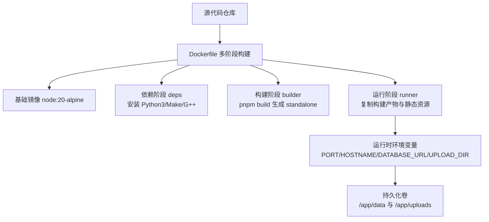
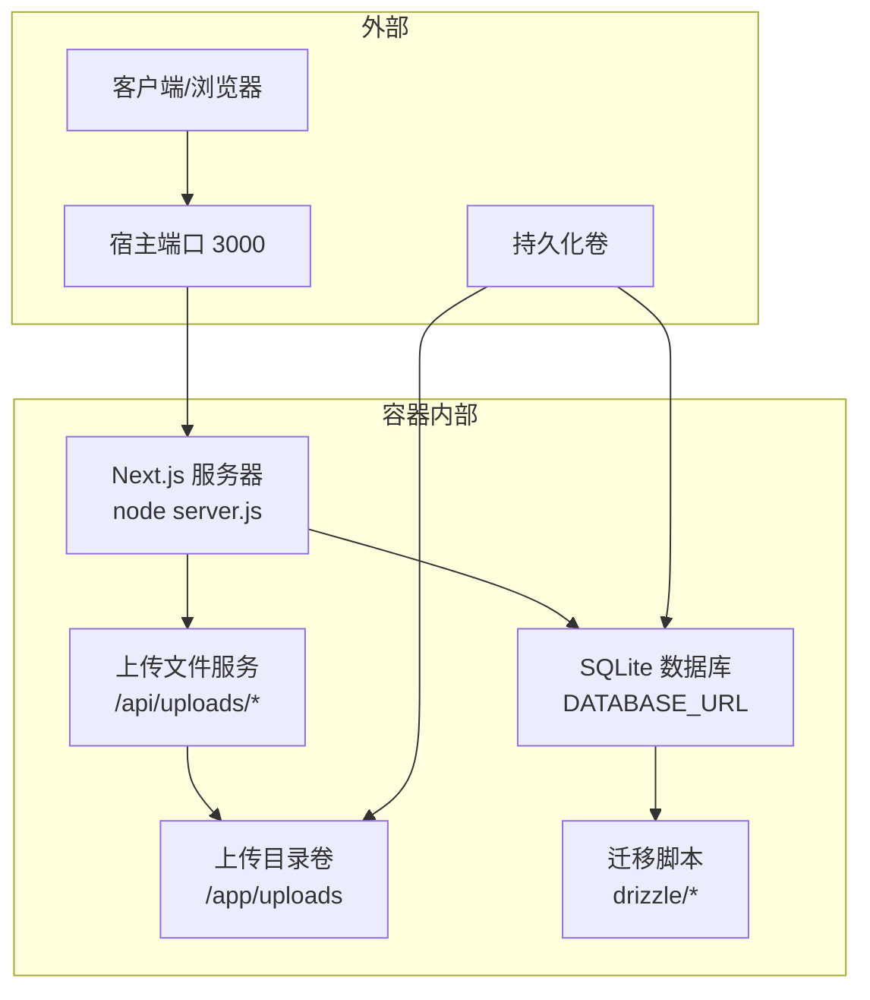
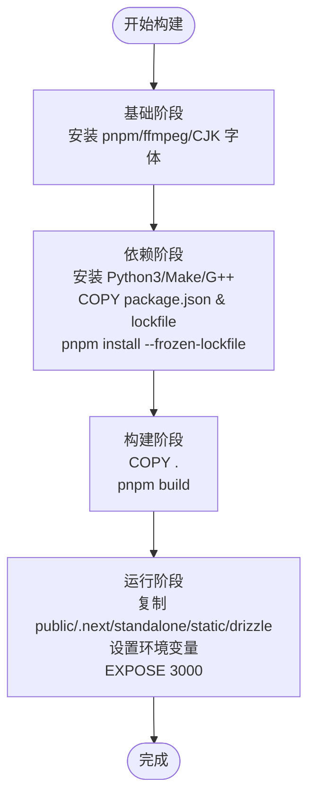
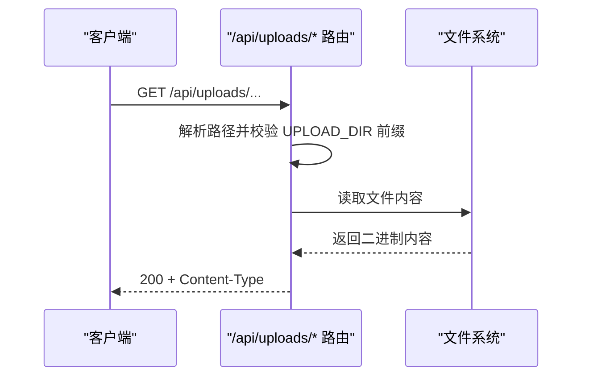
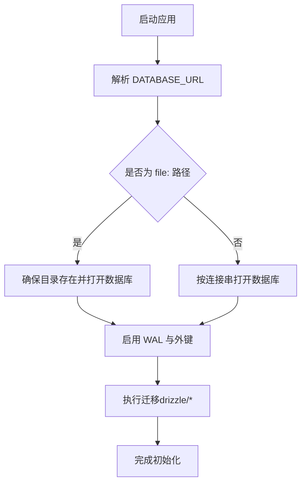
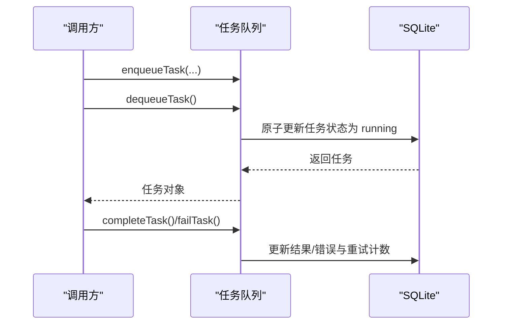
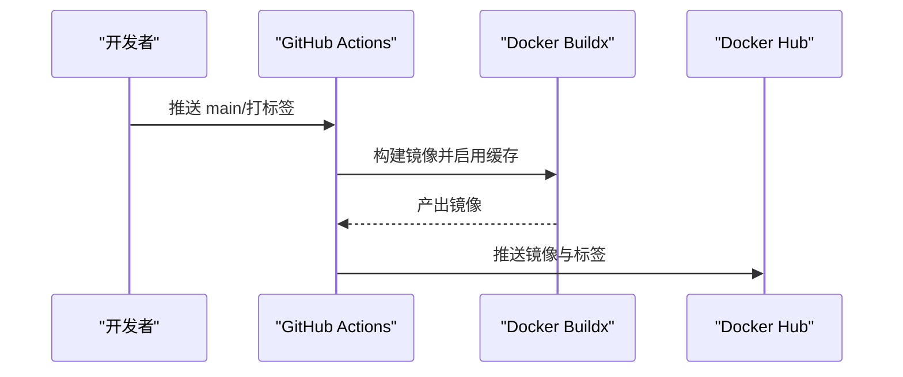
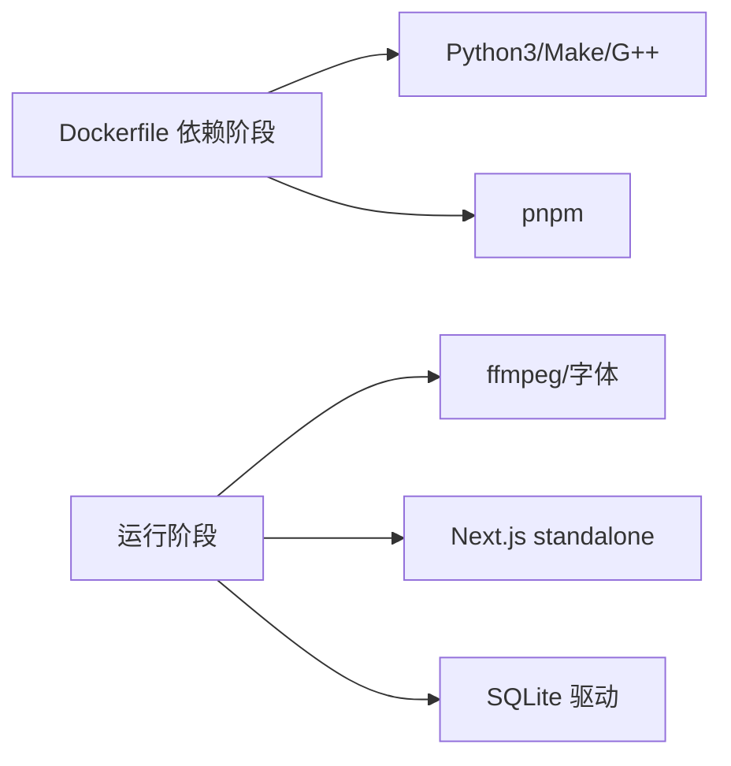

# Docker容器化

<cite>
**本文引用的文件**
- [Dockerfile](file://Dockerfile)
- [.dockerignore](file://.dockerignore)
- [.github/workflows/docker-publish.yml](file://.github/workflows/docker-publish.yml)
- [package.json](file://package.json)
- [next.config.ts](file://next.config.ts)
- [drizzle.config.ts](file://drizzle.config.ts)
- [src/lib/db/index.ts](file://src/lib/db/index.ts)
- [src/app/api/uploads/[...path]/route.ts](file://src/app/api/uploads/[...path]/route.ts)
- [src/lib/utils/upload-url.ts](file://src/lib/utils/upload-url.ts)
- [src/lib/task-queue/queue.ts](file://src/lib/task-queue/queue.ts)
</cite>

## 目录
1. [简介](#简介)
2. [项目结构](#项目结构)
3. [核心组件](#核心组件)
4. [架构总览](#架构总览)
5. [详细组件分析](#详细组件分析)
6. [依赖分析](#依赖分析)
7. [性能考虑](#性能考虑)
8. [故障排查指南](#故障排查指南)
9. [结论](#结论)
10. [附录](#附录)

## 简介
本指南面向希望将 AIComicBuilder 进行容器化部署的用户，系统讲解 Dockerfile 的构建流程、多阶段构建优化与镜像层管理策略，给出容器运行时配置、环境变量与卷挂载方案，提供基于 docker-compose 的服务编排思路与网络设置建议，并覆盖健康检查、资源限制、性能调优以及安全最佳实践与漏洞扫描流程。

## 项目结构
AIComicBuilder 使用 Next.js 16 的 standalone 输出模式进行生产构建，Dockerfile 采用多阶段构建，分别完成依赖安装、应用构建与最终运行镜像。项目还包含 GitHub Actions 自动化构建与推送流程，以及针对 SQLite 数据库与上传目录的运行时路径约定。

图表来源
- [Dockerfile:1-41](file://Dockerfile#L1-L41)
- [next.config.ts:7-13](file://next.config.ts#L7-L13)

章节来源
- [Dockerfile:1-41](file://Dockerfile#L1-L41)
- [package.json:5-9](file://package.json#L5-L9)
- [next.config.ts:7-13](file://next.config.ts#L7-L13)

## 核心组件
- 多阶段构建
  - 基础阶段：安装 pnpm、ffmpeg 与 CJK 字体，确保视频处理与字幕渲染能力。
  - 依赖阶段：安装 Python3/Make/G++，执行 pnpm install --frozen-lockfile，隔离构建工具链。
  - 构建阶段：复制源码并执行 pnpm build，生成 standalone 输出。
  - 运行阶段：设置 NODE_ENV=production，复制 public、.next/standalone、.next/static 与 drizzle 迁移脚本，暴露端口 3000，默认监听 0.0.0.0。
- 运行时环境
  - 端口与主机绑定：PORT=3000，HOSTNAME="0.0.0.0"。
  - 数据库：DATABASE_URL=file:/app/data/aicomic.db（默认文件型 SQLite），可通过外部卷映射实现持久化。
  - 上传目录：UPLOAD_DIR=/app/uploads（用于存储上传的图片/视频等媒体资源）。
- 自动化发布
  - GitHub Actions 在 main 分支与版本标签触发，使用 buildx 构建并推送至 Docker Hub，启用 GitHub Actions 缓存以提升构建效率。

章节来源
- [Dockerfile:1-41](file://Dockerfile#L1-L41)
- [package.json:5-9](file://package.json#L5-L9)
- [.github/workflows/docker-publish.yml:1-54](file://.github/workflows/docker-publish.yml#L1-L54)

## 架构总览
下图展示容器内应用启动与数据流的关键环节：Next.js standalone 服务器启动、SQLite 数据库初始化与迁移、上传文件服务路由与卷挂载策略。

图表来源
- [Dockerfile:21-41](file://Dockerfile#L21-L41)
- [src/lib/db/index.ts:18-55](file://src/lib/db/index.ts#L18-L55)
- [src/app/api/uploads/[...path]/route.ts:16-41](file://src/app/api/uploads/[...path]/route.ts#L16-L41)

## 详细组件分析

### Dockerfile 多阶段构建与镜像层管理
- 层级划分
  - 基础层：安装 pnpm、ffmpeg 与字体，作为后续阶段的基础。
  - 依赖层：安装 Python3/Make/G++，仅拷贝 package.json 与 pnpm 锁定文件，利用缓存加速安装。
  - 构建层：复制全部源码，执行 pnpm build，生成 standalone 输出，避免运行时编译。
  - 运行层：复制构建产物与迁移脚本，设置运行时环境变量，暴露端口 3000。
- 层缓存优化
  - 将 package.json 与 pnpm-lock.yaml 单独 COPY 并安装依赖，减少源码变更导致的依赖重装。
  - 使用 --frozen-lockfile 确保依赖一致性，避免 CI 环境与本地不一致。
  - 通过 .dockerignore 排除 node_modules、.next、docs 等目录，缩小上下文体积。
- 运行时最小化
  - 使用 alpine 基础镜像，仅安装必要工具（ffmpeg、CJK 字体），降低镜像体积与攻击面。
  - 仅复制 standalone 产物与静态资源，不包含开发依赖或源码。

图表来源
- [Dockerfile:1-41](file://Dockerfile#L1-L41)
- [.dockerignore:1-8](file://.dockerignore#L1-L8)

章节来源
- [Dockerfile:1-41](file://Dockerfile#L1-L41)
- [.dockerignore:1-8](file://.dockerignore#L1-L8)

### 运行时配置与环境变量
- 必需环境变量
  - NODE_ENV=production：启用生产模式，关闭调试输出。
  - NEXT_TELEMETRY_DISABLED=1：禁用 Telemetry，避免匿名数据上报。
  - PORT=3000：容器监听端口。
  - HOSTNAME="0.0.0.0"：允许外部访问。
  - DATABASE_URL=file:/app/data/aicomic.db：默认文件型 SQLite 路径。
  - UPLOAD_DIR=/app/uploads：上传文件根目录。
- 默认值与可选覆盖
  - 可通过外部环境变量覆盖上述默认值，实现不同部署场景的灵活配置。
  - 数据库 URL 支持 file: 或其他受支持的数据库连接字符串（如需要替换为远程数据库，需相应调整运行阶段与依赖）。

章节来源
- [Dockerfile:25-39](file://Dockerfile#L25-L39)

### 卷挂载策略
- 数据持久化
  - /app/data：挂载宿主机目录到 SQLite 数据库存放位置，确保重启后数据不丢失。
  - /app/uploads：挂载宿主机目录到上传文件根目录，便于媒体资源的持久化与备份。
- 安全与隔离
  - 仅挂载必需目录，避免将整个工作区映射到容器内，降低权限暴露风险。
  - 建议为上传目录设置只读副本（如仅在导入流程中写入）以降低误删风险。

章节来源
- [Dockerfile:37-39](file://Dockerfile#L37-L39)
- [src/app/api/uploads/[...path]/route.ts:5-41](file://src/app/api/uploads/[...path]/route.ts#L5-L41)

### 上传文件服务与路径转换
- 上传服务路由
  - 通过 /api/uploads/[...path] 提供静态文件服务，内部解析请求路径并读取 /app/uploads 下的文件。
  - 包含路径遍历防护，确保请求路径位于 UPLOAD_DIR 内部。
- 路径转换工具
  - uploadUrl 工具函数将本地相对路径转换为 /api/uploads/ 开头的 API URL，便于前端统一处理。

图表来源
- [src/app/api/uploads/[...path]/route.ts:16-41](file://src/app/api/uploads/[...path]/route.ts#L16-L41)
- [src/lib/utils/upload-url.ts:5-16](file://src/lib/utils/upload-url.ts#L5-L16)

章节来源
- [src/app/api/uploads/[...path]/route.ts:16-41](file://src/app/api/uploads/[...path]/route.ts#L16-L41)
- [src/lib/utils/upload-url.ts:5-16](file://src/lib/utils/upload-url.ts#L5-L16)

### 数据库初始化与迁移
- 初始化流程
  - 启动时根据 DATABASE_URL 解析实际数据库路径，若为 file: 则确保目录存在并打开数据库。
  - 启用 WAL 模式与外键约束，提升并发与一致性。
- 迁移机制
  - 通过 drizzle 迁移脚本目录（drizzle/*）执行迁移，支持现有 schema 的基线迁移逻辑。
  - 迁移历史记录于 __drizzle_migrations 表，避免重复迁移。

图表来源
- [src/lib/db/index.ts:18-55](file://src/lib/db/index.ts#L18-L55)
- [drizzle.config.ts:7-10](file://drizzle.config.ts#L7-L10)

章节来源
- [src/lib/db/index.ts:18-55](file://src/lib/db/index.ts#L18-L55)
- [drizzle.config.ts:7-10](file://drizzle.config.ts#L7-L10)

### 任务队列与状态管理
- 入队与出队
  - 支持按项目/剧集维度入队任务，原子性地将待处理任务标记为运行中。
  - 支持失败重试与最大重试次数控制，超过阈值则标记失败。
- 数据一致性
  - 使用数据库事务与原子更新保证并发安全，避免竞态条件。

图表来源
- [src/lib/task-queue/queue.ts:7-50](file://src/lib/task-queue/queue.ts#L7-L50)
- [src/lib/task-queue/queue.ts:52-92](file://src/lib/task-queue/queue.ts#L52-L92)

章节来源
- [src/lib/task-queue/queue.ts:7-50](file://src/lib/task-queue/queue.ts#L7-L50)
- [src/lib/task-queue/queue.ts:52-92](file://src/lib/task-queue/queue.ts#L52-L92)

### 自动化构建与发布
- 触发条件
  - main 分支推送与版本标签（v*）触发。
- 关键步骤
  - checkout 代码 → 设置 buildx → 登录 Docker Hub → 生成元数据标签 → 构建并推送镜像 → 启用 GitHub Actions 缓存。
- 版本标签
  - 自动生成 latest、语义化版本与主次版本标签，便于多环境分发。

图表来源
- [.github/workflows/docker-publish.yml:1-54](file://.github/workflows/docker-publish.yml#L1-L54)

章节来源
- [.github/workflows/docker-publish.yml:1-54](file://.github/workflows/docker-publish.yml#L1-L54)

## 依赖分析
- 构建期依赖
  - Python3/Make/G++：满足某些原生模块（如 better-sqlite3）的编译需求。
  - pnpm：包管理器，配合 --frozen-lockfile 保证依赖一致性。
- 运行期依赖
  - ffmpeg 与字体：用于视频处理与字幕烧录、CJK 字体渲染。
  - Next.js standalone：无需 Node.js 开发依赖即可运行。
- 外部集成
  - 数据库：默认使用 SQLite 文件数据库，可通过环境变量切换为其他数据库（需相应调整运行阶段与依赖）。
  - 上传服务：基于 /api/uploads/* 路由提供静态文件服务，结合卷挂载实现持久化。

图表来源
- [Dockerfile:10-14](file://Dockerfile#L10-L14)
- [Dockerfile:21-32](file://Dockerfile#L21-L32)
- [package.json:41-44](file://package.json#L41-L44)

章节来源
- [Dockerfile:10-14](file://Dockerfile#L10-L14)
- [Dockerfile:21-32](file://Dockerfile#L21-L32)
- [package.json:41-44](file://package.json#L41-L44)

## 性能考虑
- 构建性能
  - 使用 --frozen-lockfile 与 .dockerignore 控制构建上下文与依赖缓存，缩短 CI 时间。
  - GitHub Actions 启用缓存（cache-from/cache-to），显著提升重复构建速度。
- 运行性能
  - 使用 standalone 输出避免运行时编译，启动更快。
  - SQLite WAL 模式提升并发读写性能；外键约束保障数据一致性。
  - 上传文件直接从磁盘读取，避免不必要的中间层开销。
- 资源限制建议
  - CPU/内存限额：根据并发任务数量与视频处理负载设定合理上限，防止资源争用。
  - 磁盘配额：为 /app/data 与 /app/uploads 分配充足空间，定期清理临时文件。
  - 端口与网络：仅暴露必要端口，使用反向代理或网关统一入口。

章节来源
- [Dockerfile:13-14](file://Dockerfile#L13-L14)
- [.github/workflows/docker-publish.yml:45-46](file://.github/workflows/docker-publish.yml#L45-L46)
- [src/lib/db/index.ts:40-41](file://src/lib/db/index.ts#L40-L41)

## 故障排查指南
- 数据库无法打开或迁移失败
  - 检查 DATABASE_URL 是否指向正确路径，确认 /app/data 目录已挂载且具备读写权限。
  - 查看迁移日志与 __drizzle_migrations 表状态，确认迁移是否重复执行。
- 上传文件 403/404
  - 确认请求路径位于 UPLOAD_DIR 内部，避免路径穿越。
  - 检查 /app/uploads 卷挂载是否正确，文件是否存在。
- 任务队列异常
  - 检查任务状态是否被正确原子更新，确认数据库连接正常。
  - 若出现频繁重试，核查上游服务稳定性与资源可用性。
- 端口占用或无法访问
  - 确认容器内 PORT=3000 与宿主端口映射一致，防火墙未阻断。

章节来源
- [src/lib/db/index.ts:18-55](file://src/lib/db/index.ts#L18-L55)
- [src/app/api/uploads/[...path]/route.ts:23-32](file://src/app/api/uploads/[...path]/route.ts#L23-L32)
- [src/lib/task-queue/queue.ts:36-49](file://src/lib/task-queue/queue.ts#L36-L49)

## 结论
通过多阶段构建与精简运行时配置，AIComicBuilder 的容器镜像实现了快速构建与稳定运行。结合卷挂载与环境变量，可在不同环境中灵活部署。配合自动化发布流程、健康检查与资源限制策略，可进一步提升系统的可靠性与安全性。

## 附录

### 健康检查与探针建议
- HTTP 探针
  - 对 /api/projects 或 /api/health（如自定义）发起 GET 请求，期望 2xx 响应。
- 数据库探针
  - 执行简单查询（如 SELECT 1）验证数据库连通性。
- 建议间隔
  - 探测间隔 30 秒，超时 5 秒，成功阈值 1，失败阈值 3。

### 资源限制与性能调优清单
- CPU/内存
  - 为容器设置合理的 CPU 份额与内存上限，避免与其他容器争抢资源。
- 存储
  - 为 /app/data 与 /app/uploads 分配足够空间，定期清理临时文件。
- 网络
  - 仅暴露必要端口，使用反向代理统一入口，开启 TLS 终止。
- 日志
  - 将日志输出到 stdout/stderr，结合集中式日志收集系统进行分析。

### 安全最佳实践与漏洞扫描
- 镜像安全
  - 使用官方 alpine 基础镜像，定期更新基础镜像与依赖。
  - 启用只读根文件系统与最小权限原则，移除不必要的包与工具。
- 运行时安全
  - 通过环境变量注入敏感配置，避免硬编码。
  - 使用非 root 用户运行（如需，可参考社区最佳实践）。
- 漏洞扫描
  - 在 CI 中集成镜像扫描（如 Trivy/Snyk），在推送前拦截高危漏洞。
  - 对第三方依赖定期审计，关注 CVE 与许可证合规。