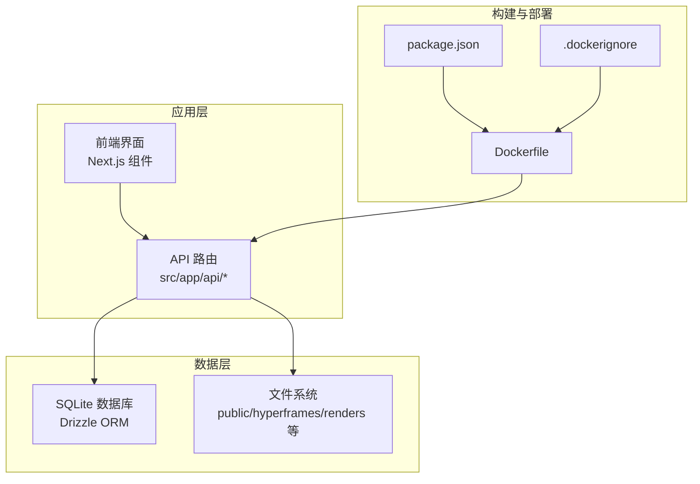
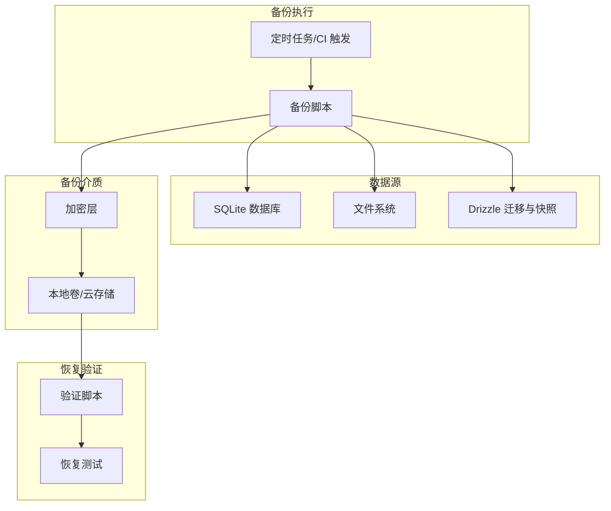
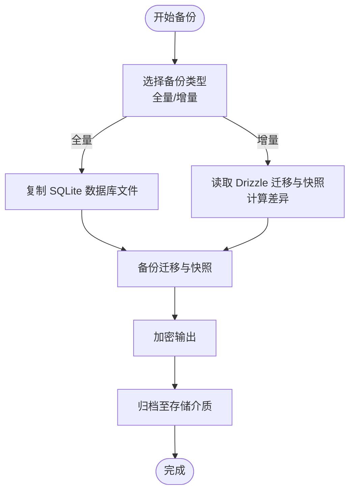
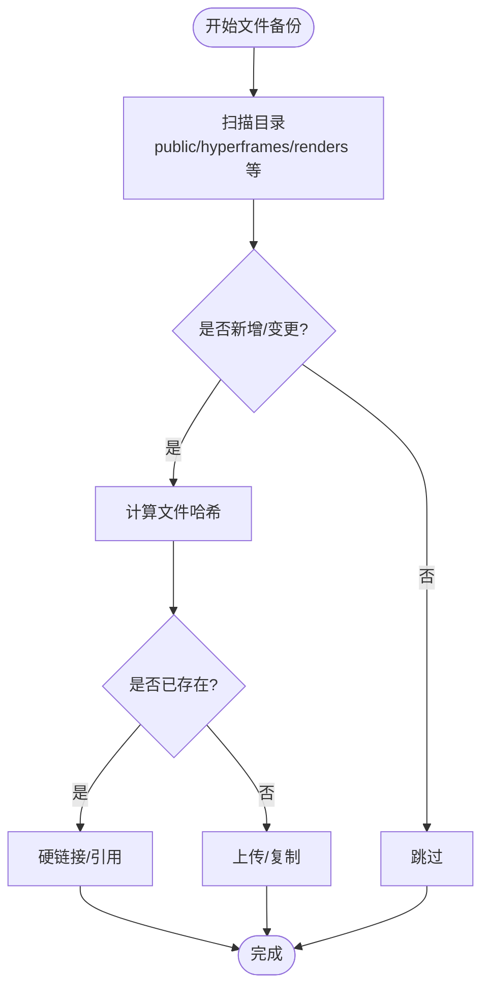
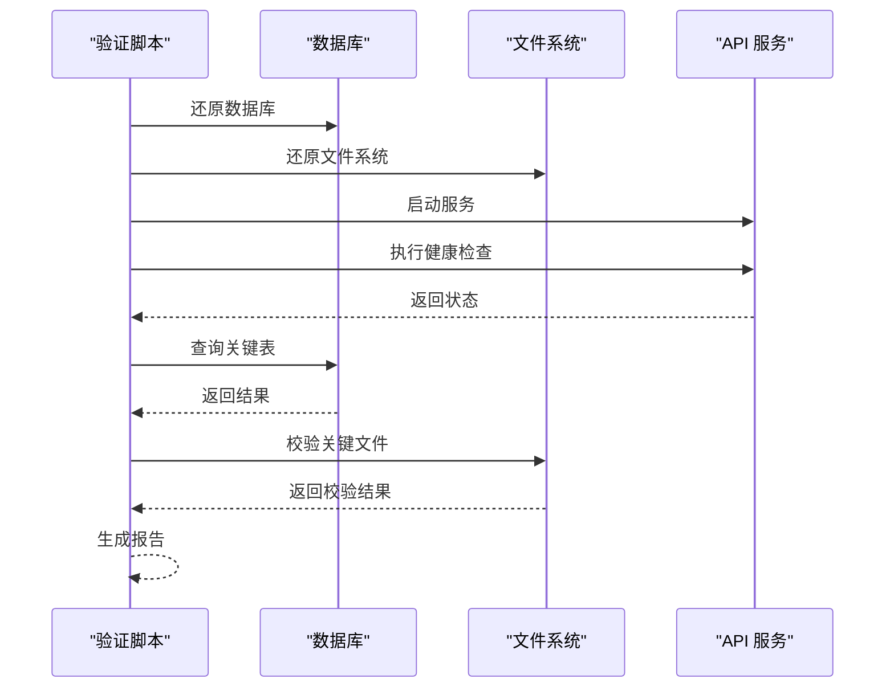
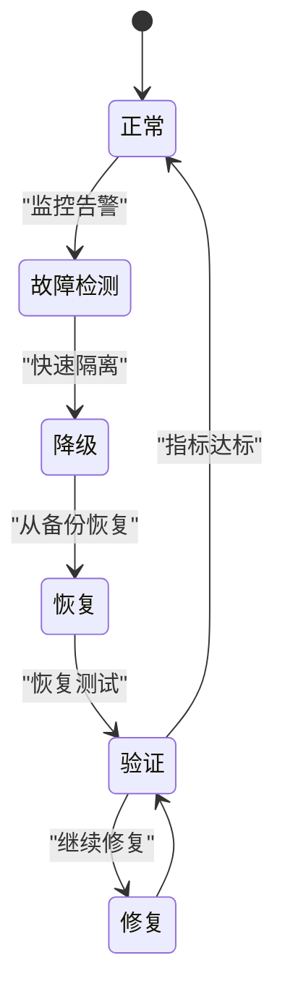
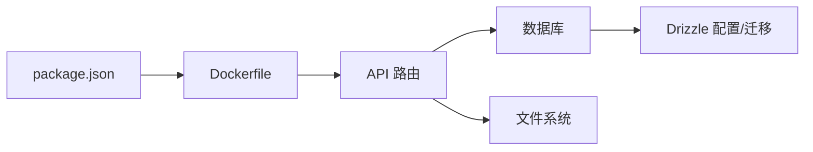

# 备份与恢复

<cite>
**本文引用的文件**
- [package.json](file://package.json)
- [Dockerfile](file://Dockerfile)
- [.dockerignore](file://.dockerignore)
- [drizzle.config.ts](file://drizzle.config.ts)
- [drizzle/meta/_journal.json](file://drizzle/meta/_journal.json)
- [drizzle/meta/0000_snapshot.json](file://drizzle/meta/0000_snapshot.json)
- [drizzle/0000_chemical_tyrannus.sql](file://drizzle/0000_chemical_tyrannus.sql)
- [src/lib/db/index.ts](file://src/lib/db/index.ts)
- [src/app/api/projects/[id]/route.ts](file://src/app/api/projects/[id]/route.ts)
- [src/app/api/projects/[id]/download/route.ts](file://src/app/api/projects/[id]/download/route.ts)
- [src/app/api/uploads/[...path]/route.ts](file://src/app/api/uploads/[...path]/route.ts)
- [src/lib/bootstrap.ts](file://src/lib/bootstrap.ts)
- [src/lib/utils.ts](file://src/lib/utils.ts)
- [src/lib/import-utils.ts](file://src/lib/import-utils.ts)
- [src/lib/shot-asset-utils.ts](file://src/lib/shot-asset-utils.ts)
- [src/lib/ref-image-utils.ts](file://src/lib/ref-image-utils.ts)
- [src/stores/project-store.ts](file://src/stores/project-store.ts)
- [src/stores/episode-store.ts](file://src/stores/episode-store.ts)
- [src/stores/agent-store.ts](file://src/stores/agent-store.ts)
- [src/stores/model-store.ts](file://src/stores/model-store.ts)
- [src/stores/prompt-template-store.ts](file://src/stores/prompt-template-store.ts)
- [src/components/editor/episode-card.tsx](file://src/components/editor/episode-card.tsx)
- [src/components/editor/shot-card.tsx](file://src/components/editor/shot-card.tsx)
- [src/components/editor/character-card.tsx](file://src/components/editor/character-card.tsx)
- [src/components/prompt-templates/preset-dialog.tsx](file://src/components/prompt-templates/preset-dialog.tsx)
- [src/components/prompt-templates/project-prompt-cards.tsx](file://src/components/prompt-templates/project-prompt-cards.tsx)
- [src/components/settings/provider-section.tsx](file://src/components/settings/provider-section.tsx)
- [src/components/settings/provider-card.tsx](file://src/components/settings/provider-card.tsx)
- [src/components/settings/default-model-picker.tsx](file://src/components/settings/default-model-picker.tsx)
- [src/hooks/use-model-guard.ts](file://src/hooks/use-model-guard.ts)
- [src/instrumentation.ts](file://src/instrumentation.ts)
- [src/proxy.ts](file://src/proxy.ts)
- [next.config.ts](file://next.config.ts)
- [tsconfig.json](file://tsconfig.json)
- [postcss.config.mjs](file://postcss.config.mjs)
- [components.json](file://components.json)
- [eslint.config.mjs](file://eslint.config.mjs)
- [pnpm-workspace.yaml](file://pnpm-workspace.yaml)
</cite>

## 目录
1. [引言](#引言)
2. [项目结构](#项目结构)
3. [核心组件](#核心组件)
4. [架构总览](#架构总览)
5. [详细组件分析](#详细组件分析)
6. [依赖关系分析](#依赖关系分析)
7. [性能考量](#性能考量)
8. [故障排查指南](#故障排查指南)
9. [结论](#结论)
10. [附录](#附录)

## 引言
本方案面向 AIComicBuilder 的数据备份与灾难恢复，覆盖数据库（Drizzle/SQLite）与文件系统两大部分。方案明确全量与增量备份策略、版本控制与数据同步机制、备份验证与恢复测试流程、RTO/RPO 目标设定、自动化备份脚本建议、备份存储管理与安全加密要求，并提供故障场景模拟与应急响应流程，以保障业务连续性。

## 项目结构
AIComicBuilder 前后端一体化，采用 Next.js 应用与 Drizzle ORM 管理 SQLite 数据库存储；媒体资产通过上传接口写入文件系统。关键结构如下：
- 后端服务：Next.js 应用，API 路由位于 src/app/api 下，数据库访问封装在 src/lib/db 中。
- 数据库：Drizzle 配置与迁移文件位于 drizzle 目录，包含迁移 SQL 文件与元数据快照。
- 文件系统：上传接口负责接收媒体资源，生成的视频与图片等产物存放在 public/hyperframes/renders 等目录中。
- 构建与部署：Dockerfile、.dockerignore、package.json 等定义了容器化打包与运行环境。

**图示来源**
- [Dockerfile](file://Dockerfile)
- [package.json](file://package.json)
- [src/app/api/projects/[id]/route.ts](file://src/app/api/projects/[id]/route.ts)
- [src/lib/db/index.ts](file://src/lib/db/index.ts)

**章节来源**
- [Dockerfile](file://Dockerfile)
- [package.json](file://package.json)
- [drizzle.config.ts](file://drizzle.config.ts)
- [drizzle/meta/_journal.json](file://drizzle/meta/_journal.json)
- [drizzle/meta/0000_snapshot.json](file://drizzle/meta/0000_snapshot.json)

## 核心组件
- 数据库与迁移：Drizzle 提供类型安全的数据库操作与迁移管理，迁移文件与元数据快照用于追踪数据库演进。
- API 层：提供项目、角色、镜头、提示模板等资源的增删改查与下载接口，是备份范围的关键入口。
- 文件系统：上传接口与渲染产物目录构成非结构化数据备份对象。
- 存储与容器：Docker 容器化部署，便于统一备份与恢复。

**章节来源**
- [drizzle/0000_chemical_tyrannus.sql](file://drizzle/0000_chemical_tyrannus.sql)
- [src/app/api/projects/[id]/download/route.ts](file://src/app/api/projects/[id]/download/route.ts)
- [src/app/api/uploads/[...path]/route.ts](file://src/app/api/uploads/[...path]/route.ts)
- [src/lib/db/index.ts](file://src/lib/db/index.ts)

## 架构总览
下图展示备份与恢复涉及的组件交互与数据流向：

**图示来源**
- [drizzle.meta._journal.json](file://drizzle/meta/_journal.json)
- [drizzle.meta.0000_snapshot.json](file://drizzle/meta/0000_snapshot.json)
- [drizzle/0000_chemical_tyrannus.sql](file://drizzle/0000_chemical_tyrannus.sql)

## 详细组件分析

### 数据库备份策略（全量与增量）
- 全量备份
  - 目标：定期对 SQLite 数据库文件进行完整复制，确保可恢复到任意时间点。
  - 触发：每日或每周定时任务，结合 CI/CD 流水线触发。
  - 介质：本地磁盘或云对象存储。
- 增量备份
  - 目标：基于 Drizzle 迁移与快照，识别自上次备份以来的结构变化与数据变更。
  - 实现：利用迁移 SQL 文件与 _journal.json 快照，配合数据库 WAL/回滚日志（如适用）进行差异捕获。
- 版本控制与同步
  - 迁移文件与快照作为“数据库版本”，用于跨环境同步与一致性校验。
  - 建议：将迁移与快照纳入版本控制系统，配合分支策略与合并审查。

**图示来源**
- [drizzle.meta._journal.json](file://drizzle/meta/_journal.json)
- [drizzle.meta.0000_snapshot.json](file://drizzle/meta/0000_snapshot.json)
- [drizzle/0000_chemical_tyrannus.sql](file://drizzle/0000_chemical_tyrannus.sql)

**章节来源**
- [drizzle.config.ts](file://drizzle.config.ts)
- [drizzle/meta/_journal.json](file://drizzle/meta/_journal.json)
- [drizzle/meta/0000_snapshot.json](file://drizzle/meta/0000_snapshot.json)
- [drizzle/0000_chemical_tyrannus.sql](file://drizzle/0000_chemical_tyrannus.sql)

### 文件系统备份
- 备份范围
  - 上传接口产生的媒体资源与渲染产物目录（如 public/hyperframes/renders）。
  - 重要配置与静态资源（public/*）。
- 备份策略
  - 全量：周期性完整拷贝。
  - 增量：基于文件修改时间戳或哈希差异，仅传输变更内容。
- 同步与去重
  - 使用哈希索引避免重复传输。
  - 支持断点续传与并发分片。

**图示来源**
- [src/app/api/uploads/[...path]/route.ts](file://src/app/api/uploads/[...path]/route.ts)
- [src/app/api/projects/[id]/download/route.ts](file://src/app/api/projects/[id]/download/route.ts)

**章节来源**
- [src/app/api/uploads/[...path]/route.ts](file://src/app/api/uploads/[...path]/route.ts)
- [src/app/api/projects/[id]/download/route.ts](file://src/app/api/projects/[id]/download/route.ts)

### 备份验证与恢复测试
- 验证清单
  - 数据库：校验迁移与快照完整性，执行查询验证关键表数据。
  - 文件系统：比对哈希与文件数，检查关键路径可用性。
  - 集成：端到端恢复测试，验证 API 可用性与页面加载。
- 恢复测试流程
  - 从备份介质还原数据库与文件系统。
  - 启动应用，执行最小化回归测试集。
  - 记录 RTO/RPO 指标，评估与目标差距。

**图示来源**
- [src/lib/db/index.ts](file://src/lib/db/index.ts)
- [src/app/api/projects/[id]/route.ts](file://src/app/api/projects/[id]/route.ts)

**章节来源**
- [src/lib/db/index.ts](file://src/lib/db/index.ts)
- [src/app/api/projects/[id]/route.ts](file://src/app/api/projects/[id]/route.ts)

### 自动化备份脚本与存储管理
- 脚本建议
  - 数据库：导出 SQLite 文件，附加 Drizzle 迁移与快照。
  - 文件系统：遍历 public/hyperframes/renders 等目录，按需全量/增量。
  - 加密：使用对称加密（如 AES）保护备份文件。
  - 归档：压缩（如 tar.gz）并上传至对象存储（S3/GCS/OSS）。
- 存储管理
  - 生命周期策略：设置过期删除与分层存储。
  - 多地冗余：至少异地两个副本。
  - 访问控制：最小权限原则与 IAM 策略。

**章节来源**
- [drizzle.meta._journal.json](file://drizzle/meta/_journal.json)
- [drizzle.meta.0000_snapshot.json](file://drizzle/meta/0000_snapshot.json)
- [src/app/api/uploads/[...path]/route.ts](file://src/app/api/uploads/[...path]/route.ts)

### 安全与加密
- 传输加密：TLS/HTTPS。
- 静态加密：备份文件本地加密与云存储服务端加密。
- 密钥管理：使用 KMS 或密钥管理服务，定期轮换。
- 审计与合规：记录备份与恢复操作日志，满足审计要求。

**章节来源**
- [Dockerfile](file://Dockerfile)
- [package.json](file://package.json)

### 故障场景模拟与应急响应
- 场景一：数据库损坏
  - 行为：无法连接或查询失败。
  - 响应：切换到最近一次成功备份，恢复数据库与快照，重启服务。
- 场景二：文件系统丢失
  - 行为：渲染产物缺失。
  - 响应：从备份恢复对应目录，重建索引或重新生成。
- 场景三：误删除关键数据
  - 行为：误删项目或角色。
  - 响应：基于增量备份回滚到删除前状态，通知用户并补偿。
- 应急流程
  - 事件上报 → 评估影响 → 切换备用环境 → 恢复 → 验证 → 复盘。

**图示来源**
- [src/lib/db/index.ts](file://src/lib/db/index.ts)
- [src/app/api/projects/[id]/route.ts](file://src/app/api/projects/[id]/route.ts)

## 依赖关系分析
- 组件耦合
  - API 路由依赖数据库与文件系统。
  - 数据库依赖 Drizzle 配置与迁移文件。
  - 构建与部署依赖 Dockerfile 与包管理配置。
- 外部依赖
  - 对象存储、KMS、监控与日志服务。
- 循环依赖
  - 当前结构未见循环导入，但需在新增模块时保持单向依赖。

**图示来源**
- [src/app/api/projects/[id]/route.ts](file://src/app/api/projects/[id]/route.ts)
- [src/lib/db/index.ts](file://src/lib/db/index.ts)
- [drizzle.config.ts](file://drizzle.config.ts)
- [Dockerfile](file://Dockerfile)
- [package.json](file://package.json)

**章节来源**
- [src/app/api/projects/[id]/route.ts](file://src/app/api/projects/[id]/route.ts)
- [src/lib/db/index.ts](file://src/lib/db/index.ts)
- [drizzle.config.ts](file://drizzle.config.ts)
- [Dockerfile](file://Dockerfile)
- [package.json](file://package.json)

## 性能考量
- 备份窗口：在低峰时段执行全量备份，增量在夜间执行。
- 并发与限速：控制并发度与带宽，避免影响线上服务。
- 压缩与去重：提升吞吐，降低存储成本。
- 缓存与预热：恢复前预热缓存，缩短 RTO。

## 故障排查指南
- 数据库问题
  - 检查迁移与快照文件完整性，确认数据库连接参数正确。
- 文件系统问题
  - 校验目录权限与磁盘空间，比对哈希确认一致性。
- API 问题
  - 查看日志与监控指标，确认服务启动与路由可达。
- 恢复验证
  - 执行最小化回归测试，关注关键路径（项目列表、下载、上传）。

**章节来源**
- [src/lib/db/index.ts](file://src/lib/db/index.ts)
- [src/app/api/projects/[id]/route.ts](file://src/app/api/projects/[id]/route.ts)
- [src/app/api/uploads/[...path]/route.ts](file://src/app/api/uploads/[...path]/route.ts)

## 结论
通过全量与增量备份相结合、数据库与文件系统的协同治理、严格的验证与恢复测试、以及完善的应急响应流程，AIComicBuilder 可实现高可靠的数据保护与业务连续性。建议尽快落地自动化脚本与加密归档策略，并持续优化 RTO/RPO 指标。

## 附录
- RTO/RPO 目标建议
  - RTO：数据库与文件系统恢复不超过 2 小时；API 服务恢复不超过 15 分钟。
  - RPO：数据库与文件系统不高于 15 分钟；关键业务不高于 5 分钟。
- 关键备份对象清单
  - 数据库：SQLite 文件、Drizzle 迁移与快照。
  - 文件系统：public/hyperframes/renders、public/images、public/docs 等。
  - 配置：Dockerfile、package.json、drizzle.config.ts、next.config.ts 等。