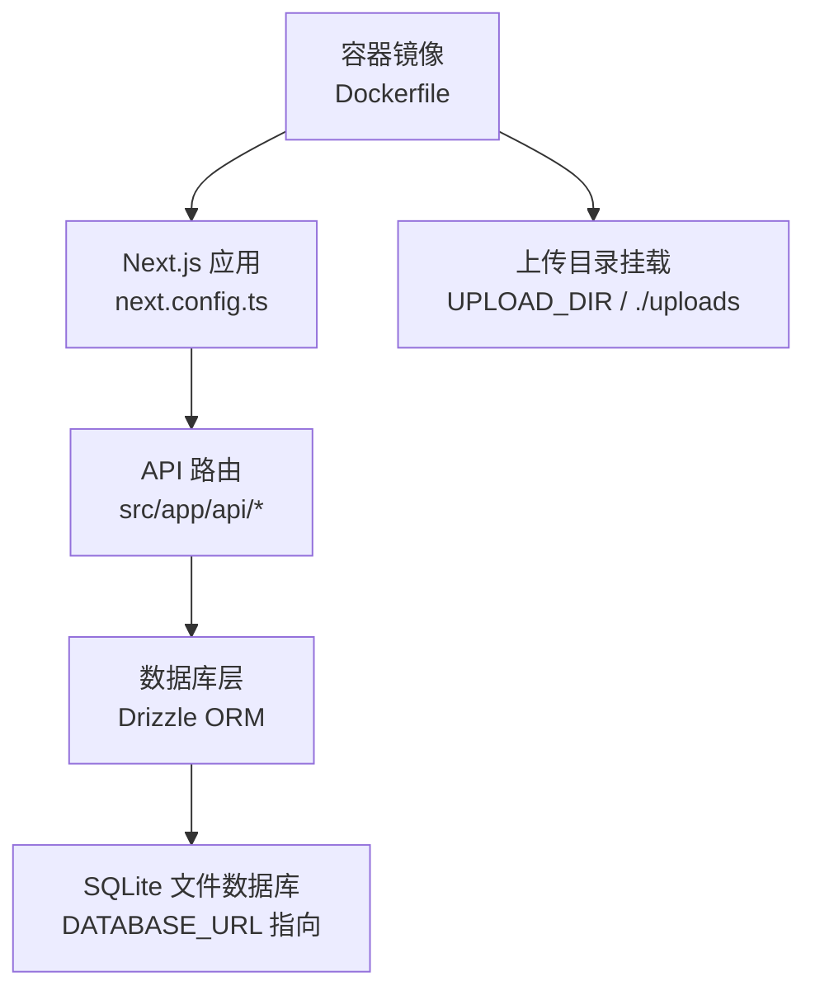
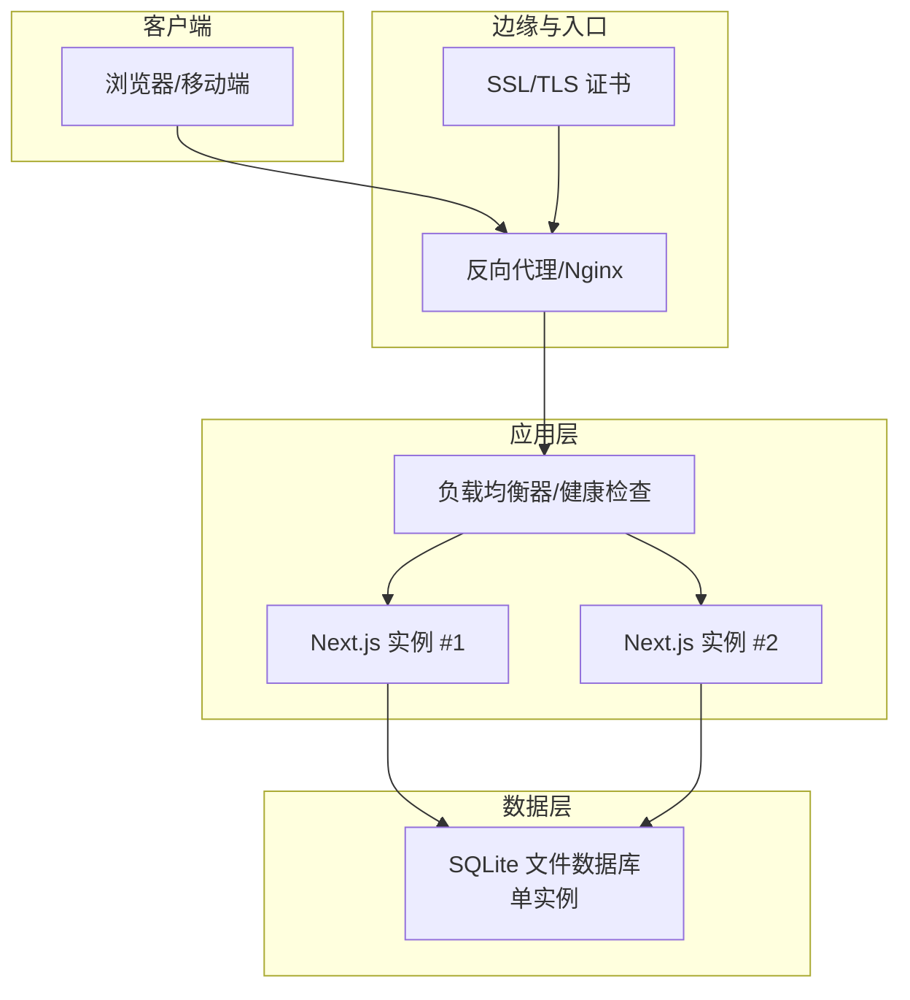
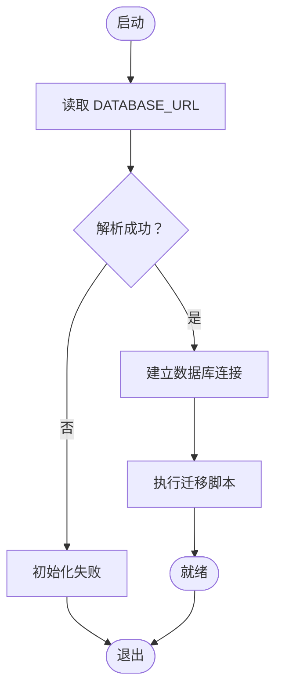
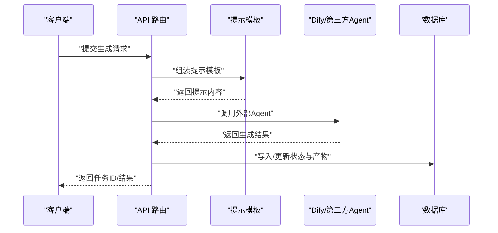
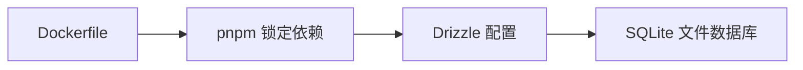

# 生产环境配置

<cite>
**本文引用的文件**
- [Dockerfile](file://Dockerfile)
- [next.config.ts](file://next.config.ts)
- [drizzle.config.ts](file://drizzle.config.ts)
- [src/lib/db/index.ts](file://src/lib/db/index.ts)
- [README.md](file://README.md)
- [src/app/api/projects/[id]/generate/route.ts](file://src/app/api/projects/[id]/generate/route.ts)
- [src/lib/ai/prompts/registry.ts](file://src/lib/ai/prompts/registry.ts)
- [src/lib/ai/prompts/character-extract.ts](file://src/lib/ai/prompts/character-extract.ts)
- [src/lib/ai/prompts/script-parse.ts](file://src/lib/ai/prompts/script-parse.ts)
- [agents/dify/character-extract.dify.yml](file://agents/dify/character-extract.dify.yml)
- [agents/dify/keyframe-prompts.dify.yml](file://agents/dify/keyframe-prompts.dify.yml)
- [agents/dify/ref-image-prompts.dify.yml](file://agents/dify/ref-image-prompts.dify.yml)
- [agents/dify/ref-video-prompts.dify.yml](file://agents/dify/ref-video-prompts.dify.yml)
- [agents/dify/script-generate.dify.yml](file://agents/dify/script-generate.dify.yml)
- [agents/dify/script-outline.dify.yml](file://agents/dify/script-outline.dify.yml)
- [agents/dify/script-parse.dify.yml](file://agents/dify/script-parse.dify.yml)
- [agents/dify/shot-split.dify.yml](file://agents/dify/shot-split.dify.yml)
- [agents/dify/video-prompts.dify.yml](file://agents/dify/video-prompts.dify.yml)
</cite>

## 目录
1. [简介](#简介)
2. [项目结构](#项目结构)
3. [核心组件](#核心组件)
4. [架构总览](#架构总览)
5. [详细组件分析](#详细组件分析)
6. [依赖关系分析](#依赖关系分析)
7. [性能考虑](#性能考虑)
8. [故障排查指南](#故障排查指南)
9. [结论](#结论)
10. [附录](#附录)

## 简介
本指南面向生产环境部署AIComicBuilder，覆盖服务器环境准备、依赖安装与系统要求；Next.js生产配置优化；数据库连接与Drizzle迁移；缓存策略；环境变量与密钥管理；负载均衡、反向代理与SSL证书配置；以及性能基准测试、容量规划与扩展策略。文档严格依据仓库内现有实现与配置进行说明。

## 项目结构
- 应用采用Next.js应用模式，API路由位于src/app/api下，按功能模块组织。
- 数据层通过Drizzle ORM与SQLite文件数据库交互，数据库路径由环境变量控制。
- 构建与运行通过Dockerfile定义，包含FFmpeg与Python工具链以支持视频/图像处理。
- 提供Docker Compose示例挂载上传目录，便于持久化与外部访问。

图表来源
- [Dockerfile:1-40](file://Dockerfile#L1-L40)
- [next.config.ts](file://next.config.ts)
- [drizzle.config.ts:1-10](file://drizzle.config.ts#L1-L10)
- [src/lib/db/index.ts:15-25](file://src/lib/db/index.ts#L15-L25)

章节来源
- [Dockerfile:1-40](file://Dockerfile#L1-L40)
- [README.md:90-130](file://README.md#L90-L130)

## 核心组件
- 容器与运行时
  - 使用多阶段构建，生产环境设置NODE_ENV=production，禁用遥测，暴露端口3000并绑定0.0.0.0。
  - 安装FFmpeg与Python工具链，满足视频/图像处理需求。
- Next.js生产配置
  - 通过next.config.ts集中管理构建与运行参数（如静态资源、实验特性等），建议结合生产环境调整。
- 数据库与迁移
  - Drizzle配置读取DATABASE_URL，缺省指向本地文件数据库；迁移脚本位于drizzle目录，版本化管理。
- 上传与资源
  - 通过UPLOAD_DIR或本地./uploads目录挂载，用于存放用户上传与生成的媒体资源。

章节来源
- [Dockerfile:20-40](file://Dockerfile#L20-L40)
- [drizzle.config.ts:1-10](file://drizzle.config.ts#L1-L10)
- [src/lib/db/index.ts:15-25](file://src/lib/db/index.ts#L15-L25)
- [README.md:90-130](file://README.md#L90-L130)

## 架构总览
生产部署建议采用“反向代理/Nginx + 多实例Next.js + 单一数据库”的拓扑。Nginx负责SSL终止、静态资源分发与健康检查，Next.js实例处理API与页面请求，数据库统一由单一节点提供服务，避免跨节点数据不一致。

## 详细组件分析

### 数据库与迁移（Drizzle）
- 连接配置
  - Drizzle从环境变量DATABASE_URL读取数据库连接串，缺省值指向本地文件数据库。
  - 应用启动时根据该URL解析实际数据库路径。
- 迁移与版本
  - 迁移脚本位于drizzle目录，按序号命名，版本信息保存于元数据文件中。
- 建议
  - 生产环境应将DATABASE_URL指向持久化存储（如云盘挂载或专用数据库服务），并确保只读副本或主从复制策略。
  - 在升级前执行迁移，验证SQL变更与索引。

图表来源
- [drizzle.config.ts:1-10](file://drizzle.config.ts#L1-L10)
- [src/lib/db/index.ts:15-25](file://src/lib/db/index.ts#L15-L25)

章节来源
- [drizzle.config.ts:1-10](file://drizzle.config.ts#L1-L10)
- [src/lib/db/index.ts:15-25](file://src/lib/db/index.ts#L15-L25)

### 上传与资源存储
- 上传目录
  - 通过环境变量UPLOAD_DIR或本地./uploads目录挂载，用于存放用户上传与生成的媒体资源。
- 建议
  - 生产环境建议使用持久化卷或对象存储（如S3），并配合CDN加速静态资源。
  - 控制上传大小与类型，限制并发写入，避免磁盘空间耗尽。

章节来源
- [Dockerfile:34-37](file://Dockerfile#L34-L37)
- [README.md:90-130](file://README.md#L90-L130)

### AI提示工程与工作流
- 提示模板
  - 项目内置多语言提示模板，涵盖角色抽取、剧本解析、分镜拆分、关键帧提示等。
- 关键字段
  - 角色抽取模板强调输出完整且有效的JSON，包含表演风格等字段。
  - 剧本解析模板强调输出语言需与源文本一致，JSON字段不应被翻译。
- 工作流编排
  - Dify工作流配置包含多个Agent任务（角色抽取、关键帧提示、参考图像提示、视频提示、脚本生成、大纲生成、解析、分镜拆分等），均声明了file_upload输入。
- 建议
  - 将提示模板与工作流参数化，结合环境变量注入API密钥与模型参数。
  - 对提示输出进行校验与重试机制，保证生成质量与稳定性。

图表来源
- [src/app/api/projects/[id]/generate/route.ts:700-760](file://src/app/api/projects/[id]/generate/route.ts#L700-L760)
- [src/lib/ai/prompts/registry.ts:530-640](file://src/lib/ai/prompts/registry.ts#L530-L640)
- [agents/dify/character-extract.dify.yml:130-240](file://agents/dify/character-extract.dify.yml#L130-L240)

章节来源
- [src/lib/ai/prompts/character-extract.ts:1-90](file://src/lib/ai/prompts/character-extract.ts#L1-L90)
- [src/lib/ai/prompts/script-parse.ts:1-50](file://src/lib/ai/prompts/script-parse.ts#L1-L50)
- [agents/dify/character-extract.dify.yml:130-240](file://agents/dify/character-extract.dify.yml#L130-L240)
- [agents/dify/keyframe-prompts.dify.yml:1-30](file://agents/dify/keyframe-prompts.dify.yml#L1-L30)
- [agents/dify/ref-image-prompts.dify.yml:1-30](file://agents/dify/ref-image-prompts.dify.yml#L1-L30)
- [agents/dify/ref-video-prompts.dify.yml:1-30](file://agents/dify/ref-video-prompts.dify.yml#L1-L30)
- [agents/dify/script-generate.dify.yml:1-30](file://agents/dify/script-generate.dify.yml#L1-L30)
- [agents/dify/script-outline.dify.yml:1-30](file://agents/dify/script-outline.dify.yml#L1-L30)
- [agents/dify/script-parse.dify.yml:1-30](file://agents/dify/script-parse.dify.yml#L1-L30)
- [agents/dify/shot-split.dify.yml:1-30](file://agents/dify/shot-split.dify.yml#L1-L30)
- [agents/dify/video-prompts.dify.yml:1-30](file://agents/dify/video-prompts.dify.yml#L1-L30)

### 缓存策略
- 应用层缓存
  - 可利用Next.js App Router的缓存语义与React缓存能力，对重复查询与渲染结果进行缓存。
- 数据层缓存
  - SQLite本身具备页缓存，建议通过连接池与事务优化减少锁竞争。
- 建议
  - 对热点数据（如提示模板、角色/场景元数据）引入进程内缓存或Redis缓存，降低数据库压力。
  - 对静态资源与生成产物使用CDN缓存，缩短首屏加载时间。

## 依赖关系分析
- 构建与运行
  - Dockerfile定义基础镜像、安装FFmpeg与Python工具链，随后进行构建与产物复制。
- 依赖与版本
  - pnpm-lock.yaml显示依赖树，包括@upstash/redis等组件，可用于后续缓存方案选型。
- 数据库驱动
  - Drizzle配置与数据库URL共同决定底层驱动与连接行为。

图表来源
- [Dockerfile:1-40](file://Dockerfile#L1-L40)
- [drizzle.config.ts:1-10](file://drizzle.config.ts#L1-L10)

章节来源
- [Dockerfile:1-40](file://Dockerfile#L1-L40)
- [drizzle.config.ts:1-10](file://drizzle.config.ts#L1-L10)

## 性能考虑
- 构建与运行优化
  - 使用多阶段构建减少镜像体积；启用静态资源优化与压缩。
  - 合理设置并发与内存上限，避免GC压力过大。
- 数据库性能
  - 为常用查询建立索引；限制大查询与复杂JOIN；使用事务批量写入。
  - 将数据库置于SSD或高性能存储上，确保IOPS满足峰值写入。
- 缓存与CDN
  - 对静态资源与生成产物使用CDN缓存；对热点查询引入Redis缓存。
- 并发与队列
  - 对耗时任务（如视频生成）采用异步队列与限流，避免阻塞请求线程。
- 监控与日志
  - 记录慢查询、错误率与响应时间；设置告警阈值。

## 故障排查指南
- 数据库连接失败
  - 检查DATABASE_URL是否正确，确认数据库文件存在且可读写。
  - 若使用远程数据库，核对网络连通性与认证信息。
- 上传目录不可写
  - 确认UPLOAD_DIR或./uploads挂载权限与磁盘空间充足。
- FFmpeg/Python工具缺失
  - 确认Dockerfile中已安装所需工具；容器内命令可用性验证。
- 提示模板错误
  - 校验提示模板输出格式要求（如完整有效JSON），必要时开启重试与降级策略。
- 代理与SSL问题
  - 检查反向代理配置与证书有效性；确认健康检查端点可达。

章节来源
- [src/lib/db/index.ts:15-25](file://src/lib/db/index.ts#L15-L25)
- [Dockerfile:6-12](file://Dockerfile#L6-L12)
- [README.md:90-130](file://README.md#L90-L130)

## 结论
本指南基于仓库现有配置与实现，给出了生产环境部署的关键步骤与最佳实践。建议在真实环境中结合业务流量与硬件条件进行容量评估与压测，持续优化数据库与缓存策略，并完善监控与告警体系，确保系统稳定与可扩展。

## 附录

### 环境变量清单
- NODE_ENV=production
- NEXT_TELEMETRY_DISABLED=1
- PORT=3000
- HOSTNAME=0.0.0.0
- DATABASE_URL=file:/app/data/aicomic.db
- UPLOAD_DIR=/app/uploads

章节来源
- [Dockerfile:24-37](file://Dockerfile#L24-L37)

### 反向代理与SSL配置要点
- 终止TLS，转发至Next.js实例端口
- 配置健康检查路径与超时
- 为静态资源与API设置合适的缓存头
- 限制请求体大小与速率，防止滥用

### 负载均衡与扩展策略
- 使用Nginx或云负载均衡器分发请求
- 实例水平扩展，共享数据库或引入只读副本
- 对上传与生成任务进行队列化与异步化，避免单点瓶颈