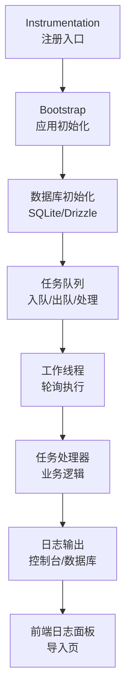
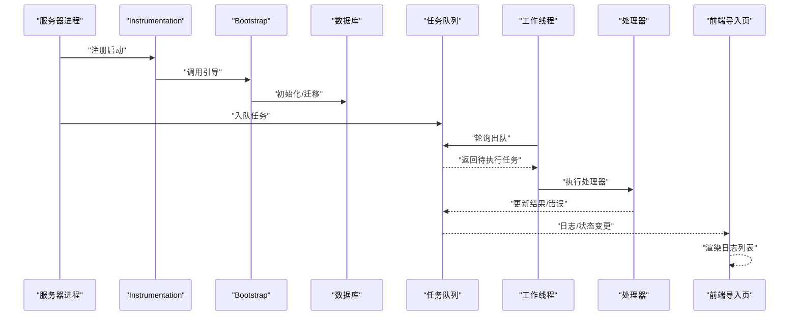
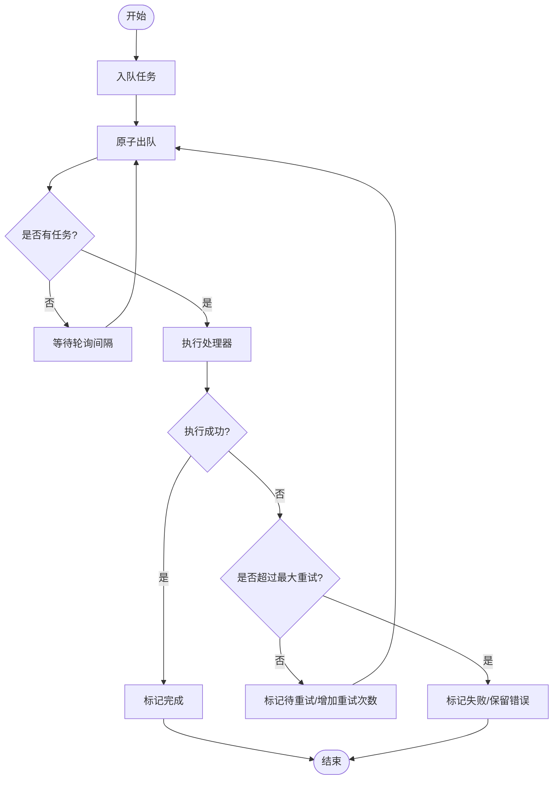
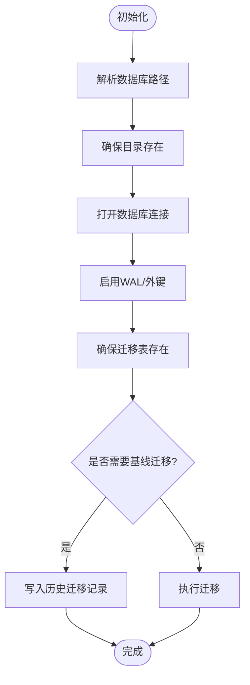
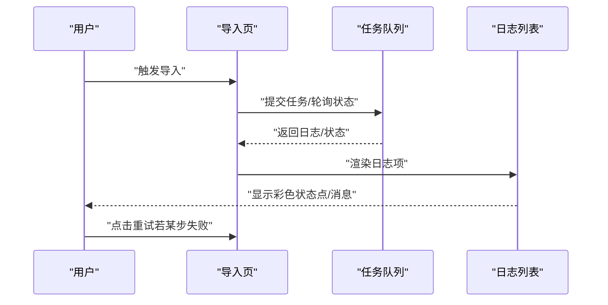
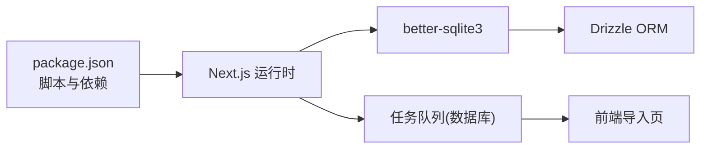

# 监控与日志

<cite>
**本文引用的文件**   
- [src/instrumentation.ts](file://src/instrumentation.ts)
- [package.json](file://package.json)
- [drizzle.config.ts](file://drizzle.config.ts)
- [src/lib/db/index.ts](file://src/lib/db/index.ts)
- [src/lib/task-queue/queue.ts](file://src/lib/task-queue/queue.ts)
- [src/lib/task-queue/worker.ts](file://src/lib/task-queue/worker.ts)
- [src/lib/task-queue/index.ts](file://src/lib/task-queue/index.ts)
- [src/app/[locale]/project/[id]/import/page.tsx](file://src/app/[locale]/project/[id]/import/page.tsx)
- [src/components/editor/emotion-curve.tsx](file://src/components/editor/emotion-curve.tsx)
</cite>

## 目录
1. [简介](#简介)
2. [项目结构](#项目结构)
3. [核心组件](#核心组件)
4. [架构总览](#架构总览)
5. [详细组件分析](#详细组件分析)
6. [依赖关系分析](#依赖关系分析)
7. [性能考量](#性能考量)
8. [故障排查指南](#故障排查指南)
9. [结论](#结论)
10. [附录](#附录)

## 简介
本指南面向 AIComicBuilder 的监控与日志管理，聚焦以下目标：
- 应用性能监控（APM）配置建议与关键指标采集
- 日志级别管理、日志轮转与存储策略
- 错误追踪、异常监控与用户体验分析
- 监控仪表板配置、性能瓶颈识别与容量预警机制
- 日志聚合、搜索与分析工具集成思路

当前仓库未内置专用的 APM 或日志库依赖；本指南基于现有代码结构与运行时环境，给出可落地的实践方案与最佳实践。

## 项目结构
与监控和日志密切相关的模块包括：
- 启动与注册：Next.js Instrumentation 注册入口
- 数据层：SQLite/Drizzle ORM 配置与迁移
- 任务队列：异步任务入队、出队、执行与失败重试
- 前端展示：导入流程中的日志可视化与状态提示
- 可视化组件：情感曲线等前端性能与体验指标的可视化基础

图表来源
- [src/instrumentation.ts:1-8](file://src/instrumentation.ts#L1-L8)
- [src/lib/db/index.ts:1-186](file://src/lib/db/index.ts#L1-L186)
- [src/lib/task-queue/queue.ts:1-100](file://src/lib/task-queue/queue.ts#L1-L100)
- [src/lib/task-queue/worker.ts:1-56](file://src/lib/task-queue/worker.ts#L1-L56)
- [src/app/[locale]/project/[id]/import/page.tsx:657-693](file://src/app/[locale]/project/[id]/import/page.tsx#L657-L693)

章节来源
- [src/instrumentation.ts:1-8](file://src/instrumentation.ts#L1-L8)
- [drizzle.config.ts:1-11](file://drizzle.config.ts#L1-L11)
- [src/lib/db/index.ts:1-186](file://src/lib/db/index.ts#L1-L186)

## 核心组件
- 启动注册与引导
  - 通过 Instrumentation 在 Node 运行时加载引导逻辑，确保数据库与任务队列在服务启动时初始化。
- 数据库与迁移
  - 使用 Drizzle ORM + better-sqlite3，支持迁移与模式校验，生产环境建议开启 WAL 模式以提升并发写入性能。
- 任务队列与工作线程
  - 提供原子化出队、重试上限、成功/失败状态更新，配合轮询工作线程实现后台任务处理。
- 前端日志展示
  - 导入页面提供步骤级日志列表，按状态高亮显示，支持失败步骤重试按钮。

章节来源
- [src/instrumentation.ts:1-8](file://src/instrumentation.ts#L1-L8)
- [src/lib/db/index.ts:1-186](file://src/lib/db/index.ts#L1-L186)
- [src/lib/task-queue/queue.ts:1-100](file://src/lib/task-queue/queue.ts#L1-L100)
- [src/lib/task-queue/worker.ts:1-56](file://src/lib/task-queue/worker.ts#L1-L56)
- [src/app/[locale]/project/[id]/import/page.tsx:657-693](file://src/app/[locale]/project/[id]/import/page.tsx#L657-L693)

## 架构总览
下图展示了从启动到任务执行与日志呈现的整体流程：

图表来源
- [src/instrumentation.ts:1-8](file://src/instrumentation.ts#L1-L8)
- [src/lib/db/index.ts:156-172](file://src/lib/db/index.ts#L156-L172)
- [src/lib/task-queue/queue.ts:31-50](file://src/lib/task-queue/queue.ts#L31-L50)
- [src/lib/task-queue/worker.ts:29-44](file://src/lib/task-queue/worker.ts#L29-L44)
- [src/app/[locale]/project/[id]/import/page.tsx:657-693](file://src/app/[locale]/project/[id]/import/page.tsx#L657-L693)

## 详细组件分析

### 组件A：任务队列与工作线程
- 设计要点
  - 出队采用原子 UPDATE 查询，避免竞态条件，优先调度最早创建且满足定时条件的任务。
  - 失败重试遵循最大重试次数阈值，超过则标记失败并保留错误信息。
  - 工作线程以固定轮询间隔扫描队列，异常被捕获并记录到控制台。
- 关键数据流
  - 入队 → 出队 → 执行 → 成功/失败更新 → 前端日志刷新
- 性能与可靠性
  - 轮询间隔可调，平衡吞吐与延迟；建议结合数据库索引优化查询。
  - 失败任务应纳入告警与人工干预流程。

图表来源
- [src/lib/task-queue/queue.ts:31-92](file://src/lib/task-queue/queue.ts#L31-L92)
- [src/lib/task-queue/worker.ts:29-44](file://src/lib/task-queue/worker.ts#L29-L44)

章节来源
- [src/lib/task-queue/queue.ts:1-100](file://src/lib/task-queue/queue.ts#L1-L100)
- [src/lib/task-queue/worker.ts:1-56](file://src/lib/task-queue/worker.ts#L1-L56)
- [src/lib/task-queue/index.ts:1-3](file://src/lib/task-queue/index.ts#L1-L3)

### 组件B：数据库初始化与迁移
- 设计要点
  - 动态解析 DATABASE_URL，支持本地文件数据库路径；首次访问自动创建目录。
  - 生产环境启用 WAL 模式与外键约束，提升并发与一致性。
  - 支持“基线迁移”与标准迁移流程，兼容已有 schema。
- 关键数据流
  - 初始化 → 确保迁移表 → 判断是否基线 → 执行迁移
- 性能与可靠性
  - WAL 模式适合高并发写入场景；建议定期备份数据库文件。
  - 迁移失败需人工介入，避免破坏现有数据。

图表来源
- [src/lib/db/index.ts:18-44](file://src/lib/db/index.ts#L18-L44)
- [src/lib/db/index.ts:81-172](file://src/lib/db/index.ts#L81-L172)
- [drizzle.config.ts:1-11](file://drizzle.config.ts#L1-L11)

章节来源
- [src/lib/db/index.ts:1-186](file://src/lib/db/index.ts#L1-L186)
- [drizzle.config.ts:1-11](file://drizzle.config.ts#L1-L11)

### 组件C：前端日志面板（导入页）
- 设计要点
  - 展示步骤级日志，按状态（进行中/完成/错误）使用不同颜色标识。
  - 当任一步骤失败时显示重试按钮，便于用户快速恢复。
- 用户体验
  - 自动滚动到底部，保证最新日志可见；错误消息高亮提醒。

图表来源
- [src/app/[locale]/project/[id]/import/page.tsx:657-693](file://src/app/[locale]/project/[id]/import/page.tsx#L657-L693)

章节来源
- [src/app/[locale]/project/[id]/import/page.tsx:657-693](file://src/app/[locale]/project/[id]/import/page.tsx#L657-L693)

### 组件D：可视化组件（情感曲线）
- 设计要点
  - 将紧张度与情感评分映射为折线图，支持前端性能与体验指标的直观展示。
- 性能与可用性
  - 使用 useMemo 缓存路径计算，减少不必要的重绘；在数据为空时优雅降级。

章节来源
- [src/components/editor/emotion-curve.tsx:1-127](file://src/components/editor/emotion-curve.tsx#L1-L127)

## 依赖关系分析
- 运行时与脚本
  - 项目使用 Next.js 作为框架，提供开发/构建/启动脚本；未内置 APM 或日志库。
- 数据库与迁移
  - 依赖 better-sqlite3 与 drizzle-orm，支持 SQLite 文件数据库与迁移。
- 任务队列
  - 无外部消息队列依赖，使用数据库表模拟队列，适合中小规模任务。

图表来源
- [package.json:1-60](file://package.json#L1-L60)
- [src/lib/db/index.ts:1-186](file://src/lib/db/index.ts#L1-L186)
- [src/lib/task-queue/queue.ts:1-100](file://src/lib/task-queue/queue.ts#L1-L100)
- [src/app/[locale]/project/[id]/import/page.tsx:657-693](file://src/app/[locale]/project/[id]/import/page.tsx#L657-L693)

章节来源
- [package.json:1-60](file://package.json#L1-L60)
- [src/lib/db/index.ts:1-186](file://src/lib/db/index.ts#L1-L186)
- [src/lib/task-queue/queue.ts:1-100](file://src/lib/task-queue/queue.ts#L1-L100)

## 性能考量
- 数据库性能
  - 启用 WAL 模式与外键约束，适合高并发写入；建议对常用查询字段建立索引（如任务表的状态、创建时间、定时时间）。
  - 定期备份数据库文件，避免单点故障。
- 任务队列性能
  - 轮询间隔（默认 2 秒）可根据任务量调整；过短会增加数据库压力，过长会增加延迟。
  - 失败重试策略需结合业务容忍度设置最大重试次数与退避策略。
- 前端渲染
  - 对日志列表使用虚拟滚动或分页，避免大量 DOM 节点导致卡顿。
  - 可视化组件使用缓存与最小重绘策略，降低 CPU 占用。

## 故障排查指南
- 控制台日志
  - 工作线程轮询异常会在控制台输出错误信息，便于定位问题。
- 任务失败
  - 检查任务表的错误字段与重试次数，确认是否达到最大重试阈值。
  - 若为处理器缺失，确认已注册对应类型的任务处理器。
- 数据库迁移
  - 若出现迁移不一致，检查迁移表与现有表结构；必要时执行基线迁移或回滚修复。
- 前端日志
  - 若日志不刷新，检查导入页的轮询与状态更新逻辑；确认网络请求与后端接口正常。

章节来源
- [src/lib/task-queue/worker.ts:38-38](file://src/lib/task-queue/worker.ts#L38-L38)
- [src/lib/task-queue/queue.ts:62-92](file://src/lib/task-queue/queue.ts#L62-L92)
- [src/lib/db/index.ts:156-172](file://src/lib/db/index.ts#L156-L172)
- [src/app/[locale]/project/[id]/import/page.tsx:657-693](file://src/app/[locale]/project/[id]/import/page.tsx#L657-L693)

## 结论
- 当前系统以数据库为核心承载监控与日志能力：任务状态、错误信息、迁移记录均可沉淀至 SQLite。
- 建议在现有基础上扩展：
  - 引入轻量 APM（如 OpenTelemetry Node SDK）采集关键链路指标与分布式追踪
  - 集成日志聚合（如 Loki + Promtail）与可视化（Grafana），将控制台与数据库日志统一接入
  - 增设告警规则（如任务失败率、队列积压、数据库慢查询、响应时间阈值）
  - 为前端埋点与用户行为分析提供标准化事件上报通道
- 通过上述措施，可实现从基础设施到业务指标的全栈可观测性闭环。

## 附录
- 监控仪表板建议
  - 任务队列看板：入队速率、出队速率、积压时长、失败率、重试次数分布
  - 数据库看板：连接数、事务耗时、慢查询、WAL 写入量
  - 前端看板：页面加载时间、交互延迟、错误占比、用户操作序列
- 告警策略示例
  - 任务失败率连续 5 分钟超过阈值
  - 队列积压超过预设分钟数
  - 数据库慢查询占比上升
  - 前端错误率突增或特定错误占比异常
- 日志管理
  - 控制台日志：INFO/ERROR 等级分离，关键路径打点
  - 文件轮转：按大小/时间轮转，保留最近 N 天
  - 存储策略：短期本地归档 + 长期对象存储归档
- 日志聚合与分析
  - 使用结构化 JSON 日志，便于检索与统计
  - 与 SIEM/日志平台对接，实现集中检索与关联分析