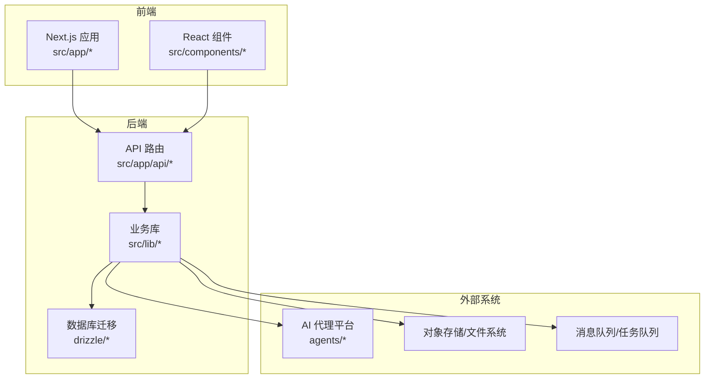
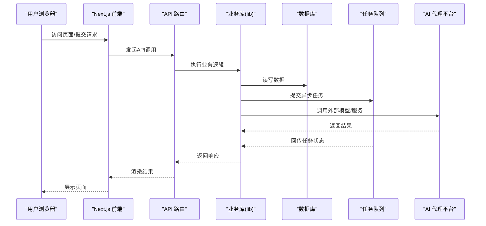
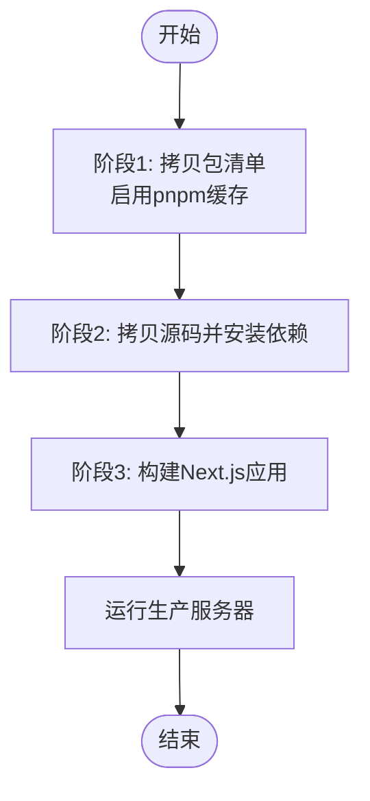
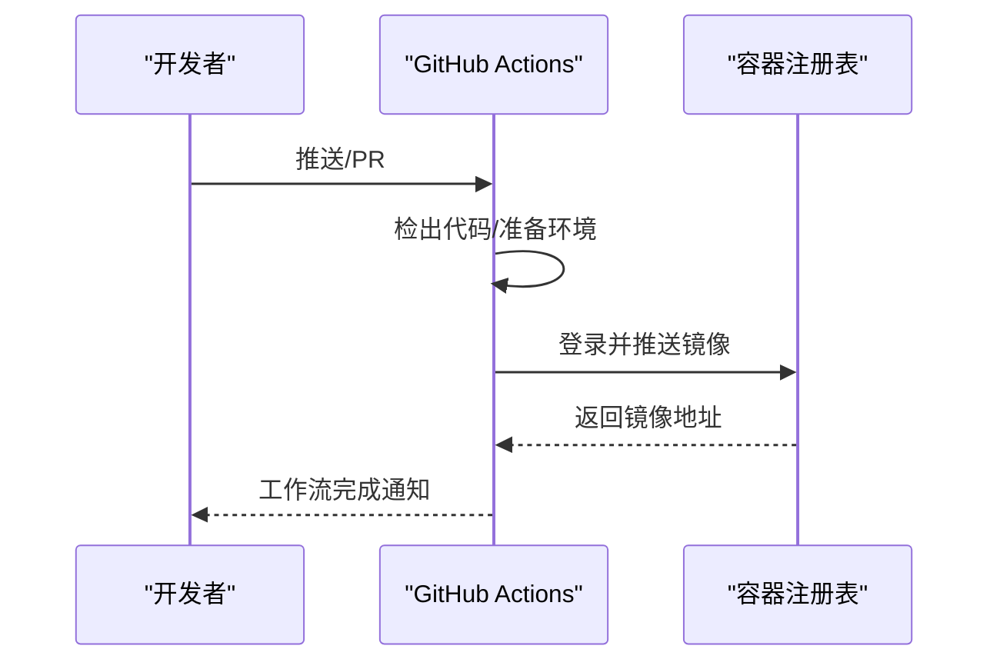
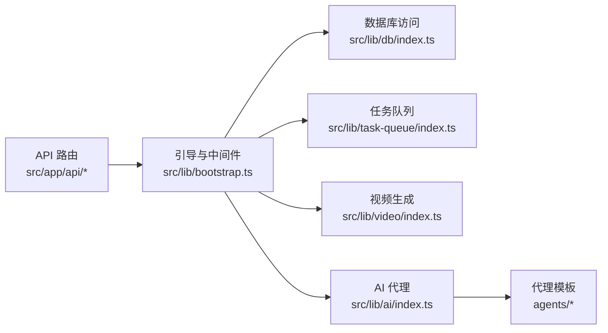
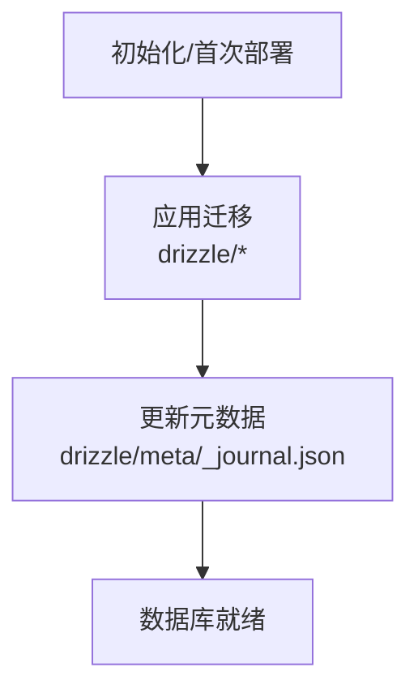
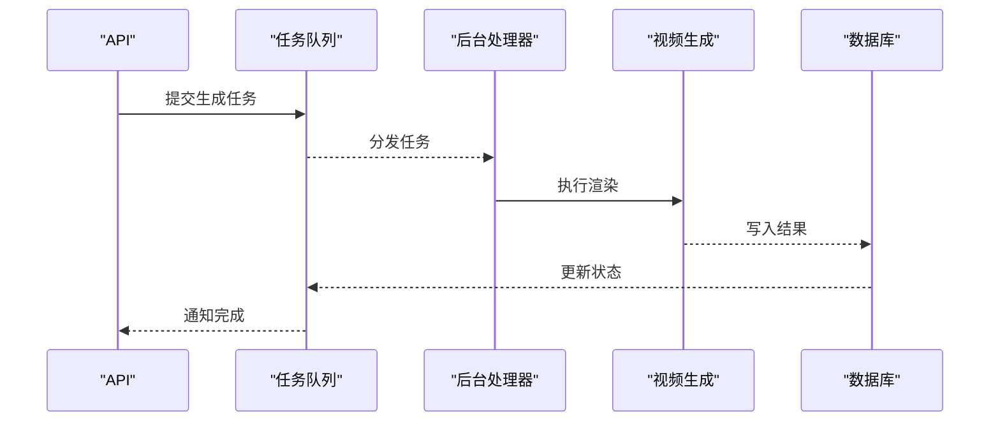
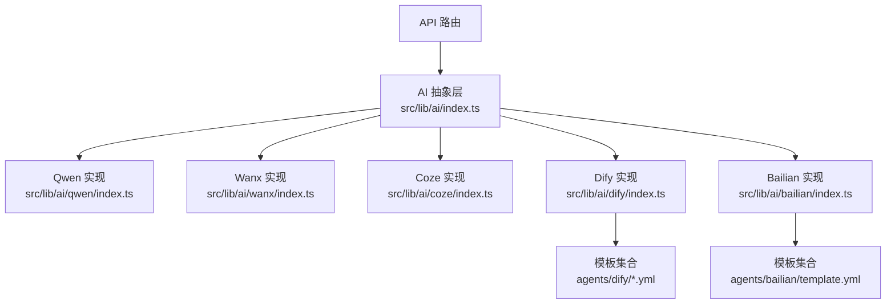
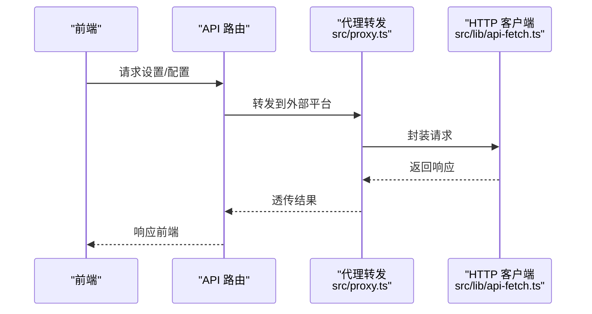
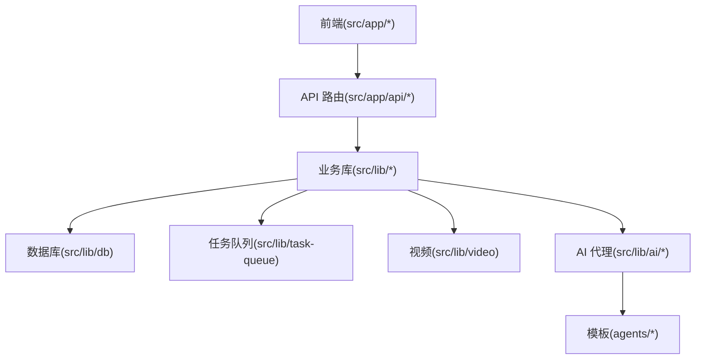

# 部署运维

<cite>
**本文引用的文件**
- [Dockerfile](file://Dockerfile)
- [.dockerignore](file://.dockerignore)
- [.github/workflows/docker-publish.yml](file://.github/workflows/docker-publish.yml)
- [package.json](file://package.json)
- [src/app/api/route.ts](file://src/app/api/route.ts)
- [src/lib/bootstrap.ts](file://src/lib/bootstrap.ts)
- [src/instrumentation.ts](file://src/instrumentation.ts)
- [drizzle.config.ts](file://drizzle.config.ts)
- [drizzle/meta/_journal.json](file://drizzle/meta/_journal.json)
- [drizzle/0000_chemical_tyrannus.sql](file://drizzle/0000_chemical_tyrannus.sql)
- [src/lib/task-queue/index.ts](file://src/lib/task-queue/index.ts)
- [src/lib/utils.ts](file://src/lib/utils.ts)
- [src/proxy.ts](file://src/proxy.ts)
- [src/lib/db/index.ts](file://src/lib/db/index.ts)
- [src/lib/pipeline/index.ts](file://src/lib/pipeline/index.ts)
- [src/lib/video/index.ts](file://src/lib/video/index.ts)
- [src/lib/ai/index.ts](file://src/lib/ai/index.ts)
- [src/lib/import-utils.ts](file://src/lib/import-utils.ts)
- [src/lib/ref-image-utils.ts](file://src/lib/ref-image-utils.ts)
- [src/lib/shot-asset-utils.ts](file://src/lib/shot-asset-utils.ts)
- [src/lib/staleness.ts](file://src/lib/staleness.ts)
- [src/hooks/use-model-guard.ts](file://src/hooks/use-model-guard.ts)
- [src/lib/get-user-id.ts](file://src/lib/get-user-id.ts)
- [src/lib/fingerprint.ts](file://src/lib/fingerprint.ts)
- [src/lib/api-fetch.ts](file://src/lib/api-fetch.ts)
- [src/lib/assert-project-ownership.ts](file://src/lib/assert-project-ownership.ts)
- [src/lib/id.ts](file://src/lib/id.ts)
- [src/lib/prompt-templates/index.ts](file://src/lib/prompt-templates/index.ts)
- [src/lib/stores/index.ts](file://src/lib/stores/index.ts)
- [src/lib/stores/agent-store.ts](file://src/lib/stores/agent-store.ts)
- [src/lib/stores/episode-store.ts](file://src/lib/stores/episode-store.ts)
- [src/lib/stores/project-store.ts](file://src/lib/stores/project-store.ts)
- [src/lib/stores/prompt-template-store.ts](file://src/lib/stores/prompt-template-store.ts)
- [src/components/settings/provider-section.tsx](file://src/components/settings/provider-section.tsx)
- [src/components/settings/provider-form.tsx](file://src/components/settings/provider-form.tsx)
- [src/components/settings/agent-section.tsx](file://src/components/settings/agent-section.tsx)
- [src/components/settings/default-model-picker.tsx](file://src/components/settings/default-model-picker.tsx)
- [src/lib/ai/qwen/index.ts](file://src/lib/ai/qwen/index.ts)
- [src/lib/ai/wanx/index.ts](file://src/lib/ai/wanx/index.ts)
- [src/lib/ai/coze/index.ts](file://src/lib/ai/coze/index.ts)
- [src/lib/ai/dify/index.ts](file://src/lib/ai/dify/index.ts)
- [src/lib/ai/bailian/index.ts](file://src/lib/ai/bailian/index.ts)
- [agents/bailian/template.yml](file://agents/bailian/template.yml)
- [agents/dify/script-generate.dify.yml](file://agents/dify/script-generate.dify.yml)
- [agents/dify/shot-split.dify.yml](file://agents/dify/shot-split.dify.yml)
- [agents/dify/character-extract.dify.yml](file://agents/dify/character-extract.dify.yml)
- [agents/dify/keyframe-prompts.dify.yml](file://agents/dify/keyframe-prompts.dify.yml)
- [agents/dify/ref-image-prompts.dify.yml](file://agents/dify/ref-image-prompts.dify.yml)
- [agents/dify/ref-video-prompts.dify.yml](file://agents/dify/ref-video-prompts.dify.yml)
- [agents/dify/script-parse.dify.yml](file://agents/dify/script-parse.dify.yml)
- [agents/dify/script-outline.dify.yml](file://agents/dify/script-outline.dify.yml)
- [agents/dify/video-prompts.dify.yml](file://agents/dify/video-prompts.dify.yml)
</cite>

## 目录
1. [简介](#简介)
2. [项目结构](#项目结构)
3. [核心组件](#核心组件)
4. [架构总览](#架构总览)
5. [详细组件分析](#详细组件分析)
6. [依赖关系分析](#依赖关系分析)
7. [性能考量](#性能考量)
8. [故障排查指南](#故障排查指南)
9. [结论](#结论)
10. [附录](#附录)

## 简介
本指南面向AIComicBuilder的部署与运维团队，覆盖容器化部署、CI/CD流水线、生产环境配置、服务编排、环境变量管理、监控与日志、性能调优、备份恢复、安全加固、故障处理、自动化脚本与运维工具、以及扩展性与高可用设计建议。文档基于仓库中现有的Dockerfile、GitHub Actions工作流、Next.js应用入口、数据库迁移与配置、任务队列、视频生成管线、AI代理集成等关键文件进行梳理与落地。

## 项目结构
AIComicBuilder采用Next.js 14 App Router架构，后端API通过App Router的路由模块提供REST接口；前端页面与组件位于src/app与src/components；业务逻辑集中在src/lib（数据库、任务队列、视频生成、AI代理、导入导出等）；数据库迁移与配置位于drizzle目录；AI代理模板位于agents目录；容器化与CI/CD由Dockerfile与GitHub Actions工作流支撑。

图表来源
- [Dockerfile](file://Dockerfile)
- [.github/workflows/docker-publish.yml](file://.github/workflows/docker-publish.yml)
- [src/app/api/route.ts](file://src/app/api/route.ts)
- [src/lib/bootstrap.ts](file://src/lib/bootstrap.ts)
- [drizzle.config.ts](file://drizzle.config.ts)

章节来源
- [Dockerfile](file://Dockerfile)
- [.github/workflows/docker-publish.yml](file://.github/workflows/docker-publish.yml)
- [src/app/api/route.ts](file://src/app/api/route.ts)
- [src/lib/bootstrap.ts](file://src/lib/bootstrap.ts)
- [drizzle.config.ts](file://drizzle.config.ts)

## 核心组件
- 容器镜像与打包：基于Dockerfile定义的多阶段构建，COPY package.json与pnpm-lock.yaml以启用缓存优化，COPY源码后执行安装与构建，最终运行Next.js生产服务器。
- CI/CD流水线：GitHub Actions工作流在推送或PR时触发，构建并发布容器镜像到注册表。
- 数据库与迁移：Drizzle ORM配置与SQL迁移文件，支持版本化数据库演进。
- 任务队列与视频生成：src/lib/task-queue与src/lib/video负责异步任务与视频渲染。
- AI代理集成：agents目录下各平台模板（如Dify、Coze、Bailian），配合src/lib/ai/*实现统一调用。
- API网关与代理：src/proxy.ts用于转发与代理请求，src/lib/api-fetch.ts封装HTTP客户端。
- 前端路由与仪表盘：src/app/*提供项目管理、角色、剧集、分镜、脚本、预览等功能页面。

章节来源
- [Dockerfile](file://Dockerfile)
- [.github/workflows/docker-publish.yml](file://.github/workflows/docker-publish.yml)
- [drizzle.config.ts](file://drizzle.config.ts)
- [src/lib/task-queue/index.ts](file://src/lib/task-queue/index.ts)
- [src/lib/video/index.ts](file://src/lib/video/index.ts)
- [src/lib/ai/index.ts](file://src/lib/ai/index.ts)
- [src/proxy.ts](file://src/proxy.ts)
- [src/lib/api-fetch.ts](file://src/lib/api-fetch.ts)
- [src/app/api/route.ts](file://src/app/api/route.ts)

## 架构总览
下图展示从浏览器到API、数据库、任务队列与AI代理的整体调用链路，以及容器化与CI/CD的集成点。

图表来源
- [src/app/api/route.ts](file://src/app/api/route.ts)
- [src/lib/bootstrap.ts](file://src/lib/bootstrap.ts)
- [src/lib/db/index.ts](file://src/lib/db/index.ts)
- [src/lib/task-queue/index.ts](file://src/lib/task-queue/index.ts)
- [src/lib/ai/index.ts](file://src/lib/ai/index.ts)

## 详细组件分析

### 容器镜像构建与发布
- 多阶段构建：第一阶段复制包清单以利用缓存，第二阶段复制源码并安装依赖，第三阶段构建Next.js应用，最终以最小化镜像运行生产服务器。
- 缓存策略：COPY package.json与pnpm-lock.yaml在前，避免不必要的重装。
- 运行时：使用Next.js生产模式启动，监听环境变量指定的端口与主机地址。
- 发布流程：GitHub Actions工作流在分支推送时构建镜像并推送到注册表。

图表来源
- [Dockerfile](file://Dockerfile)

章节来源
- [Dockerfile](file://Dockerfile)
- [.github/workflows/docker-publish.yml](file://.github/workflows/docker-publish.yml)

### CI/CD流水线配置
- 触发条件：分支推送或拉取请求。
- 步骤概览：检出代码、设置QEMU与Buildx、登录注册表、构建并推送镜像。
- 版本标签：使用短提交哈希作为镜像标签，便于追踪。

图表来源
- [.github/workflows/docker-publish.yml](file://.github/workflows/docker-publish.yml)

章节来源
- [.github/workflows/docker-publish.yml](file://.github/workflows/docker-publish.yml)

### 生产环境设置与环境变量
- Next.js运行参数：通过环境变量控制主机与端口，结合容器入口命令或Dockerfile ENV/EXPOSE。
- 数据库连接：Drizzle配置文件与迁移文件定义数据库连接与版本控制。
- AI代理密钥：agents模板与src/lib/ai/*中使用平台密钥与API端点，需通过环境变量注入。
- 文件存储：上传与生成的媒体资源可配置至对象存储或本地卷挂载。

章节来源
- [Dockerfile](file://Dockerfile)
- [drizzle.config.ts](file://drizzle.config.ts)
- [src/lib/ai/index.ts](file://src/lib/ai/index.ts)
- [agents/bailian/template.yml](file://agents/bailian/template.yml)
- [agents/dify/script-generate.dify.yml](file://agents/dify/script-generate.dify.yml)

### 服务编排与依赖
- API路由：src/app/api/*提供REST接口，统一由API路由模块处理。
- 业务库：src/lib/*封装数据库、任务队列、视频生成、AI代理、导入导出等能力。
- 代理与模板：agents/*提供各平台提示词模板，src/lib/ai/*统一封装调用。
- 前端仪表盘：src/app/*提供项目管理、角色、剧集、分镜、脚本、预览等页面。

图表来源
- [src/app/api/route.ts](file://src/app/api/route.ts)
- [src/lib/bootstrap.ts](file://src/lib/bootstrap.ts)
- [src/lib/db/index.ts](file://src/lib/db/index.ts)
- [src/lib/task-queue/index.ts](file://src/lib/task-queue/index.ts)
- [src/lib/video/index.ts](file://src/lib/video/index.ts)
- [src/lib/ai/index.ts](file://src/lib/ai/index.ts)
- [agents/bailian/template.yml](file://agents/bailian/template.yml)

章节来源
- [src/app/api/route.ts](file://src/app/api/route.ts)
- [src/lib/bootstrap.ts](file://src/lib/bootstrap.ts)
- [src/lib/db/index.ts](file://src/lib/db/index.ts)
- [src/lib/task-queue/index.ts](file://src/lib/task-queue/index.ts)
- [src/lib/video/index.ts](file://src/lib/video/index.ts)
- [src/lib/ai/index.ts](file://src/lib/ai/index.ts)
- [agents/bailian/template.yml](file://agents/bailian/template.yml)

### 数据库与迁移
- Drizzle配置：drizzle.config.ts定义数据库连接、Schema输出与迁移策略。
- 迁移文件：drizzle/*包含SQL迁移与元数据，支持版本化演进。
- 元数据：drizzle/meta/_journal.json记录已应用迁移的顺序与校验。

图表来源
- [drizzle.config.ts](file://drizzle.config.ts)
- [drizzle/meta/_journal.json](file://drizzle/meta/_journal.json)
- [drizzle/0000_chemical_tyrannus.sql](file://drizzle/0000_chemical_tyrannus.sql)

章节来源
- [drizzle.config.ts](file://drizzle.config.ts)
- [drizzle/meta/_journal.json](file://drizzle/meta/_journal.json)
- [drizzle/0000_chemical_tyrannus.sql](file://drizzle/0000_chemical_tyrannus.sql)

### 任务队列与视频生成
- 任务队列：src/lib/task-queue/index.ts负责任务提交、轮询与状态回传。
- 视频生成：src/lib/video/index.ts封装渲染流程，与任务队列协同。
- 异步处理：API层提交任务，后台进程消费队列，完成后回调或持久化结果。

图表来源
- [src/lib/task-queue/index.ts](file://src/lib/task-queue/index.ts)
- [src/lib/video/index.ts](file://src/lib/video/index.ts)

章节来源
- [src/lib/task-queue/index.ts](file://src/lib/task-queue/index.ts)
- [src/lib/video/index.ts](file://src/lib/video/index.ts)

### AI代理集成与提示词模板
- 代理抽象：src/lib/ai/index.ts统一管理各平台（如Qwen、Wanx、Coze、Dify、Bailian）。
- 模板管理：agents/*提供各平台的提示词模板，按功能拆分（如脚本生成、分镜拆分、角色提取等）。
- 调用流程：API层根据配置选择代理与模板，调用对应SDK或HTTP接口，返回结果并持久化。

图表来源
- [src/lib/ai/index.ts](file://src/lib/ai/index.ts)
- [src/lib/ai/qwen/index.ts](file://src/lib/ai/qwen/index.ts)
- [src/lib/ai/wanx/index.ts](file://src/lib/ai/wanx/index.ts)
- [src/lib/ai/coze/index.ts](file://src/lib/ai/coze/index.ts)
- [src/lib/ai/dify/index.ts](file://src/lib/ai/dify/index.ts)
- [src/lib/ai/bailian/index.ts](file://src/lib/ai/bailian/index.ts)
- [agents/dify/script-generate.dify.yml](file://agents/dify/script-generate.dify.yml)
- [agents/bailian/template.yml](file://agents/bailian/template.yml)

章节来源
- [src/lib/ai/index.ts](file://src/lib/ai/index.ts)
- [agents/dify/script-generate.dify.yml](file://agents/dify/script-generate.dify.yml)
- [agents/dify/shot-split.dify.yml](file://agents/dify/shot-split.dify.yml)
- [agents/dify/character-extract.dify.yml](file://agents/dify/character-extract.dify.yml)
- [agents/dify/keyframe-prompts.dify.yml](file://agents/dify/keyframe-prompts.dify.yml)
- [agents/dify/ref-image-prompts.dify.yml](file://agents/dify/ref-image-prompts.dify.yml)
- [agents/dify/ref-video-prompts.dify.yml](file://agents/dify/ref-video-prompts.dify.yml)
- [agents/dify/script-parse.dify.yml](file://agents/dify/script-parse.dify.yml)
- [agents/dify/script-outline.dify.yml](file://agents/dify/script-outline.dify.yml)
- [agents/dify/video-prompts.dify.yml](file://agents/dify/video-prompts.dify.yml)
- [agents/bailian/template.yml](file://agents/bailian/template.yml)

### API与代理转发
- API路由：src/app/api/*提供REST接口，集中处理鉴权、校验与业务编排。
- 代理转发：src/proxy.ts用于跨域与平台间转发，src/lib/api-fetch.ts封装HTTP请求。
- 仪表盘与设置：src/components/settings/*提供Provider与Agent配置界面，配合API持久化。

图表来源
- [src/app/api/route.ts](file://src/app/api/route.ts)
- [src/proxy.ts](file://src/proxy.ts)
- [src/lib/api-fetch.ts](file://src/lib/api-fetch.ts)
- [src/components/settings/provider-section.tsx](file://src/components/settings/provider-section.tsx)
- [src/components/settings/provider-form.tsx](file://src/components/settings/provider-form.tsx)
- [src/components/settings/agent-section.tsx](file://src/components/settings/agent-section.tsx)
- [src/components/settings/default-model-picker.tsx](file://src/components/settings/default-model-picker.tsx)

章节来源
- [src/app/api/route.ts](file://src/app/api/route.ts)
- [src/proxy.ts](file://src/proxy.ts)
- [src/lib/api-fetch.ts](file://src/lib/api-fetch.ts)
- [src/components/settings/provider-section.tsx](file://src/components/settings/provider-section.tsx)
- [src/components/settings/provider-form.tsx](file://src/components/settings/provider-form.tsx)
- [src/components/settings/agent-section.tsx](file://src/components/settings/agent-section.tsx)
- [src/components/settings/default-model-picker.tsx](file://src/components/settings/default-model-picker.tsx)

## 依赖关系分析
- 组件耦合：API路由依赖业务库；业务库依赖数据库、任务队列、AI代理与外部存储；前端通过API与业务交互。
- 外部依赖：Next.js、Drizzle ORM、pnpm包管理、容器运行时与注册表。
- 可能的循环依赖：当前结构以API→业务库→底层模块单向依赖为主，未见明显循环。

图表来源
- [src/app/api/route.ts](file://src/app/api/route.ts)
- [src/lib/bootstrap.ts](file://src/lib/bootstrap.ts)
- [src/lib/db/index.ts](file://src/lib/db/index.ts)
- [src/lib/task-queue/index.ts](file://src/lib/task-queue/index.ts)
- [src/lib/video/index.ts](file://src/lib/video/index.ts)
- [src/lib/ai/index.ts](file://src/lib/ai/index.ts)
- [agents/bailian/template.yml](file://agents/bailian/template.yml)

章节来源
- [src/app/api/route.ts](file://src/app/api/route.ts)
- [src/lib/bootstrap.ts](file://src/lib/bootstrap.ts)
- [src/lib/db/index.ts](file://src/lib/db/index.ts)
- [src/lib/task-queue/index.ts](file://src/lib/task-queue/index.ts)
- [src/lib/video/index.ts](file://src/lib/video/index.ts)
- [src/lib/ai/index.ts](file://src/lib/ai/index.ts)
- [agents/bailian/template.yml](file://agents/bailian/template.yml)

## 性能考量
- 构建缓存：Dockerfile中先COPY包清单再COPY源码，提升pnpm安装缓存命中率。
- 运行时优化：使用Next.js生产模式，合理设置并发与内存上限。
- 数据库：Drizzle配置与迁移文件确保Schema一致性，避免运行期DDL风暴。
- 任务队列：异步化长耗时操作（如视频渲染），降低请求延迟。
- AI调用：对高频请求进行限流与缓存，避免代理平台限流。
- 存储：大文件走对象存储，减少容器卷压力。

章节来源
- [Dockerfile](file://Dockerfile)
- [drizzle.config.ts](file://drizzle.config.ts)
- [src/lib/task-queue/index.ts](file://src/lib/task-queue/index.ts)
- [src/lib/ai/index.ts](file://src/lib/ai/index.ts)

## 故障排查指南
- 启动失败：检查容器日志与端口映射，确认环境变量是否正确注入。
- 数据库异常：核对Drizzle配置与迁移是否成功应用，查看元数据文件。
- 任务积压：检查任务队列消费者状态与数据库连接，确认视频生成依赖的服务可用。
- AI代理错误：验证平台密钥与模板配置，查看代理SDK返回码与超时设置。
- API 5xx：定位具体API路由与业务库调用栈，结合日志定位异常点。
- 代理转发问题：检查src/proxy.ts与src/lib/api-fetch.ts的请求头与超时配置。

章节来源
- [src/lib/bootstrap.ts](file://src/lib/bootstrap.ts)
- [drizzle/meta/_journal.json](file://drizzle/meta/_journal.json)
- [src/lib/task-queue/index.ts](file://src/lib/task-queue/index.ts)
- [src/lib/ai/index.ts](file://src/lib/ai/index.ts)
- [src/proxy.ts](file://src/proxy.ts)
- [src/lib/api-fetch.ts](file://src/lib/api-fetch.ts)

## 结论
本指南基于仓库现有文件梳理了AIComicBuilder的容器化、CI/CD、数据库迁移、任务队列、AI代理与API架构，并提供了生产部署、监控日志、性能调优、备份恢复、安全加固与故障处理的实践建议。建议在实际生产中补充Kubernetes编排、健康检查、自动扩缩容与蓝绿发布策略，以进一步提升可用性与可观测性。

## 附录
- 自动化部署脚本与运维工具：可基于Dockerfile与GitHub Actions工作流扩展为GitOps流水线，结合kubectl/kustomize/helm进行声明式部署。
- 扩展性与高可用：引入负载均衡、多副本部署、持久化存储、数据库主从/集群、消息队列集群与分布式锁，保障水平扩展与故障隔离。
- 安全加固：限制容器权限、启用只读根文件系统、配置网络策略、密钥管理与轮换、TLS终止与WAF接入。
- 备份恢复：定期备份数据库迁移产物与对象存储内容，制定RTO/RPO目标与演练计划。