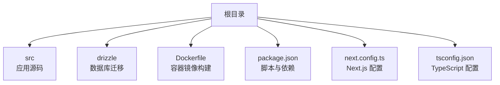
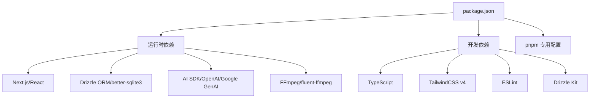

# 快速开始

<cite>
**本文引用的文件**
- [package.json](file://package.json)
- [Dockerfile](file://Dockerfile)
- [drizzle.config.ts](file://drizzle.config.ts)
- [next.config.ts](file://next.config.ts)
- [tsconfig.json](file://tsconfig.json)
</cite>

## 目录
1. [简介](#简介)
2. [项目结构](#项目结构)
3. [核心组件](#核心组件)
4. [架构总览](#架构总览)
5. [详细组件分析](#详细组件分析)
6. [依赖分析](#依赖分析)
7. [性能考虑](#性能考虑)
8. [故障排除指南](#故障排除指南)
9. [结论](#结论)
10. [附录](#附录)

## 简介
本指南面向首次接触 AIComicBuilder 的开发者与运维人员，帮助你在本地或容器环境中快速完成环境准备、依赖安装、数据库初始化与首次运行，并提供常见问题排查建议。项目基于 Next.js 16.1.6 构建，采用 Drizzle ORM 进行 SQLite 数据库迁移与访问，支持通过 pnpm 安装依赖并在容器中一键构建与运行。

## 项目结构
- 应用主体位于 src 目录，包含页面路由、API 路由、组件与工具库。
- 数据库迁移脚本位于 drizzle 目录，配置文件为 drizzle.config.ts。
- 构建与运行配置集中在根目录的 package.json、Dockerfile、next.config.ts、tsconfig.json 中。
- 项目默认使用 pnpm 作为包管理器，且在 Docker 镜像中通过 corepack 启用并激活 pnpm。

**章节来源**
- [package.json:1-60](file://package.json#L1-L60)
- [Dockerfile:1-41](file://Dockerfile#L1-L41)
- [drizzle.config.ts:1-11](file://drizzle.config.ts#L1-L11)
- [next.config.ts:1-16](file://next.config.ts#L1-L16)
- [tsconfig.json:1-35](file://tsconfig.json#L1-L35)

## 核心组件
- 包管理与脚本：使用 pnpm，提供 dev/build/start/lint 等常用脚本。
- 数据库与迁移：Drizzle Kit 配置 schema 与输出目录，SQLite 作为默认数据库。
- 构建与运行：Next.js 输出模式为 standalone，便于容器化部署。
- TypeScript：严格类型检查与 bundler 模块解析，支持路径别名 @/*。

**章节来源**
- [package.json:5-10](file://package.json#L5-L10)
- [drizzle.config.ts:3-10](file://drizzle.config.ts#L3-L10)
- [next.config.ts:7-13](file://next.config.ts#L7-L13)
- [tsconfig.json:21-24](file://tsconfig.json#L21-L24)

## 架构总览
下图展示了从本地开发到容器部署的关键流程：本地安装依赖 → 构建应用 → 初始化数据库 → 运行服务；以及容器镜像构建时的多阶段流程与默认环境变量。

```mermaid
graph TB
subgraph "本地开发"
L1["安装依赖(pnpm)"] --> L2["构建应用(pnpm build)"]
L2 --> L3["初始化数据库(drizzle migrate)"]
L3 --> L4["启动服务(pnpm dev 或 pnpm start)"]
end
subgraph "容器构建(Docker)"
D1["基础镜像(node:20-alpine)"] --> D2["启用并激活 pnpm(corepack)"]
D2 --> D3["安装构建依赖与 ffmpeg 字体"]
D3 --> D4["复制锁文件并安装依赖(pnpm install)"]
D4 --> D5["复制源码并构建(pnpm build)"]
D5 --> D6["生产阶段拷贝静态资源与迁移脚本"]
D6 --> D7["设置默认环境变量(NODE_ENV/DATABASE_URL/UPLOAD_DIR)"]
D7 --> D8["暴露端口并启动(node server.js)"]
end
```

**图表来源**
- [Dockerfile:1-41](file://Dockerfile#L1-L41)
- [package.json:5-10](file://package.json#L5-L10)
- [drizzle.config.ts:3-10](file://drizzle.config.ts#L3-L10)

**章节来源**
- [Dockerfile:1-41](file://Dockerfile#L1-L41)
- [package.json:5-10](file://package.json#L5-L10)
- [drizzle.config.ts:3-10](file://drizzle.config.ts#L3-L10)

## 详细组件分析

### 环境与版本要求
- Node.js 版本：容器镜像使用 node:20-alpine，推荐在本地也使用 Node.js 20 运行时以保持一致性。
- 包管理器：pnpm，Dockerfile 中通过 corepack 启用并激活 pnpm。
- TypeScript：严格类型检查，模块解析采用 bundler，路径别名 @/* 指向 src。
- Next.js：输出模式为 standalone，便于独立运行。

**章节来源**
- [Dockerfile:1](file://Dockerfile#L1)
- [Dockerfile:4](file://Dockerfile#L4)
- [tsconfig.json:10-14](file://tsconfig.json#L10-L14)
- [tsconfig.json:21-24](file://tsconfig.json#L21-L24)
- [next.config.ts:7-13](file://next.config.ts#L7-L13)

### 依赖安装与本地开发
- 使用 pnpm 安装依赖，Dockerfile 在构建阶段会冻结 lockfile 并仅安装生产依赖。
- 本地开发可直接运行 dev 脚本启动 Next.js 开发服务器。
- 生产构建使用 build 脚本生成 standalone 输出，随后可用 start 启动。

**章节来源**
- [Dockerfile:13-14](file://Dockerfile#L13-L14)
- [Dockerfile:19](file://Dockerfile#L19)
- [package.json:5-10](file://package.json#L5-L10)

### 数据库初始化与迁移
- Drizzle 配置指定 schema 文件路径与输出目录，默认数据库 URL 可通过环境变量覆盖。
- 建议在首次运行前执行数据库迁移，确保表结构与最新迁移一致。
- 默认数据库文件位于项目内 data 目录（容器中为 /app/data/aicomic.db）。

**章节来源**
- [drizzle.config.ts:3-10](file://drizzle.config.ts#L3-L10)

### 环境变量与配置要点
- NODE_ENV：生产模式。
- NEXT_TELEMETRY_DISABLED：禁用 Telemetry。
- DATABASE_URL：数据库连接字符串，容器默认指向 SQLite 文件。
- UPLOAD_DIR：上传目录，容器默认为 /app/uploads。
- PORT/HOSTNAME：容器暴露端口与监听地址。

**章节来源**
- [Dockerfile:25-39](file://Dockerfile#L25-L39)

### 容器化部署流程
- 多阶段构建：基础镜像安装 pnpm 与 ffmpeg 字体；第二阶段安装构建依赖并构建；第三阶段生产运行，拷贝静态资源与迁移脚本。
- 运行时命令：node server.js，端口 3000。
- 建议：挂载持久卷至 /app/data 与 /app/uploads，以保留数据与上传内容。

**章节来源**
- [Dockerfile:1-41](file://Dockerfile#L1-L41)

## 依赖分析
- 运行时依赖：Next.js、React、Drizzle ORM、better-sqlite3、AI SDK（OpenAI/Google GenAI）、FFmpeg 工具链等。
- 开发依赖：TypeScript、TailwindCSS v4、ESLint、Drizzle Kit。
- pnpm 专用配置：onlyBuiltDependencies 指定需要预编译的原生依赖（如 better-sqlite3）。

**图表来源**
- [package.json:11-58](file://package.json#L11-L58)

**章节来源**
- [package.json:11-58](file://package.json#L11-L58)

## 性能考虑
- 使用 standalone 输出减少运行时外部依赖，提升容器部署效率。
- 严格类型检查与 bundler 模块解析有助于在构建期发现潜在问题。
- FFmpeg 与字幕渲染能力已在容器中预置，适合视频类工作流。

**章节来源**
- [next.config.ts:7-13](file://next.config.ts#L7-L13)
- [Dockerfile:6-7](file://Dockerfile#L6-L7)

## 故障排除指南
- pnpm 安装失败或原生依赖编译错误
  - 确认 Node.js 版本与镜像一致（推荐 20）。
  - 在容器中使用 frozen-lockfile 安装，避免版本漂移。
  - 如需本地安装，参考 pnpm.onlyBuiltDependencies 配置，确保原生依赖正确编译。
  - 参考来源：[package.json:41-45](file://package.json#L41-L45)，[Dockerfile:11-14](file://Dockerfile#L11-L14)
- 数据库无法连接或迁移失败
  - 检查 DATABASE_URL 是否正确（容器默认为 SQLite 文件路径）。
  - 首次运行前执行数据库迁移，确保 schema 与迁移脚本一致。
  - 参考来源：[Dockerfile:37](file://Dockerfile#L37)，[drizzle.config.ts:7-9](file://drizzle.config.ts#L7-L9)
- 上传或媒体处理异常
  - 确认 UPLOAD_DIR 权限与挂载路径（容器默认 /app/uploads）。
  - 确保 FFmpeg 已安装（容器已内置），若本地运行请确认系统环境。
  - 参考来源：[Dockerfile:6-7](file://Dockerfile#L6-L7)，[Dockerfile:38](file://Dockerfile#L38)
- 开发服务器端口占用
  - 修改 PORT 或关闭占用进程后重试。
  - 参考来源：[Dockerfile:35](file://Dockerfile#L35)
- 国际化与语言切换异常
  - 确认 next-intl 插件已正确加载，检查 i18n 请求处理器路径。
  - 参考来源：[next.config.ts:3](file://next.config.ts#L3)

## 结论
通过本指南，你可以在本地或容器环境中快速完成环境准备、依赖安装、数据库初始化与应用运行。建议在生产部署时使用容器镜像，并挂载持久卷以保存数据库与上传内容。遇到问题时，优先核对 Node.js/pnpm 版本、DATABASE_URL、UPLOAD_DIR 与端口占用情况。

## 附录

### 首次运行命令清单（本地）
- 安装依赖：使用 pnpm 安装项目依赖
- 构建应用：生成 Next.js standalone 输出
- 初始化数据库：执行数据库迁移
- 启动服务：开发模式或生产模式启动
- 访问应用：在浏览器打开默认端口

**章节来源**
- [package.json:5-10](file://package.json#L5-L10)
- [drizzle.config.ts:3-10](file://drizzle.config.ts#L3-L10)
- [Dockerfile:19](file://Dockerfile#L19)

### 首次运行命令清单（容器）
- 构建镜像：使用 Dockerfile 构建多阶段镜像
- 运行容器：暴露端口 3000，设置 DATABASE_URL 与 UPLOAD_DIR
- 初始化数据库：进入容器执行数据库迁移
- 访问应用：在浏览器打开容器映射端口

**章节来源**
- [Dockerfile:1-41](file://Dockerfile#L1-L41)