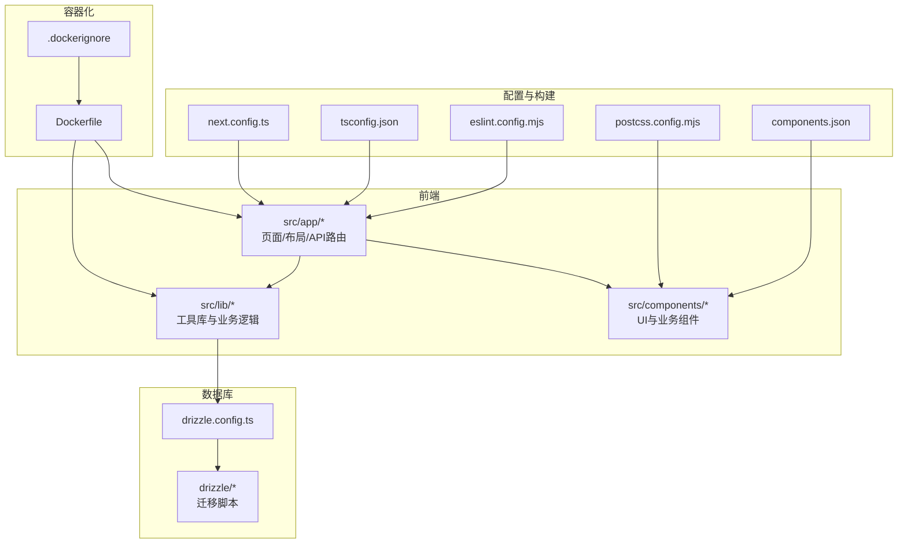
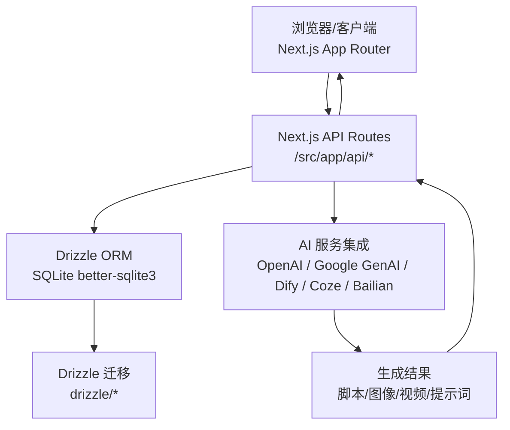
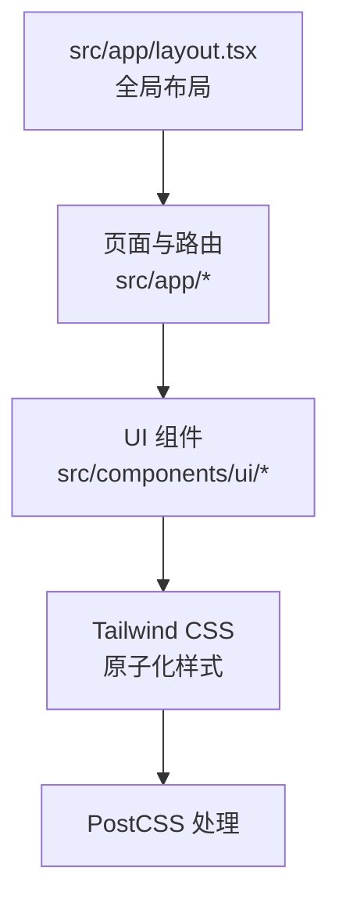
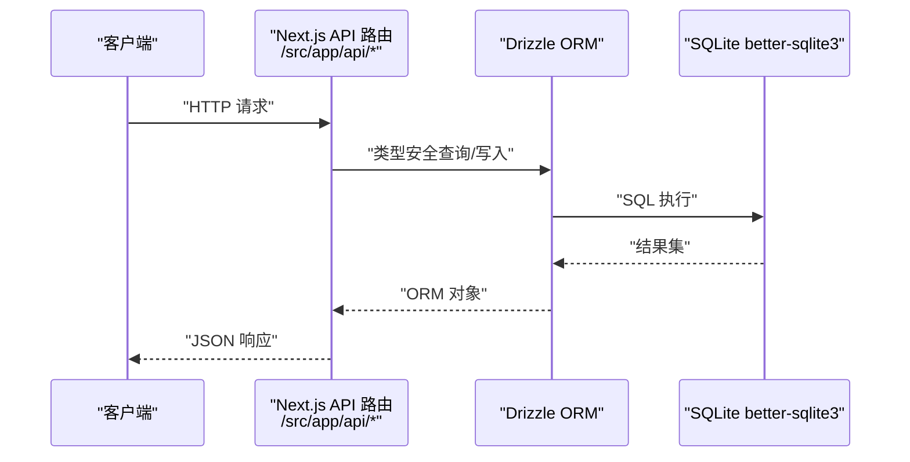
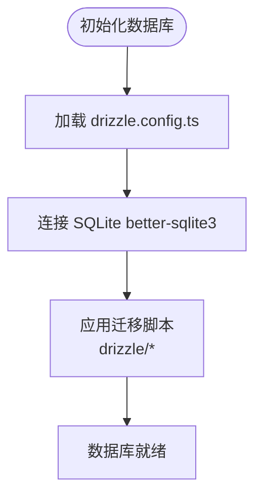
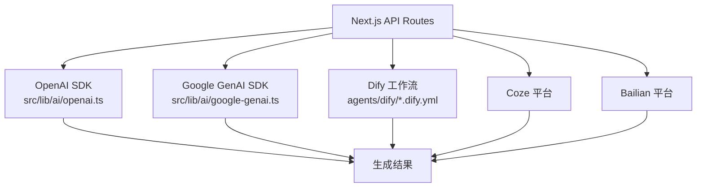
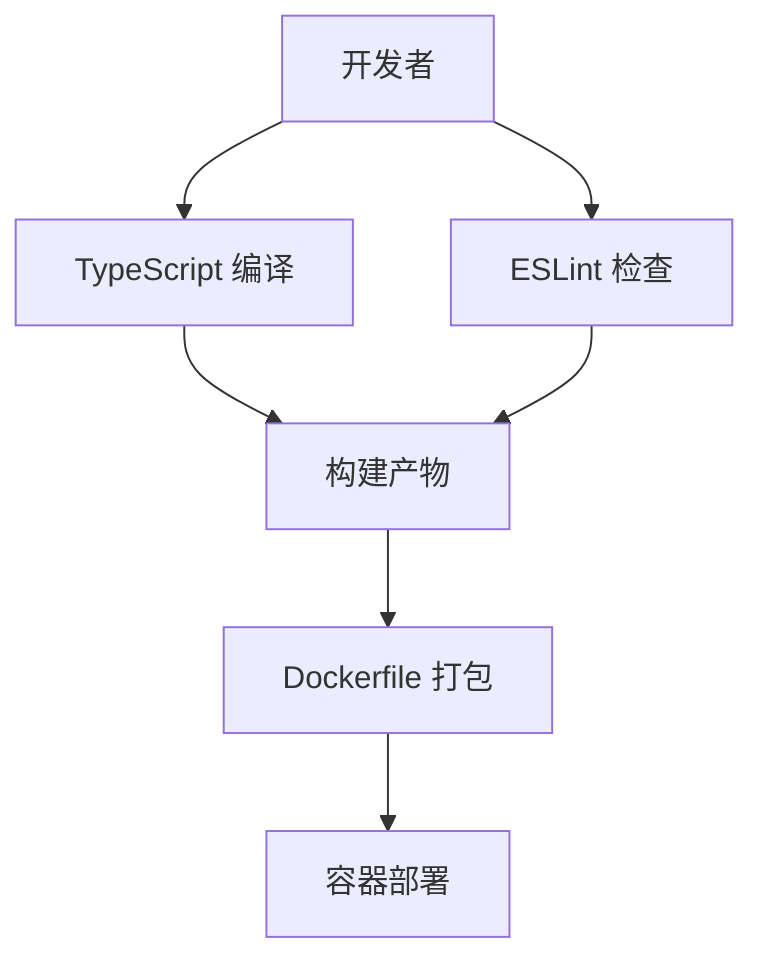
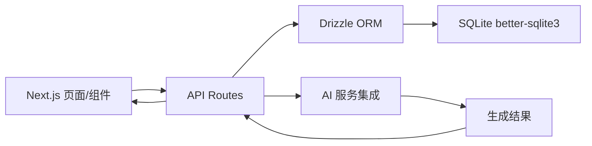

# 技术栈

<cite>
**本文档引用的文件**
- [package.json](file://package.json)
- [next.config.ts](file://next.config.ts)
- [tsconfig.json](file://tsconfig.json)
- [drizzle.config.ts](file://drizzle.config.ts)
- [Dockerfile](file://Dockerfile)
- [.dockerignore](file://.dockerignore)
- [eslint.config.mjs](file://eslint.config.mjs)
- [postcss.config.mjs](file://postcss.config.mjs)
- [components.json](file://components.json)
- [src/app/layout.tsx](file://src/app/layout.tsx)
- [src/lib/db/index.ts](file://src/lib/db/index.ts)
- [src/lib/ai/openai.ts](file://src/lib/ai/openai.ts)
- [src/lib/ai/google-genai.ts](file://src/lib/ai/google-genai.ts)
- [agents/dify/script-generate.dify.yml](file://agents/dify/script-generate.dify.yml)
- [agents/bailian/template.yml](file://agents/bailian/template.yml)
- [agents/coze/](file://agents/coze/)
- [src/app/api/projects/[id]/route.ts](file://src/app/api/projects/[id]/route.ts)
- [src/app/api/agents/route.ts](file://src/app/api/agents/route.ts)
</cite>

## 目录
1. [引言](#引言)
2. [项目结构](#项目结构)
3. [核心组件](#核心组件)
4. [架构总览](#架构总览)
5. [详细组件分析](#详细组件分析)
6. [依赖关系分析](#依赖关系分析)
7. [性能考量](#性能考量)
8. [故障排除指南](#故障排除指南)
9. [结论](#结论)
10. [附录](#附录)

## 引言
本技术栈文档面向希望快速理解并参与 AIComicBuilder 项目的开发者与运维人员。文档系统化梳理了前端框架（Next.js 16、React 19、Tailwind CSS）、后端架构（Next.js API Routes、Drizzle ORM）、数据库方案（SQLite better-sqlite3）、AI 服务集成（OpenAI、Google GenAI、Dify 等）、以及开发工具链（TypeScript、ESLint、Docker）。我们将解释每项技术的选择原因、优势、在项目中的具体应用，并提供兼容性与版本要求，帮助读者迅速把握项目的技术基础与架构决策。

## 项目结构
AIComicBuilder 采用 Next.js 应用程序模式组织前端与后端逻辑，核心目录如下：
- 前端页面与布局：src/app 下按路由组织页面、布局与 API 路由
- 组件层：src/components 提供可复用 UI 与业务组件
- 工具库与业务逻辑：src/lib 下包含数据库、AI、任务队列、视频处理等模块
- 数据迁移与模型：drizzle 目录管理数据库迁移脚本与元数据
- 配置文件：next.config.ts、tsconfig.json、drizzle.config.ts、eslint.config.mjs、postcss.config.mjs、components.json 等
- 容器化：Dockerfile 与 .dockerignore 支持容器部署

**图表来源**
- [next.config.ts](file://next.config.ts)
- [tsconfig.json](file://tsconfig.json)
- [drizzle.config.ts](file://drizzle.config.ts)
- [Dockerfile](file://Dockerfile)
- [components.json](file://components.json)

**章节来源**
- [package.json](file://package.json)
- [next.config.ts](file://next.config.ts)
- [tsconfig.json](file://tsconfig.json)
- [drizzle.config.ts](file://drizzle.config.ts)
- [Dockerfile](file://Dockerfile)
- [eslint.config.mjs](file://eslint.config.mjs)
- [postcss.config.mjs](file://postcss.config.mjs)
- [components.json](file://components.json)

## 核心组件
本节概述项目的关键技术选型及其在系统中的定位与作用。

- 前端框架与运行时
  - Next.js 16：应用程序模式、App Router、Server Components、Edge Runtime 支持，提供 SSR/SSG、路由与 API 路由一体化能力
  - React 19：最新 React 特性与并发更新能力，提升交互性能与开发体验
  - Tailwind CSS：原子化样式与组件化设计，结合 components.json 的本地组件库实现一致的视觉体系
- 后端与数据访问
  - Next.js API Routes：以路由即服务的方式提供后端接口，统一前后端代码组织
  - Drizzle ORM：类型安全的数据库查询与迁移管理，支持 SQLite better-sqlite3
- 数据库
  - SQLite better-sqlite3：轻量、嵌入式、零配置，适合开发与小规模生产场景
- AI 服务集成
  - OpenAI：用于文本生成、图像生成与对话推理
  - Google GenAI：用于多模态与推理任务
  - Dify/Coze/Bailian：作为代理平台或工作流编排，支撑脚本生成、角色提取、分镜提示等流程
- 开发工具链
  - TypeScript：强类型保障，提升代码质量与可维护性
  - ESLint：统一代码风格与静态检查
  - PostCSS/Tailwind：现代化样式管线与原子化 CSS
  - Docker：容器化打包与部署

**章节来源**
- [package.json](file://package.json)
- [next.config.ts](file://next.config.ts)
- [tsconfig.json](file://tsconfig.json)
- [drizzle.config.ts](file://drizzle.config.ts)
- [eslint.config.mjs](file://eslint.config.mjs)
- [postcss.config.mjs](file://postcss.config.mjs)
- [components.json](file://components.json)

## 架构总览
下图展示了从前端到后端、数据库与 AI 服务的整体交互路径。Next.js 应用承载页面与 API，Drizzle ORM 访问 SQLite 数据库，AI 服务通过 SDK 或代理平台完成智能任务。

**图表来源**
- [src/app/layout.tsx](file://src/app/layout.tsx)
- [src/app/api/projects/[id]/route.ts](file://src/app/api/projects/[id]/route.ts)
- [src/lib/db/index.ts](file://src/lib/db/index.ts)
- [src/lib/ai/openai.ts](file://src/lib/ai/openai.ts)
- [src/lib/ai/google-genai.ts](file://src/lib/ai/google-genai.ts)
- [agents/dify/script-generate.dify.yml](file://agents/dify/script-generate.dify.yml)

## 详细组件分析

### 前端技术栈：Next.js 16、React 19、Tailwind CSS
- Next.js 16
  - 应用程序模式与 App Router：页面按路由组织，支持 layout.tsx、page.tsx、loading.tsx 等约定式结构
  - Server Components 与 Edge Runtime：在服务端渲染与边缘运行时中执行，降低首屏延迟
  - API Routes：在 src/app/api 下定义后端接口，与前端同源开发
- React 19
  - 并发特性与状态提升：优化用户体验与渲染性能
  - Hooks 与自定义 Hook：如 use-model-guard.ts 等封装权限与模型校验
- Tailwind CSS
  - 原子化样式与组件库：通过 components.json 集成本地 UI 组件，保证一致性
  - PostCSS 管线：自动优化与按需输出

**图表来源**
- [src/app/layout.tsx](file://src/app/layout.tsx)
- [components.json](file://components.json)
- [postcss.config.mjs](file://postcss.config.mjs)

**章节来源**
- [next.config.ts](file://next.config.ts)
- [tsconfig.json](file://tsconfig.json)
- [components.json](file://components.json)
- [postcss.config.mjs](file://postcss.config.mjs)

### 后端架构：Next.js API Routes、Drizzle ORM
- Next.js API Routes
  - 在 src/app/api 下以文件系统路由方式暴露 REST 接口，便于统一管理与版本控制
  - 典型接口：项目管理、角色/角色关系、分镜/资产、上传、生成等
- Drizzle ORM
  - 类型安全的查询 DSL 与迁移管理，配合 SQLite better-sqlite3 实现高性能本地存储
  - 迁移脚本位于 drizzle 目录，包含数百个迁移文件，覆盖项目、剧集、场景、分镜、角色、提示模板等表结构演进

**图表来源**
- [src/app/api/projects/[id]/route.ts](file://src/app/api/projects/[id]/route.ts)
- [src/lib/db/index.ts](file://src/lib/db/index.ts)
- [drizzle.config.ts](file://drizzle.config.ts)

**章节来源**
- [src/app/api/agents/route.ts](file://src/app/api/agents/route.ts)
- [src/lib/db/index.ts](file://src/lib/db/index.ts)
- [drizzle.config.ts](file://drizzle.config.ts)

### 数据库解决方案：SQLite better-sqlite3
- 选择原因
  - 零配置、低开销、跨平台，适合开发与小规模生产
  - 与 Drizzle ORM 协同，提供类型安全与迁移管理
- 使用方式
  - Drizzle 配置指向 SQLite，迁移脚本集中管理
  - 通过 ORM 模块进行读写操作，避免手写 SQL

**图表来源**
- [drizzle.config.ts](file://drizzle.config.ts)
- [drizzle/0000_chemical_tyrannus.sql](file://drizzle/0000_chemical_tyrannus.sql)

**章节来源**
- [drizzle.config.ts](file://drizzle.config.ts)

### AI 服务集成：OpenAI、Google GenAI、Dify、Coze、Bailian
- OpenAI
  - 用于文本生成、图像生成与对话推理，封装于 src/lib/ai/openai.ts
- Google GenAI
  - 用于多模态与推理任务，封装于 src/lib/ai/google-genai.ts
- Dify/Coze/Bailian
  - 通过 YAML 模板定义工作流与提示词，例如脚本生成、角色提取、参考图像提示等
  - agents/dify/*.dify.yml 定义了完整的 AI 流程片段

**图表来源**
- [src/lib/ai/openai.ts](file://src/lib/ai/openai.ts)
- [src/lib/ai/google-genai.ts](file://src/lib/ai/google-genai.ts)
- [agents/dify/script-generate.dify.yml](file://agents/dify/script-generate.dify.yml)
- [agents/bailian/template.yml](file://agents/bailian/template.yml)
- [agents/coze/](file://agents/coze/)

**章节来源**
- [src/lib/ai/openai.ts](file://src/lib/ai/openai.ts)
- [src/lib/ai/google-genai.ts](file://src/lib/ai/google-genai.ts)
- [agents/dify/script-generate.dify.yml](file://agents/dify/script-generate.dify.yml)
- [agents/bailian/template.yml](file://agents/bailian/template.yml)
- [agents/coze/](file://agents/coze/)

### 开发工具链：TypeScript、ESLint、Docker
- TypeScript
  - 强类型保障，提升代码可维护性；tsconfig.json 提供严格模式与路径别名
- ESLint
  - eslint.config.mjs 统一规则，确保团队协作一致性
- Docker
  - Dockerfile 与 .dockerignore 提供容器化打包与部署能力，简化环境差异

**图表来源**
- [tsconfig.json](file://tsconfig.json)
- [eslint.config.mjs](file://eslint.config.mjs)
- [Dockerfile](file://Dockerfile)
- [.dockerignore](file://.dockerignore)

**章节来源**
- [tsconfig.json](file://tsconfig.json)
- [eslint.config.mjs](file://eslint.config.mjs)
- [Dockerfile](file://Dockerfile)
- [.dockerignore](file://.dockerignore)

## 依赖关系分析
- 前端与后端耦合
  - 页面与 API 路由在同一 Next.js 应用内，通过文件系统路由解耦但共享类型与工具库
- 数据层
  - Drizzle ORM 作为唯一数据访问层，隔离数据库细节，迁移脚本集中管理
- AI 层
  - 通过统一的 API 路由聚合不同 AI 服务，屏蔽平台差异
- 工具链
  - TypeScript 与 ESLint 在开发阶段强制约束，Docker 在构建与部署阶段统一环境

**图表来源**
- [src/app/layout.tsx](file://src/app/layout.tsx)
- [src/app/api/projects/[id]/route.ts](file://src/app/api/projects/[id]/route.ts)
- [src/lib/db/index.ts](file://src/lib/db/index.ts)
- [src/lib/ai/openai.ts](file://src/lib/ai/openai.ts)

**章节来源**
- [package.json](file://package.json)

## 性能考量
- 前端性能
  - 利用 Next.js 的 App Router 与 Server Components，减少客户端传输与首屏渲染时间
  - Tailwind 原子化样式与 PostCSS 优化，避免冗余 CSS
- 后端性能
  - API 路由按需加载，避免不必要的中间件与路由解析
  - Drizzle ORM 的类型安全与查询优化，减少错误与回退
- 数据库性能
  - SQLite 适合中小规模数据；建议在高并发场景评估读写分离与缓存策略
- AI 服务性能
  - 将长耗时任务放入队列或异步处理，避免阻塞 API 响应

## 故障排除指南
- TypeScript 错误
  - 检查 tsconfig.json 的严格模式与路径映射，确保类型声明完整
- ESLint 规则冲突
  - 参考 eslint.config.mjs 的规则配置，必要时在 IDE 中启用自动修复
- 数据库迁移失败
  - 查看 drizzle 目录的迁移脚本与 drizzle.config.ts 配置，确认 SQLite 连接参数
- Docker 构建问题
  - 检查 Dockerfile 与 .dockerignore，确保依赖安装与资源复制正确

**章节来源**
- [tsconfig.json](file://tsconfig.json)
- [eslint.config.mjs](file://eslint.config.mjs)
- [drizzle.config.ts](file://drizzle.config.ts)
- [Dockerfile](file://Dockerfile)
- [.dockerignore](file://.dockerignore)

## 结论
AIComicBuilder 的技术栈围绕 Next.js 16/React 19 与 Tailwind CSS 构建前端体验，以 Next.js API Routes 与 Drizzle ORM 组织后端与数据访问，采用 SQLite better-sqlite3 作为轻量数据库，并通过 OpenAI、Google GenAI、Dify、Coze、Bailian 等 AI 服务实现智能化创作流程。开发工具链（TypeScript、ESLint、Docker）贯穿全生命周期，确保高质量与可维护性。该架构在易用性、扩展性与性能之间取得平衡，适合从个人到小团队的创意项目。

## 附录
- 版本与兼容性要点
  - Next.js 16：应用程序模式、App Router、Edge Runtime
  - React 19：并发特性与状态提升
  - TypeScript：严格模式与路径别名
  - Drizzle ORM：SQLite better-sqlite3 驱动
  - Docker：容器化打包与部署
- 关键文件清单
  - 前端入口与布局：src/app/layout.tsx
  - API 路由示例：src/app/api/projects/[id]/route.ts、src/app/api/agents/route.ts
  - 数据库配置与迁移：drizzle.config.ts、drizzle/*
  - AI 服务封装：src/lib/ai/openai.ts、src/lib/ai/google-genai.ts
  - 代理平台模板：agents/dify/*.dify.yml、agents/bailian/template.yml、agents/coze/