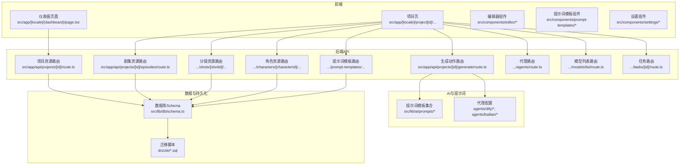
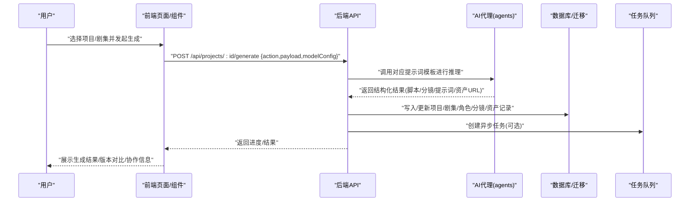
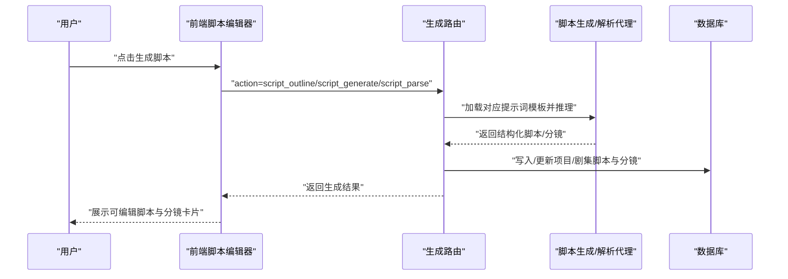
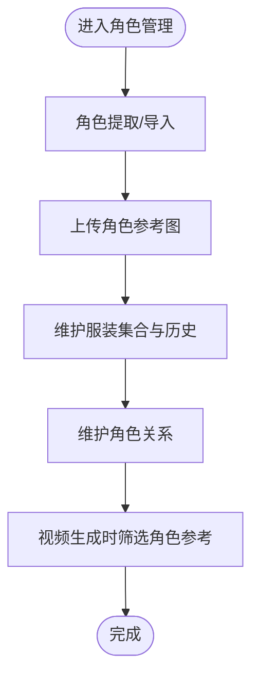
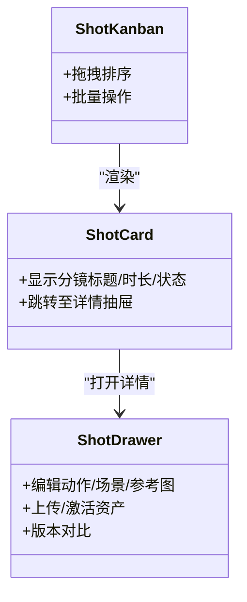
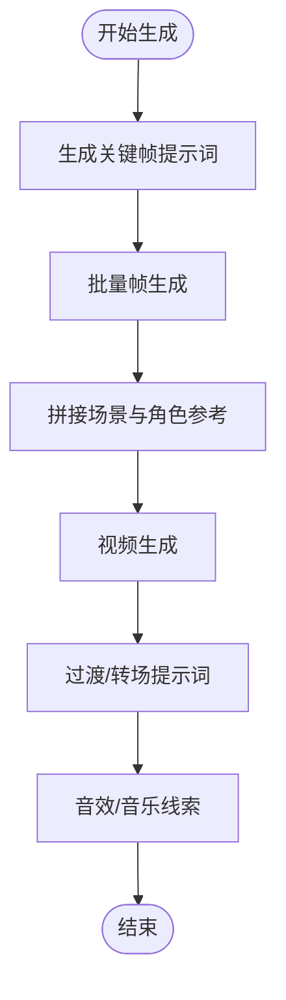
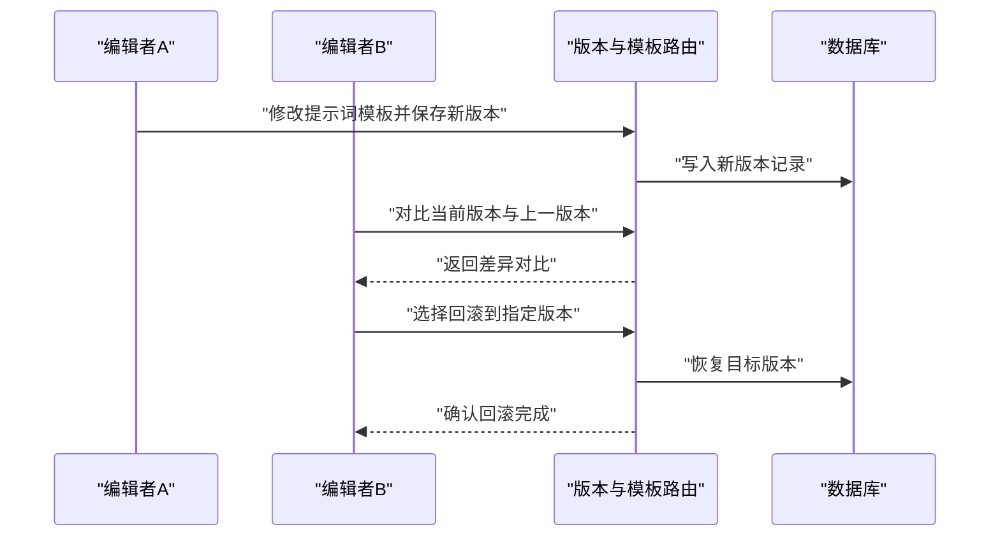
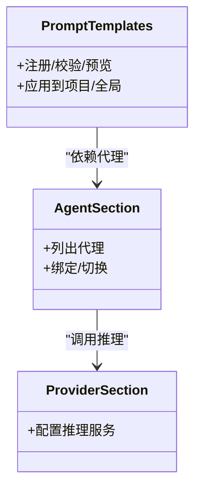
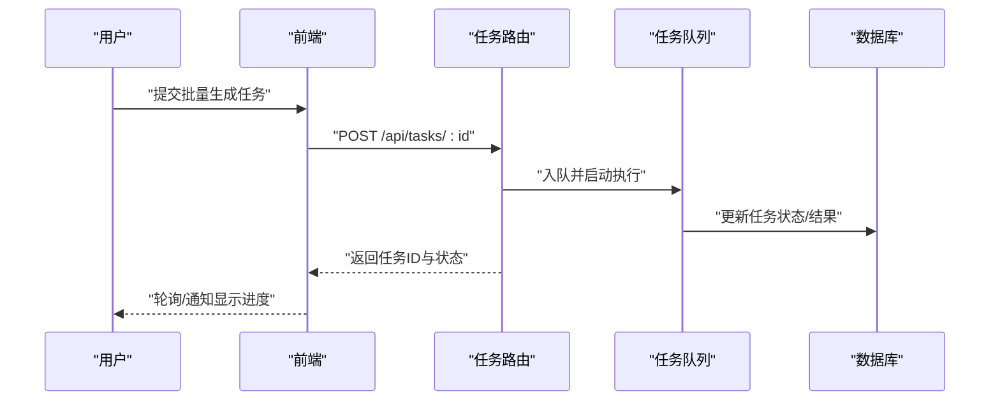
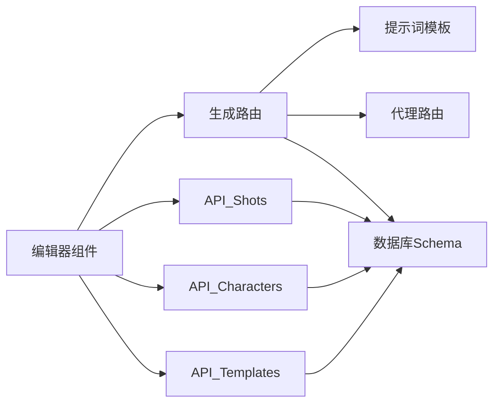

# 核心功能

<cite>
**本文引用的文件**   
- [src/app/api/projects/[id]/generate/route.ts](file://src/app/api/projects/[id]/generate/route.ts)
- [src/app/api/projects/[id]/route.ts](file://src/app/api/projects/[id]/route.ts)
- [src/app/api/projects/[id]/episodes/route.ts](file://src/app/api/projects/[id]/episodes/route.ts)
- [src/app/api/projects/[id]/shots/[shotId]/assets/[assetId]/activate/route.ts](file://src/app/api/projects/[id]/shots/[shotId]/assets/[assetId]/activate/route.ts)
- [src/app/api/projects/[id]/shots/[shotId]/assets/route.ts](file://src/app/api/projects/[id]/shots/[shotId]/assets/route.ts)
- [src/app/api/projects/[id]/shots/[shotId]/upload/route.ts](file://src/app/api/projects/[id]/shots/[shotId]/upload/route.ts)
- [src/app/api/projects/[id]/characters/[characterId]/costumes/route.ts](file://src/app/api/projects/[id]/characters/[characterId]/costumes/route.ts)
- [src/app/api/projects/[id]/characters/[characterId]/upload/route.ts](file://src/app/api/projects/[id]/characters/[characterId]/upload/route.ts)
- [src/app/api/projects/[id]/prompt-templates/[promptKey]/versions/[vid]/restore/route.ts](file://src/app/api/projects/[id]/prompt-templates/[promptKey]/versions/[vid]/restore/route.ts)
- [src/app/api/projects/[id]/prompt-templates/[promptKey]/versions/route.ts](file://src/app/api/projects/[id]/prompt-templates/[promptKey]/versions/route.ts)
- [src/app/api/prompt-templates/[presetId]/apply/route.ts](file://src/app/api/prompt-templates/[presetId]/apply/route.ts)
- [src/app/api/prompt-templates/route.ts](file://src/app/api/prompt-templates/route.ts)
- [src/app/api/agents/route.ts](file://src/app/api/agents/route.ts)
- [src/app/api/models/list/route.ts](file://src/app/api/models/list/route.ts)
- [src/app/api/tasks/[id]/route.ts](file://src/app/api/tasks/[id]/route.ts)
- [src/components/editor/ai-optimize-button.tsx](file://src/components/editor/ai-optimize-button.tsx)
- [src/components/editor/script-editor.tsx](file://src/components/editor/script-editor.tsx)
- [src/components/editor/shot-card.tsx](file://src/components/editor/shot-card.tsx)
- [src/components/editor/shot-drawer.tsx](file://src/components/editor/shot-drawer.tsx)
- [src/components/editor/shot-kanban.tsx](file://src/components/editor/shot-kanban.tsx)
- [src/components/editor/character-card.tsx](file://src/components/editor/character-card.tsx)
- [src/components/editor/version-compare.tsx](file://src/components/editor/version-compare.tsx)
- [src/components/prompt-templates/preset-dialog.tsx](file://src/components/prompt-templates/preset-dialog.tsx)
- [src/components/prompt-templates/project-prompt-cards.tsx](file://src/components/prompt-templates/project-prompt-cards.tsx)
- [src/components/prompt-templates/prompt-drawer.tsx](file://src/components/prompt-templates/prompt-drawer.tsx)
- [src/components/prompt-templates/prompt-editor.tsx](file://src/components/prompt-templates/prompt-editor.tsx)
- [src/components/settings/agent-section.tsx](file://src/components/settings/agent-section.tsx)
- [src/components/settings/provider-section.tsx](file://src/components/settings/provider-section.tsx)
- [src/lib/db/schema.ts](file://src/lib/db/schema.ts)
- [drizzle/0000_chemical_tyrannus.sql](file://drizzle/0000_chemical_tyrannus.sql)
- [drizzle/0001_add_user_id.sql](file://drizzle/0001_add_user_id.sql)
- [drizzle/0002_add_generation_mode.sql](file://drizzle/0002_add_generation_mode.sql)
- [drizzle/0003_add_reference_video_url.sql](file://drizzle/0003_add_reference_video_url.sql)
- [drizzle/0004_add_last_frame_url.sql](file://drizzle/0004_add_last_frame_url.sql)
- [drizzle/0005_add_scene_ref_frame.sql](file://drizzle/0005_add_scene_ref_frame.sql)
- [drizzle/0006_add_video_script.sql](file://drizzle/0006_add_video_script.sql)
- [drizzle/0007_add_storyboard_versions.sql](file://drizzle/0007_add_storyboard_versions.sql)
- [drizzle/0008_add_video_prompt.sql](file://drizzle/0008_add_video_prompt.sql)
- [drizzle/0009_add_character_visual_hint.sql](file://drizzle/0009_add_character_visual_hint.sql)
- [drizzle/0010_add_episodes.sql](file://drizzle/0010_add_episodes.sql)
- [drizzle/0011_add_episode_description_keywords.sql](file://drizzle/0011_add_episode_description_keywords.sql)
- [drizzle/0012_add_import_logs.sql](file://drizzle/0012_add_import_logs.sql)
- [drizzle/0013_add_episode_characters.sql](file://drizzle/0013_add_episode_characters.sql)
- [drizzle/0014_add_prompt_templates.sql](file://drizzle/0014_add_prompt_templates.sql)
- [drizzle/0015_add_use_project_prompts.sql](file://drizzle/0015_add_use_project_prompts.sql)
- [drizzle/0016_add_transition_in.sql](file://drizzle/0016_add_transition_in.sql)
- [drizzle/0017_add_transition_out.sql](file://drizzle/0017_add_transition_out.sql)
- [drizzle/0018_add_dialogue_start_ratio.sql](file://drizzle/0018_add_dialogue_start_ratio.sql)
- [drizzle/0019_add_dialogue_end_ratio.sql](file://drizzle/0019_add_dialogue_end_ratio.sql)
- [drizzle/0020_add_shot_is_stale.sql](file://drizzle/0020_add_shot_is_stale.sql)
- [drizzle/0021_add_character_is_stale.sql](file://drizzle/0021_add_character_is_stale.sql)
- [drizzle/0022_add_episode_script_hash.sql](file://drizzle/0022_add_episode_script_hash.sql)
- [drizzle/0023_add_project_outline.sql](file://drizzle/0023_add_project_outline.sql)
- [drizzle/0024_add_episode_outline.sql](file://drizzle/0024_add_episode_outline.sql)
- [drizzle/0025_add_character_relations.sql](file://drizzle/0025_add_character_relations.sql)
- [drizzle/0026_add_scenes_table.sql](file://drizzle/0026_add_scenes_table.sql)
- [drizzle/0027_add_shot_scene_id.sql](file://drizzle/0027_add_shot_scene_id.sql)
- [drizzle/0028_add_composition_guide.sql](file://drizzle/0028_add_composition_guide.sql)
- [drizzle/0029_add_project_color_palette.sql](file://drizzle/0029_add_project_color_palette.sql)
- [drizzle/0030_add_episode_color_palette.sql](file://drizzle/0030_add_episode_color_palette.sql)
- [drizzle/0031_add_world_setting.sql](file://drizzle/0031_add_world_setting.sql)
- [drizzle/0032_add_project_target_duration.sql](file://drizzle/0032_add_project_target_duration.sql)
- [drizzle/0033_add_episode_target_duration.sql](file://drizzle/0033_add_episode_target_duration.sql)
- [drizzle/0034_add_focal_point.sql](file://drizzle/0034_add_focal_point.sql)
- [drizzle/0035_add_depth_of_field.sql](file://drizzle/0035_add_depth_of_field.sql)
- [drizzle/0036_add_sound_design.sql](file://drizzle/0036_add_sound_design.sql)
- [drizzle/0037_add_music_cue.sql](file://drizzle/0037_add_music_cue.sql)
- [drizzle/0038_add_performance_style.sql](file://drizzle/0038_add_performance_style.sql)
- [drizzle/0039_add_character_height_cm.sql](file://drizzle/0039_add_character_height_cm.sql)
- [drizzle/0040_add_character_body_type.sql](file://drizzle/0040_add_character_body_type.sql)
- [drizzle/0041_add_costume_sets.sql](file://drizzle/0041_add_costume_sets.sql)
- [drizzle/0042_add_shot_costume_overrides.sql](file://drizzle/0042_add_shot_costume_overrides.sql)
- [drizzle/0043_add_project_bgm_url.sql](file://drizzle/0043_add_project_bgm_url.sql)
- [drizzle/0044_add_episode_bgm_url.sql](file://drizzle/0044_add_episode_bgm_url.sql)
- [drizzle/0045_add_mood_board.sql](file://drizzle/0045_add_mood_board.sql)
- [drizzle/0046_add_shot_actions.sql](file://drizzle/0046_add_shot_actions.sql)
- [drizzle/0047_add_prompt_ab_tests.sql](file://drizzle/0047_add_prompt_ab_tests.sql)
- [drizzle/0048_add_shot_reference_images.sql](file://drizzle/0048_add_shot_reference_images.sql)
- [drizzle/0049_add_character_image_history.sql](file://drizzle/0049_add_character_image_history.sql)
- [drizzle/0050_add_shot_assets.sql](file://drizzle/0050_add_shot_assets.sql)
- [drizzle/0051_drop_legacy_shot_columns.sql](file://drizzle/0051_drop_legacy_shot_columns.sql)
- [drizzle/0052_add_agents.sql](file://drizzle/0052_add_agents.sql)
- [drizzle/0053_add_agent_platform.sql](file://drizzle/0053_add_agent_platform.sql)
- [agents/dify/script-generate.dify.yml](file://agents/dify/script-generate.dify.yml)
- [agents/dify/script-outline.dify.yml](file://agents/dify/script-outline.dify.yml)
- [agents/dify/shot-split.dify.yml](file://agents/dify/shot-split.dify.yml)
- [agents/bailian/template.yml](file://agents/bailian/template.yml)
- [src/lib/utils.ts](file://src/lib/utils.ts)
- [src/lib/bootstrap.ts](file://src/lib/bootstrap.ts)
- [src/lib/get-user-id.ts](file://src/lib/get-user-id.ts)
- [src/lib/assert-project-ownership.ts](file://src/lib/assert-project-ownership.ts)
- [src/lib/api-fetch.ts](file://src/lib/api-fetch.ts)
- [src/lib/id.ts](file://src/lib/id.ts)
- [src/lib/import-utils.ts](file://src/lib/import-utils.ts)
- [src/lib/ref-image-utils.ts](file://src/lib/ref-image-utils.ts)
- [src/lib/shot-asset-utils.ts](file://src/lib/shot-asset-utils.ts)
- [src/lib/staleness.ts](file://src/lib/staleness.ts)
- [src/lib/fingerprint.ts](file://src/lib/fingerprint.ts)
- [src/lib/pipeline/index.ts](file://src/lib/pipeline/index.ts)
- [src/lib/task-queue/index.ts](file://src/lib/task-queue/index.ts)
- [src/lib/video/index.ts](file://src/lib/video/index.ts)
- [src/lib/ai/index.ts](file://src/lib/ai/index.ts)
- [src/lib/ai/prompts/script-generate.ts](file://src/lib/ai/prompts/script-generate.ts)
- [src/lib/ai/prompts/script-outline.ts](file://src/lib/ai/prompts/script-outline.ts)
- [src/lib/ai/prompts/shot-split.ts](file://src/lib/ai/prompts/shot-split.ts)
- [src/lib/ai/prompts/character-extract.ts](file://src/lib/ai/prompts/character-extract.ts)
- [src/lib/ai/prompts/keyframe-prompts.ts](file://src/lib/ai/prompts/keyframe-prompts.ts)
- [src/lib/ai/prompts/video-prompts.ts](file://src/lib/ai/prompts/video-prompts.ts)
- [src/lib/ai/prompts/ref-image-prompts.ts](file://src/lib/ai/prompts/ref-image-prompts.ts)
- [src/lib/ai/prompts/ref-video-prompts.ts](file://src/lib/ai/prompts/ref-video-prompts.ts)
- [src/lib/ai/prompts/script-parse.ts](file://src/lib/ai/prompts/script-parse.ts)
- [src/lib/ai/prompts/scene-ref-frame.ts](file://src/lib/ai/prompts/scene-ref-frame.ts)
- [src/lib/ai/prompts/transition-prompts.ts](file://src/lib/ai/prompts/transition-prompts.ts)
- [src/lib/ai/prompts/emotion-analysis.ts](file://src/lib/ai/prompts/emotion-analysis.ts)
- [src/lib/ai/prompts/mood-board.ts](file://src/lib/ai/prompts/mood-board.ts)
- [src/lib/ai/prompts/world-setting.ts](file://src/lib/ai/prompts/world-setting.ts)
- [src/lib/ai/prompts/continuity-check.ts](file://src/lib/ai/prompts/continuity-check.ts)
- [src/lib/ai/prompts/episode-summary.ts](file://src/lib/ai/prompts/episode-summary.ts)
- [src/lib/ai/prompts/episode-import.ts](file://src/lib/ai/prompts/episode-import.ts)
- [src/lib/ai/prompts/project-outline.ts](file://src/lib/ai/prompts/project-outline.ts)
- [src/lib/ai/prompts/character-relations.ts](file://src/lib/ai/prompts/character-relations.ts)
- [src/lib/ai/prompts/costume-generation.ts](file://src/lib/ai/prompts/costume-generation.ts)
- [src/lib/ai/prompts/shot-rewrite.ts](file://src/lib/ai/prompts/shot-rewrite.ts)
- [src/lib/ai/prompts/shot-assets.ts](file://src/lib/ai/prompts/shot-assets.ts)
- [src/lib/ai/prompts/shot-actions.ts](file://src/lib/ai/prompts/shot-actions.ts)
- [src/lib/ai/prompts/shot-scene-id.ts](file://src/lib/ai/prompts/shot-scene-id.ts)
- [src/lib/ai/prompts/shot-costume-overrides.ts](file://src/lib/ai/prompts/shot-costume-overrides.ts)
- [src/lib/ai/prompts/shot-reference-images.ts](file://src/lib/ai/prompts/shot-reference-images.ts)
- [src/lib/ai/prompts/shot-asset-upload.ts](file://src/lib/ai/prompts/shot-asset-upload.ts)
- [src/lib/ai/prompts/character-upload.ts](file://src/lib/ai/prompts/character-upload.ts)
- [src/lib/ai/prompts/character-costume-upload.ts](file://src/lib/ai/prompts/character-costume-upload.ts)
- [src/lib/ai/prompts/character-image-history.ts](file://src/lib/ai/prompts/character-image-history.ts)
- [src/lib/ai/prompts/character-relations-update.ts](file://src/lib/ai/prompts/character-relations-update.ts)
- [src/lib/ai/prompts/character-relations-delete.ts](file://src/lib/ai/prompts/character-relations-delete.ts)
- [src/lib/ai/prompts/episode-reorder.ts](file://src/lib/ai/prompts/episode-reorder.ts)
- [src/lib/ai/prompts/episode-merge.ts](file://src/lib/ai/prompts/episode-merge.ts)
- [src/lib/ai/prompts/episode-download.ts](file://src/lib/ai/prompts/episode-download.ts)
- [src/lib/ai/prompts/episode-import-log.ts](file://src/lib/ai/prompts/episode-import-log.ts)
- [src/lib/ai/prompts/episode-character-relations.ts](file://src/lib/ai/prompts/episode-character-relations.ts)
- [src/lib/ai/prompts/episode-color-palette.ts](file://src/lib/ai/prompts/episode-color-palette.ts)
- [src/lib/ai/prompts/episode-target-duration.ts](file://src/lib/ai/prompts/episode-target-duration.ts)
- [src/lib/ai/prompts/episode-world-setting.ts](file://src/lib/ai/prompts/episode-world-setting.ts)
- [src/lib/ai/prompts/episode-mood-board.ts](file://src/lib/ai/prompts/episode-mood-board.ts)
- [src/lib/ai/prompts/episode-bgm-url.ts](file://src/lib/ai/prompts/episode-bgm-url.ts)
- [src/lib/ai/prompts/episode-scene-ref-frame.ts](file://src/lib/ai/prompts/episode-scene-ref-frame.ts)
- [src/lib/ai/prompts/episode-shot-actions.ts](file://src/lib/ai/prompts/episode-shot-actions.ts)
- [src/lib/ai/prompts/episode-shot-assets.ts](file://src/lib/ai/prompts/episode-shot-assets.ts)
- [src/lib/ai/prompts/episode-shot-reference-images.ts](file://src/lib/ai/prompts/episode-shot-reference-images.ts)
- [src/lib/ai/prompts/episode-shot-costume-overrides.ts](file://src/lib/ai/prompts/episode-shot-costume-overrides.ts)
- [src/lib/ai/prompts/episode-shot-scene-id.ts](file://src/lib/ai/prompts/episode-shot-scene-id.ts)
- [src/lib/ai/prompts/episode-shot-rewrite.ts](file://src/lib/ai/prompts/episode-shot-rewrite.ts)
- [src/lib/ai/prompts/episode-shot-assets-upload.ts](file://src/lib/ai/prompts/episode-shot-assets-upload.ts)
- [src/lib/ai/prompts/episode-shot-reference-images-upload.ts](file://src/lib/ai/prompts/episode-shot-reference-images-upload.ts)
- [src/lib/ai/prompts/episode-character-upload.ts](file://src/lib/ai/prompts/episode-character-upload.ts)
- [src/lib/ai/prompts/episode-character-costume-upload.ts](file://src/lib/ai/prompts/episode-character-costume-upload.ts)
- [src/lib/ai/prompts/episode-character-image-history.ts](file://src/lib/ai/prompts/episode-character-image-history.ts)
- [src/lib/ai/prompts/episode-character-relations-update.ts](file://src/lib/ai/prompts/episode-character-relations-update.ts)
- [src/lib/ai/prompts/episode-character-relations-delete.ts](file://src/lib/ai/prompts/episode-character-relations-delete.ts)
- [src/lib/ai/prompts/episode-character-relations.ts](file://src/lib/ai/prompts/episode-character-relations.ts)
- [src/lib/ai/prompts/episode-character-relations.ts](file://src/lib/ai/prompts/episode-character-relations.ts)
- [src/lib/ai/prompts/episode-character-relations.ts](file://src/lib/ai/prompts/episode-character-relations.ts)
</cite>

## 目录
1. [简介](#简介)
2. [项目结构](#项目结构)
3. [核心组件](#核心组件)
4. [架构总览](#架构总览)
5. [详细组件分析](#详细组件分析)
6. [依赖关系分析](#依赖关系分析)
7. [性能考量](#性能考量)
8. [故障排查指南](#故障排查指南)
9. [结论](#结论)
10. [附录](#附录)

## 简介
本文件面向创作者与技术读者，系统性介绍 AIComicBuilder 的核心功能与工作流。该平台围绕“AI 驱动漫画视频生成”构建，覆盖从创意到成品的全流程：智能脚本生成、角色与场景管理、分镜设计工具、多模式视频生成与优化、版本管理与协作编辑、提示词模板与代理绑定、以及任务队列与数据持久化。通过前端页面、后端 API、AI 提示词工程与数据库迁移脚本的协同，形成可扩展、可复用、可迭代的创作管线。

## 项目结构
项目采用 Next.js 应用结构，核心由以下部分组成：
- 前端页面与组件：位于 src/app 与 src/components，负责项目仪表盘、剧集与分镜编辑、角色管理、提示词模板、设置等界面。
- 后端 API：位于 src/app/api 下，按资源域划分（projects、agents、models、tasks、prompt-templates 等），统一暴露 REST 接口。
- AI 提示词工程：位于 agents 与 src/lib/ai/prompts，定义不同阶段的提示词模板与参数。
- 数据库与迁移：drizzle 目录包含大量迁移脚本，覆盖项目、剧集、角色、分镜、场景、提示词模板、代理等表结构演进。
- 工具与库：src/lib 下包含通用工具、引导初始化、鉴权断言、任务队列、视频处理、管道封装等。

图表来源
- [src/app/api/projects/[id]/generate/route.ts](file://src/app/api/projects/[id]/generate/route.ts)
- [src/app/api/projects/[id]/route.ts](file://src/app/api/projects/[id]/route.ts)
- [src/app/api/projects/[id]/episodes/route.ts](file://src/app/api/projects/[id]/episodes/route.ts)
- [src/lib/db/schema.ts](file://src/lib/db/schema.ts)
- [drizzle/0000_chemical_tyrannus.sql](file://drizzle/0000_chemical_tyrannus.sql)

章节来源
- [src/app/api/projects/[id]/generate/route.ts](file://src/app/api/projects/[id]/generate/route.ts)
- [src/app/api/projects/[id]/route.ts](file://src/app/api/projects/[id]/route.ts)
- [src/lib/db/schema.ts](file://src/lib/db/schema.ts)

## 核心组件
- 智能脚本生成与解析：支持“大纲生成—正文生成—解析拆分—重写优化”的链路，结合项目/剧集元信息与视觉风格注入，确保生成内容与风格一致。
- 角色管理系统：支持角色提取、参考图像上传、服装与历史图像管理、角色关系维护与更新。
- 分镜设计工具：提供分镜卡片、看板视图、抽屉式详情、资产上传与激活、动作与场景标注。
- 多模式视频生成：支持关键帧提示生成、批量帧生成、基于角色与场景的视频生成、过渡与转场提示、音效与音乐线索。
- 版本管理与协作：支持提示词模板版本回溯、分镜与角色版本对比、导入日志与连续性检查、并行编辑与冲突规避。
- 提示词模板与代理绑定：内置多种提示词模板，支持项目级启用与全局应用，支持 Dify/Bailian 等代理平台对接。
- 任务队列与异步执行：通过任务路由与队列封装，实现长耗时生成任务的排队与状态查询。

章节来源
- [src/app/api/projects/[id]/generate/route.ts](file://src/app/api/projects/[id]/generate/route.ts)
- [src/app/api/projects/[id]/episodes/route.ts](file://src/app/api/projects/[id]/episodes/route.ts)
- [src/app/api/projects/[id]/shots/[shotId]/assets/route.ts](file://src/app/api/projects/[id]/shots/[shotId]/assets/route.ts)
- [src/app/api/projects/[id]/characters/[characterId]/upload/route.ts](file://src/app/api/projects/[id]/characters/[characterId]/upload/route.ts)
- [src/app/api/prompt-templates/route.ts](file://src/app/api/prompt-templates/route.ts)
- [src/app/api/agents/route.ts](file://src/app/api/agents/route.ts)
- [src/lib/task-queue/index.ts](file://src/lib/task-queue/index.ts)

## 架构总览
下图展示从“用户操作”到“AI生成与存储”的端到端流程，涵盖脚本生成、角色与分镜准备、视频生成与资产归档、版本与协作能力。

图表来源
- [src/app/api/projects/[id]/generate/route.ts](file://src/app/api/projects/[id]/generate/route.ts)
- [agents/dify/script-generate.dify.yml](file://agents/dify/script-generate.dify.yml)
- [src/lib/db/schema.ts](file://src/lib/db/schema.ts)
- [src/lib/task-queue/index.ts](file://src/lib/task-queue/index.ts)

## 详细组件分析

### 智能脚本生成与解析
- 功能职责
  - 大纲生成：根据项目概要与风格元数据生成故事大纲。
  - 正文生成：在大纲基础上生成详细剧本，并注入视觉风格、色彩基调、时代美学、氛围情绪、画幅比例等元信息。
  - 解析拆分：将生成的剧本解析为可执行的分镜单元，便于后续分镜设计与视频生成。
  - 重写优化：对单个或批量分镜进行重写，提升画面连贯性与表现力。
- 关键实现点
  - 通过生成路由的动作分支触发不同提示词模板，结合项目/剧集脚本与元数据字段拼装最终提示词。
  - 对生成结果进行结构化解析与校验，确保后续分镜与视频生成可用。
- 使用场景
  - 快速出片：一键生成高质量脚本与分镜，缩短前期创作周期。
  - 风格一致性：通过元数据注入，保证整部作品的视觉风格统一。
- 典型流程序列图

图表来源
- [src/app/api/projects/[id]/generate/route.ts](file://src/app/api/projects/[id]/generate/route.ts)
- [agents/dify/script-generate.dify.yml](file://agents/dify/script-generate.dify.yml)
- [agents/dify/script-outline.dify.yml](file://agents/dify/script-outline.dify.yml)
- [agents/dify/shot-split.dify.yml](file://agents/dify/shot-split.dify.yml)

章节来源
- [src/app/api/projects/[id]/generate/route.ts](file://src/app/api/projects/[id]/generate/route.ts)
- [src/lib/ai/prompts/script-generate.ts](file://src/lib/ai/prompts/script-generate.ts)
- [src/lib/ai/prompts/script-outline.ts](file://src/lib/ai/prompts/script-outline.ts)
- [src/lib/ai/prompts/shot-split.ts](file://src/lib/ai/prompts/shot-split.ts)

### 角色管理系统
- 功能职责
  - 角色提取：从脚本中抽取角色名称与描述，建立角色档案。
  - 参考图像上传：为角色上传参考图，用于指导视频生成中的外观一致性。
  - 服装与历史：支持角色服装集合与图像历史记录，便于版本对比与回溯。
  - 关系维护：支持角色关系的增删改查，保障人物弧光与互动逻辑。
- 关键实现点
  - 通过角色路由与上传路由完成角色资料与资产的增删改查。
  - 在视频生成前，仅向视频模型传递与当前分镜相关的角色参考，避免无关信息干扰。
- 使用场景
  - 角色驱动：以角色为中心组织创作，确保动作、表情、服装与历史保持一致。
  - 批量生成：对多个角色进行批量参考图生成与更新。
- 组件与流程图

图表来源
- [src/app/api/projects/[id]/characters/[characterId]/upload/route.ts](file://src/app/api/projects/[id]/characters/[characterId]/upload/route.ts)
- [src/app/api/projects/[id]/characters/[characterId]/costumes/route.ts](file://src/app/api/projects/[id]/characters/[characterId]/costumes/route.ts)
- [src/app/api/projects/[id]/generate/route.ts](file://src/app/api/projects/[id]/generate/route.ts)

章节来源
- [src/app/api/projects/[id]/characters/[characterId]/upload/route.ts](file://src/app/api/projects/[id]/characters/[characterId]/upload/route.ts)
- [src/app/api/projects/[id]/characters/[characterId]/costumes/route.ts](file://src/app/api/projects/[id]/characters/[characterId]/costumes/route.ts)
- [src/app/api/projects/[id]/generate/route.ts](file://src/app/api/projects/[id]/generate/route.ts)

### 分镜设计工具
- 功能职责
  - 分镜卡片与看板：以卡片形式展示分镜，支持拖拽排序与批量操作。
  - 抽屉式详情：在抽屉中查看与编辑分镜详情、动作、场景、参考图与资产。
  - 资产上传与激活：支持为分镜上传参考图与视频片段，并激活有效资产参与生成。
  - 版本对比：支持分镜与角色版本对比，辅助协作与回溯。
- 关键实现点
  - 分镜路由提供 CRUD 与资产相关接口，配合前端组件实现所见即所得的编辑体验。
  - 通过“激活”机制控制当前分镜使用的资产，避免过期或错误资源参与生成。
- 使用场景
  - 创意编排：快速拆解镜头语言，调整节奏与构图。
  - 协作评审：多人在线编辑与版本对比，提升沟通效率。
- 组件类图

图表来源
- [src/components/editor/shot-card.tsx](file://src/components/editor/shot-card.tsx)
- [src/components/editor/shot-drawer.tsx](file://src/components/editor/shot-drawer.tsx)
- [src/components/editor/shot-kanban.tsx](file://src/components/editor/shot-kanban.tsx)

章节来源
- [src/app/api/projects/[id]/shots/[shotId]/assets/route.ts](file://src/app/api/projects/[id]/shots/[shotId]/assets/route.ts)
- [src/app/api/projects/[id]/shots/[shotId]/assets/[assetId]/activate/route.ts](file://src/app/api/projects/[id]/shots/[shotId]/assets/[assetId]/activate/route.ts)
- [src/components/editor/shot-card.tsx](file://src/components/editor/shot-card.tsx)
- [src/components/editor/shot-drawer.tsx](file://src/components/editor/shot-drawer.tsx)
- [src/components/editor/shot-kanban.tsx](file://src/components/editor/shot-kanban.tsx)
- [src/components/editor/version-compare.tsx](file://src/components/editor/version-compare.tsx)

### 多模式视频生成
- 功能职责
  - 关键帧提示生成：为分镜生成关键帧提示词，指导视频模型在关键时间点呈现指定画面。
  - 批量帧生成：对分镜进行批量帧生成，提高产出效率。
  - 场景与角色融合：根据分镜涉及的角色集合，动态拼接角色参考与场景帧，生成更贴合的视频。
  - 过渡与转场：提供过渡与转场提示词，增强段落衔接与节奏感。
  - 音效与音乐：注入音效与音乐线索，完善视听语言。
- 关键实现点
  - 生成路由中针对不同 action 分支调用相应提示词模板，结合项目/剧集元数据与角色参考，构造最终视频提示词。
  - 支持“场景参考帧”与“角色参考映射”，确保生成画面与设定一致。
- 使用场景
  - 快速样片：通过关键帧提示快速验证分镜可行性。
  - 成品输出：在角色与场景约束下生成高质量视频。
- 流程图

图表来源
- [src/app/api/projects/[id]/generate/route.ts](file://src/app/api/projects/[id]/generate/route.ts)
- [src/lib/ai/prompts/keyframe-prompts.ts](file://src/lib/ai/prompts/keyframe-prompts.ts)
- [src/lib/ai/prompts/video-prompts.ts](file://src/lib/ai/prompts/video-prompts.ts)
- [src/lib/ai/prompts/transition-prompts.ts](file://src/lib/ai/prompts/transition-prompts.ts)

章节来源
- [src/app/api/projects/[id]/generate/route.ts](file://src/app/api/projects/[id]/generate/route.ts)
- [src/lib/ai/prompts/keyframe-prompts.ts](file://src/lib/ai/prompts/keyframe-prompts.ts)
- [src/lib/ai/prompts/video-prompts.ts](file://src/lib/ai/prompts/video-prompts.ts)
- [src/lib/ai/prompts/transition-prompts.ts](file://src/lib/ai/prompts/transition-prompts.ts)

### 版本管理与协作编辑
- 功能职责
  - 提示词模板版本：支持模板版本回溯与恢复，保障生成策略的可追溯性。
  - 分镜与角色版本对比：在编辑过程中对比不同版本差异，辅助决策。
  - 导入日志与连续性检查：记录导入过程与潜在问题，提供连续性检查能力。
  - 并行编辑与冲突规避：通过版本与状态管理，降低多人协作风险。
- 关键实现点
  - 提示词模板路由提供版本查询与回滚接口；版本回溯路由支持按版本 ID 恢复。
  - 连续性检查与导入日志路由为质量保障提供依据。
- 使用场景
  - 团队协作：多人并行编辑，版本对比与回溯减少返工。
  - 策略迭代：回滚到稳定版本，逐步引入新模板与参数。
- 序列图

图表来源
- [src/app/api/projects/[id]/prompt-templates/[promptKey]/versions/route.ts](file://src/app/api/projects/[id]/prompt-templates/[promptKey]/versions/route.ts)
- [src/app/api/projects/[id]/prompt-templates/[promptKey]/versions/[vid]/restore/route.ts](file://src/app/api/projects/[id]/prompt-templates/[promptKey]/versions/[vid]/restore/route.ts)
- [src/app/api/projects/[id]/prompt-templates/[promptKey]/route.ts](file://src/app/api/projects/[id]/prompt-templates/[promptKey]/route.ts)

章节来源
- [src/app/api/projects/[id]/prompt-templates/[promptKey]/versions/route.ts](file://src/app/api/projects/[id]/prompt-templates/[promptKey]/versions/route.ts)
- [src/app/api/projects/[id]/prompt-templates/[promptKey]/versions/[vid]/restore/route.ts](file://src/app/api/projects/[id]/prompt-templates/[promptKey]/versions/[vid]/restore/route.ts)
- [src/app/api/projects/[id]/prompt-templates/[promptKey]/route.ts](file://src/app/api/projects/[id]/prompt-templates/[promptKey]/route.ts)

### 提示词模板与代理绑定
- 功能职责
  - 提示词模板：内置多种提示词模板，覆盖脚本、分镜、角色、场景、资产等全链路。
  - 代理绑定：支持 Dify、Bailian 等代理平台，统一接入不同推理服务。
  - 全局与项目级应用：支持将模板应用到项目或全局范围，便于团队标准化。
- 关键实现点
  - 提示词模板路由提供注册、校验、预览与应用接口；全局应用路由支持一键应用到项目。
  - 代理路由提供代理列表与绑定管理，支持切换与测试。
- 使用场景
  - 标准化生产：通过模板与代理绑定，统一生成质量与风格。
  - 多平台接入：按需切换代理平台，适配不同推理能力与成本。
- 类图

图表来源
- [src/app/api/prompt-templates/route.ts](file://src/app/api/prompt-templates/route.ts)
- [src/app/api/prompt-templates/[presetId]/apply/route.ts](file://src/app/api/prompt-templates/[presetId]/apply/route.ts)
- [src/app/api/agents/route.ts](file://src/app/api/agents/route.ts)
- [src/components/settings/agent-section.tsx](file://src/components/settings/agent-section.tsx)
- [src/components/settings/provider-section.tsx](file://src/components/settings/provider-section.tsx)

章节来源
- [src/app/api/prompt-templates/route.ts](file://src/app/api/prompt-templates/route.ts)
- [src/app/api/prompt-templates/[presetId]/apply/route.ts](file://src/app/api/prompt-templates/[presetId]/apply/route.ts)
- [src/app/api/agents/route.ts](file://src/app/api/agents/route.ts)
- [src/components/settings/agent-section.tsx](file://src/components/settings/agent-section.tsx)
- [src/components/settings/provider-section.tsx](file://src/components/settings/provider-section.tsx)

### 任务队列与异步执行
- 功能职责
  - 异步任务：视频生成等长耗时任务通过任务路由提交，后台队列执行，支持状态查询。
  - 队列封装：提供统一的任务封装与调度能力，便于扩展与监控。
- 关键实现点
  - 任务路由提供任务创建与状态查询；队列封装抽象了任务执行细节。
- 使用场景
  - 批量生成：提交多个生成任务，后台并发执行，节省等待时间。
  - 进度跟踪：实时查看任务状态，及时发现与处理异常。
- 序列图

图表来源
- [src/app/api/tasks/[id]/route.ts](file://src/app/api/tasks/[id]/route.ts)
- [src/lib/task-queue/index.ts](file://src/lib/task-queue/index.ts)

章节来源
- [src/app/api/tasks/[id]/route.ts](file://src/app/api/tasks/[id]/route.ts)
- [src/lib/task-queue/index.ts](file://src/lib/task-queue/index.ts)

## 依赖关系分析
- 组件耦合
  - 生成路由与提示词模板强耦合，通过 action 参数解耦不同阶段；与代理层弱耦合，便于替换推理平台。
  - 编辑器组件与 API 路由松耦合，通过标准接口交互，便于前端扩展。
- 数据依赖
  - 项目/剧集/角色/分镜/资产等实体通过数据库 Schema 定义关联关系，迁移脚本持续演进。
- 外部依赖
  - 代理平台（Dify/Bailian）作为外部推理服务，通过统一路由接入。
  - 任务队列与视频处理库提供异步执行与媒体处理能力。

图表来源
- [src/app/api/projects/[id]/generate/route.ts](file://src/app/api/projects/[id]/generate/route.ts)
- [src/lib/db/schema.ts](file://src/lib/db/schema.ts)
- [src/components/editor/shot-card.tsx](file://src/components/editor/shot-card.tsx)

章节来源
- [src/app/api/projects/[id]/generate/route.ts](file://src/app/api/projects/[id]/generate/route.ts)
- [src/lib/db/schema.ts](file://src/lib/db/schema.ts)

## 性能考量
- 批量与异步：优先使用批量生成与任务队列，避免同步阻塞，提升吞吐。
- 资源裁剪：在视频生成前仅传递与当前分镜相关的角色参考，减少无效计算。
- 缓存与版本：利用提示词模板版本与资产激活机制，避免重复生成与无效请求。
- 并发控制：合理配置任务队列并发度，平衡资源占用与响应速度。

## 故障排查指南
- 常见问题
  - 生成失败：检查代理连接与模型配置，确认提示词模板是否正确应用。
  - 资产不生效：确认分镜资产已上传并激活，且与角色集合匹配。
  - 版本回退无效：确认目标版本存在且未被删除，检查回滚路由权限。
- 排查步骤
  - 查看任务路由返回的状态与错误信息，定位具体环节。
  - 对比版本差异，确认模板变更是否符合预期。
  - 检查数据库迁移是否完成，确保表结构与字段存在。
- 相关路由与工具
  - 任务状态查询与异常处理
  - 版本回滚与模板应用
  - 代理与模型列表校验

章节来源
- [src/app/api/tasks/[id]/route.ts](file://src/app/api/tasks/[id]/route.ts)
- [src/app/api/projects/[id]/prompt-templates/[promptKey]/versions/[vid]/restore/route.ts](file://src/app/api/projects/[id]/prompt-templates/[promptKey]/versions/[vid]/restore/route.ts)
- [src/app/api/agents/route.ts](file://src/app/api/agents/route.ts)
- [src/app/api/models/list/route.ts](file://src/app/api/models/list/route.ts)

## 结论
AIComicBuilder 以“提示词工程+代理接入+数据库演进+前端编辑器”的组合，构建了完整的 AI 驱动漫画视频创作闭环。通过智能脚本生成、角色与分镜管理、多模式视频生成、版本与协作能力，平台既能满足个人快速创作，也能支撑团队规模化生产。建议在实际使用中结合项目风格元数据与提示词模板，充分利用版本管理与任务队列，持续优化生成质量与效率。

## 附录
- 数据库演进要点
  - 项目、剧集、角色、分镜、场景、资产、提示词模板、代理等表结构通过迁移脚本逐步完善，建议定期同步最新迁移。
- 提示词模板清单
  - 脚本生成、脚本大纲、分镜拆分、角色提取、关键帧提示、视频提示、参考图/视频提示、情感分析、情绪曲线、世界设定、连续性检查、剧集导入与合并等。
- 代理平台
  - Dify、Bailian 等平台通过统一代理路由接入，支持切换与测试。

章节来源
- [drizzle/0000_chemical_tyrannus.sql](file://drizzle/0000_chemical_tyrannus.sql)
- [drizzle/0001_add_user_id.sql](file://drizzle/0001_add_user_id.sql)
- [drizzle/0002_add_generation_mode.sql](file://drizzle/0002_add_generation_mode.sql)
- [drizzle/0003_add_reference_video_url.sql](file://drizzle/0003_add_reference_video_url.sql)
- [drizzle/0004_add_last_frame_url.sql](file://drizzle/0004_add_last_frame_url.sql)
- [drizzle/0005_add_scene_ref_frame.sql](file://drizzle/0005_add_scene_ref_frame.sql)
- [drizzle/0006_add_video_script.sql](file://drizzle/0006_add_video_script.sql)
- [drizzle/0007_add_storyboard_versions.sql](file://drizzle/0007_add_storyboard_versions.sql)
- [drizzle/0008_add_video_prompt.sql](file://drizzle/0008_add_video_prompt.sql)
- [drizzle/0009_add_character_visual_hint.sql](file://drizzle/0009_add_character_visual_hint.sql)
- [drizzle/0010_add_episodes.sql](file://drizzle/0010_add_episodes.sql)
- [drizzle/0011_add_episode_description_keywords.sql](file://drizzle/0011_add_episode_description_keywords.sql)
- [drizzle/0012_add_import_logs.sql](file://drizzle/0012_add_import_logs.sql)
- [drizzle/0013_add_episode_characters.sql](file://drizzle/0013_add_episode_characters.sql)
- [drizzle/0014_add_prompt_templates.sql](file://drizzle/0014_add_prompt_templates.sql)
- [drizzle/0015_add_use_project_prompts.sql](file://drizzle/0015_add_use_project_prompts.sql)
- [drizzle/0016_add_transition_in.sql](file://drizzle/0016_add_transition_in.sql)
- [drizzle/0017_add_transition_out.sql](file://drizzle/0017_add_transition_out.sql)
- [drizzle/0018_add_dialogue_start_ratio.sql](file://drizzle/0018_add_dialogue_start_ratio.sql)
- [drizzle/0019_add_dialogue_end_ratio.sql](file://drizzle/0019_add_dialogue_end_ratio.sql)
- [drizzle/0020_add_shot_is_stale.sql](file://drizzle/0020_add_shot_is_stale.sql)
- [drizzle/0021_add_character_is_stale.sql](file://drizzle/0021_add_character_is_stale.sql)
- [drizzle/0022_add_episode_script_hash.sql](file://drizzle/0022_add_episode_script_hash.sql)
- [drizzle/0023_add_project_outline.sql](file://drizzle/0023_add_project_outline.sql)
- [drizzle/0024_add_episode_outline.sql](file://drizzle/0024_add_episode_outline.sql)
- [drizzle/0025_add_character_relations.sql](file://drizzle/0025_add_character_relations.sql)
- [drizzle/0026_add_scenes_table.sql](file://drizzle/0026_add_scenes_table.sql)
- [drizzle/0027_add_shot_scene_id.sql](file://drizzle/0027_add_shot_scene_id.sql)
- [drizzle/0028_add_composition_guide.sql](file://drizzle/0028_add_composition_guide.sql)
- [drizzle/0029_add_project_color_palette.sql](file://drizzle/0029_add_project_color_palette.sql)
- [drizzle/0030_add_episode_color_palette.sql](file://drizzle/0030_add_episode_color_palette.sql)
- [drizzle/0031_add_world_setting.sql](file://drizzle/0031_add_world_setting.sql)
- [drizzle/0032_add_project_target_duration.sql](file://drizzle/0032_add_project_target_duration.sql)
- [drizzle/0033_add_episode_target_duration.sql](file://drizzle/0033_add_episode_target_duration.sql)
- [drizzle/0034_add_focal_point.sql](file://drizzle/0034_add_focal_point.sql)
- [drizzle/0035_add_depth_of_field.sql](file://drizzle/0035_add_depth_of_field.sql)
- [drizzle/0036_add_sound_design.sql](file://drizzle/0036_add_sound_design.sql)
- [drizzle/0037_add_music_cue.sql](file://drizzle/0037_add_music_cue.sql)
- [drizzle/0038_add_performance_style.sql](file://drizzle/0038_add_performance_style.sql)
- [drizzle/0039_add_character_height_cm.sql](file://drizzle/0039_add_character_height_cm.sql)
- [drizzle/0040_add_character_body_type.sql](file://drizzle/0040_add_character_body_type.sql)
- [drizzle/0041_add_costume_sets.sql](file://drizzle/0041_add_costume_sets.sql)
- [drizzle/0042_add_shot_costume_overrides.sql](file://drizzle/0042_add_shot_costume_overrides.sql)
- [drizzle/0043_add_project_bgm_url.sql](file://drizzle/0043_add_project_bgm_url.sql)
- [drizzle/0044_add_episode_bgm_url.sql](file://drizzle/0044_add_episode_bgm_url.sql)
- [drizzle/0045_add_mood_board.sql](file://drizzle/0045_add_mood_board.sql)
- [drizzle/0046_add_shot_actions.sql](file://drizzle/0046_add_shot_actions.sql)
- [drizzle/0047_add_prompt_ab_tests.sql](file://drizzle/0047_add_prompt_ab_tests.sql)
- [drizzle/0048_add_shot_reference_images.sql](file://drizzle/0048_add_shot_reference_images.sql)
- [drizzle/0049_add_character_image_history.sql](file://drizzle/0049_add_character_image_history.sql)
- [drizzle/0050_add_shot_assets.sql](file://drizzle/0050_add_shot_assets.sql)
- [drizzle/0051_drop_legacy_shot_columns.sql](file://drizzle/0051_drop_legacy_shot_columns.sql)
- [drizzle/0052_add_agents.sql](file://drizzle/0052_add_agents.sql)
- [drizzle/0053_add_agent_platform.sql](file://drizzle/0053_add_agent_platform.sql)