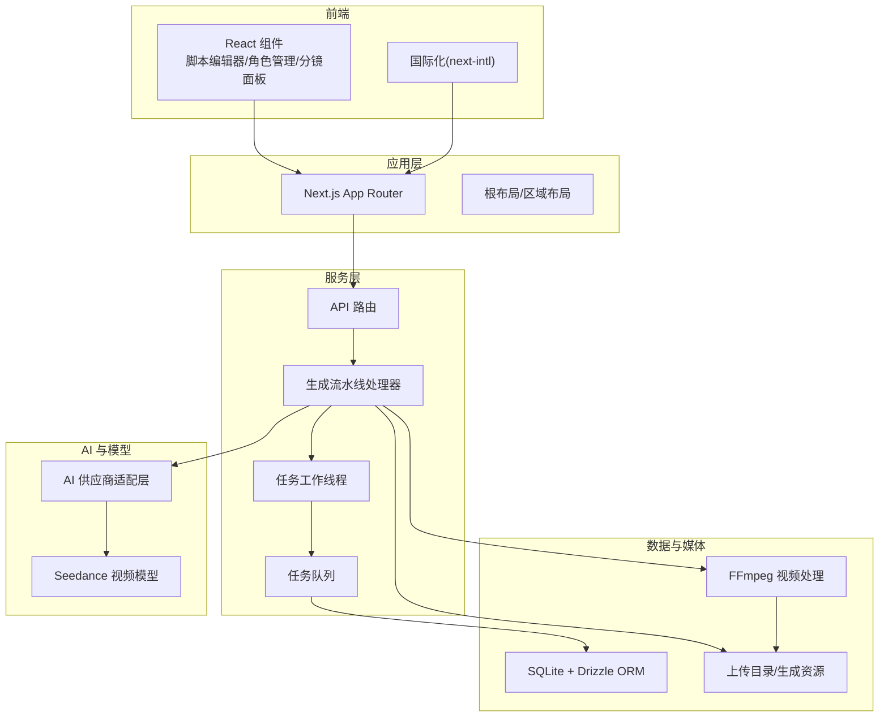
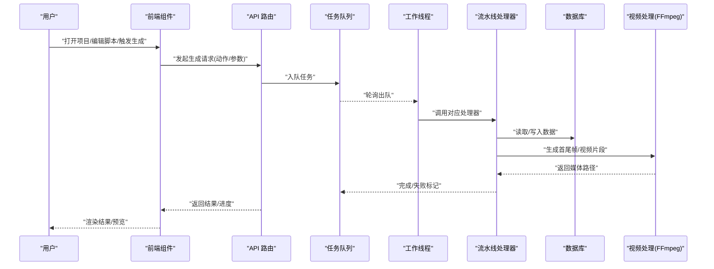
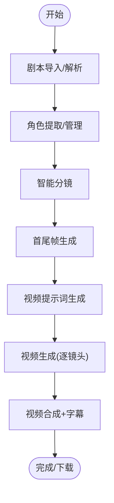
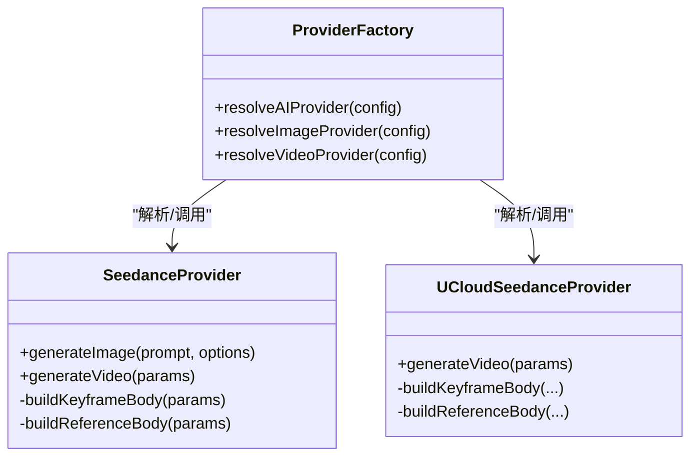
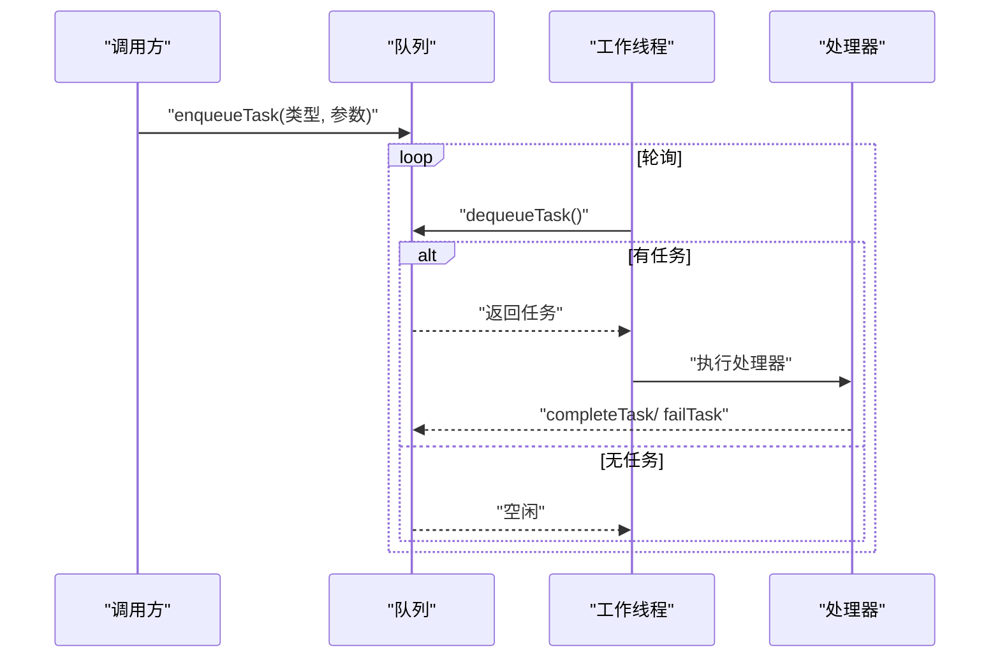
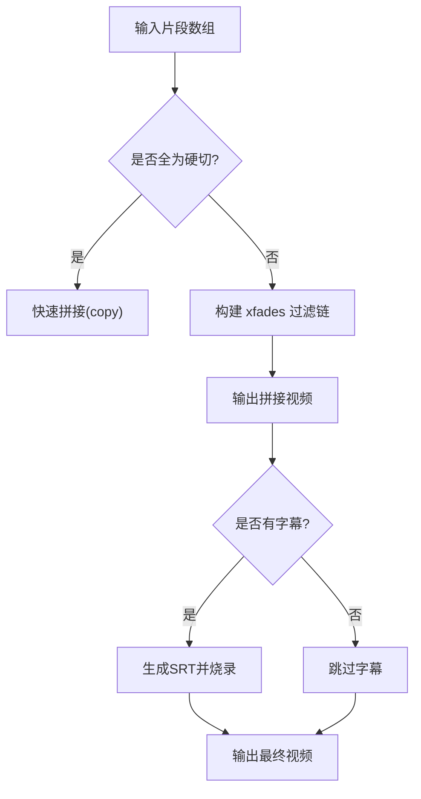
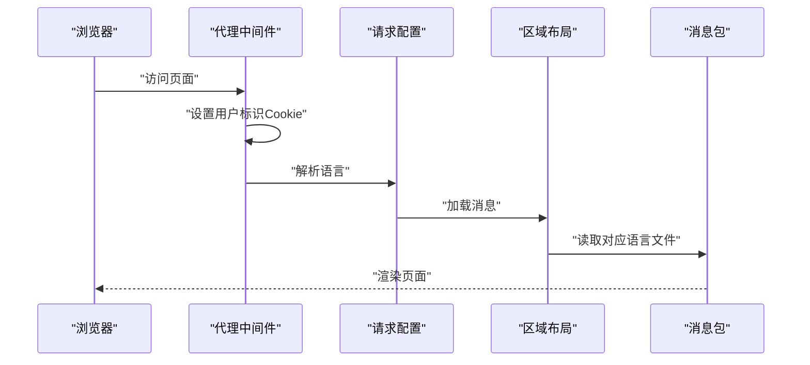
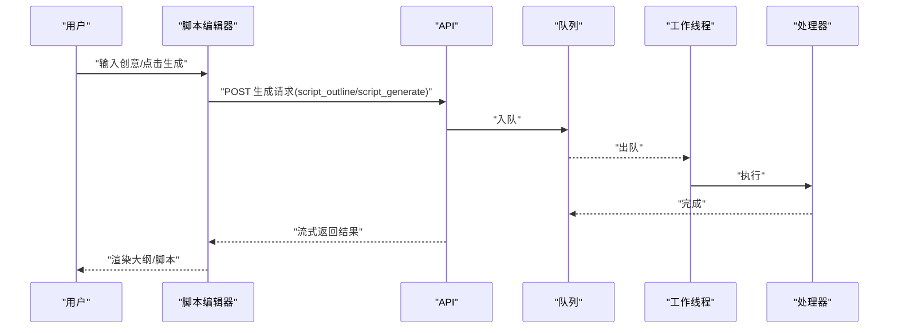
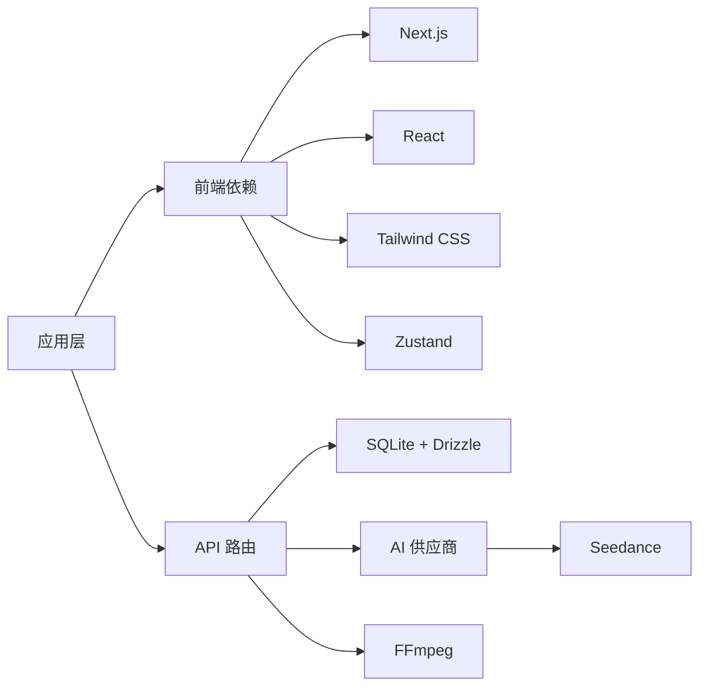

# 项目介绍

<cite>
**本文档引用的文件**
- [README.md](file://README.md)
- [package.json](file://package.json)
- [src/app/layout.tsx](file://src/app/layout.tsx)
- [src/lib/bootstrap.ts](file://src/lib/bootstrap.ts)
- [src/lib/pipeline/index.ts](file://src/lib/pipeline/index.ts)
- [src/lib/pipeline/frame-generate.ts](file://src/lib/pipeline/frame-generate.ts)
- [src/lib/pipeline/character-extract.ts](file://src/lib/pipeline/character-extract.ts)
- [src/lib/pipeline/shot-split.ts](file://src/lib/pipeline/shot-split.ts)
- [src/lib/pipeline/video-generate.ts](file://src/lib/pipeline/video-generate.ts)
- [src/lib/video/ffmpeg.ts](file://src/lib/video/ffmpeg.ts)
- [src/components/editor/script-editor.tsx](file://src/components/editor/script-editor.tsx)
- [src/app/[locale]/layout.tsx](file://src/app/[locale]/layout.tsx)
- [src/i18n/routing.ts](file://src/i18n/routing.ts)
- [src/i18n/request.ts](file://src/i18n/request.ts)
- [src/proxy.ts](file://src/proxy.ts)
- [src/components/language-switcher.tsx](file://src/components/language-switcher.tsx)
- [src/lib/task-queue/worker.ts](file://src/lib/task-queue/worker.ts)
- [src/lib/task-queue/queue.ts](file://src/lib/task-queue/queue.ts)
- [src/lib/ai/providers/seedance.ts](file://src/lib/ai/providers/seedance.ts)
- [src/lib/ai/providers/ucloud-seedance.ts](file://src/lib/ai/providers/ucloud-seedance.ts)
- [src/lib/ai/prompts/video-generate.ts](file://src/lib/ai/prompts/video-generate.ts)
</cite>

## 目录
1. [引言](#引言)
2. [项目结构](#项目结构)
3. [核心组件](#核心组件)
4. [架构总览](#架构总览)
5. [详细组件分析](#详细组件分析)
6. [依赖关系分析](#依赖关系分析)
7. [性能考量](#性能考量)
8. [故障排查指南](#故障排查指南)
9. [结论](#结论)
10. [附录](#附录)

## 引言
AIComicBuilder 是一个“从剧本到动画视频”的全自动化生成平台，旨在以人工智能为核心驱动力，大幅降低漫画视频创作门槛，提升创作效率，并支持多语言国际化。它面向独立创作者、动画工作室、教育机构等不同用户群体，提供从“剧本导入/创作”到“角色管理/分镜”再到“首尾帧生成/视频生成/视频合成”的完整流水线。

- 核心使命：让任何人都能快速把文字故事变成有画面、有节奏、有表现力的动画短片。
- 核心愿景：成为通用的AI漫画视频生成基础设施，推动内容创作的普惠化与标准化。
- 技术创新意义：将大模型能力与视频生成、图像生成、任务编排、FFmpeg 视频处理相结合，形成可扩展、可迭代的生成流水线；同时支持多种AI供应商与视频模型，满足不同场景需求。

## 项目结构
项目采用 Next.js 16 App Router 架构，前端使用 React 19 + Tailwind CSS 4 + Zustand 状态管理，后端通过任务队列与数据库协同，结合 FFmpeg 实现视频合成与字幕烧录。国际化通过 next-intl 实现，支持中/英/日/韩四种语言。

图表来源
- [src/app/[locale]/layout.tsx](file://src/app/[locale]/layout.tsx#L33-L65)
- [src/lib/bootstrap.ts:8-25](file://src/lib/bootstrap.ts#L8-L25)
- [src/lib/pipeline/index.ts:11-22](file://src/lib/pipeline/index.ts#L11-L22)
- [src/lib/task-queue/worker.ts:46-56](file://src/lib/task-queue/worker.ts#L46-L56)
- [src/lib/task-queue/queue.ts:7-29](file://src/lib/task-queue/queue.ts#L7-L29)
- [src/lib/video/ffmpeg.ts:237-318](file://src/lib/video/ffmpeg.ts#L237-L318)

章节来源
- [README.md:156-180](file://README.md#L156-L180)
- [package.json:11-39](file://package.json#L11-L39)

## 核心组件
- 生成流水线：涵盖“剧本解析/角色提取/智能分镜/首尾帧生成/视频提示词/视频生成/视频合成”等步骤，支持单步与批量执行，具备版本管理与进度看板。
- AI 供应商适配：统一抽象文本/图像/视频生成接口，当前支持 OpenAI、Gemini、Kling、Seedance、Veo 等多家供应商。
- 任务队列与工作线程：通过原子出队、重试机制与错误回退，保障生成任务稳定运行。
- FFmpeg 视频处理：实现多片段拼接、转场效果、字幕烧录、背景音乐混音等。
- 国际化与本地化：支持中/英/日/韩语言切换与消息加载。
- 用户界面：脚本编辑器、角色管理、分镜看板、提示词模板、模型配置等。

章节来源
- [README.md:24-44](file://README.md#L24-L44)
- [src/lib/pipeline/index.ts:11-22](file://src/lib/pipeline/index.ts#L11-L22)
- [src/lib/task-queue/worker.ts:9-27](file://src/lib/task-queue/worker.ts#L9-L27)
- [src/lib/video/ffmpeg.ts:237-318](file://src/lib/video/ffmpeg.ts#L237-L318)

## 架构总览
下图展示了从前端交互到后台任务执行、数据库存储与视频处理的整体流程。

图表来源
- [src/lib/task-queue/queue.ts:31-50](file://src/lib/task-queue/queue.ts#L31-L50)
- [src/lib/task-queue/worker.ts:13-27](file://src/lib/task-queue/worker.ts#L13-L27)
- [src/lib/pipeline/index.ts:11-22](file://src/lib/pipeline/index.ts#L11-L22)
- [src/lib/video/ffmpeg.ts:237-318](file://src/lib/video/ffmpeg.ts#L237-L318)

## 详细组件分析

### 生成流水线与阶段说明
- 剧本导入与解析：支持 TXT/DOCX/PDF，AI 自动解析文本、提取角色、智能分集。
- 角色管理：项目级角色管理，支持跨集复用与按集独立解析。
- 智能分镜：将剧本拆解为专业镜头列表，包含构图、灯光、运镜指令。
- 首尾帧生成：为每个镜头生成起始帧与结束帧，保证视觉连续性。
- 视频提示词：基于分镜描述与参考帧自动生成视频提示词，支持编辑。
- 视频生成：基于首尾帧插值生成动画视频片段。
- 视频合成：拼接片段、添加字幕、可选背景音乐与转场。

图表来源
- [README.md:138-154](file://README.md#L138-L154)
- [src/lib/pipeline/frame-generate.ts:14-233](file://src/lib/pipeline/frame-generate.ts#L14-L233)
- [src/lib/pipeline/video-generate.ts:24-25](file://src/lib/pipeline/video-generate.ts#L24-L25)
- [src/lib/video/ffmpeg.ts:237-318](file://src/lib/video/ffmpeg.ts#L237-L318)

章节来源
- [README.md:24-44](file://README.md#L24-L44)
- [src/lib/pipeline/frame-generate.ts:14-233](file://src/lib/pipeline/frame-generate.ts#L14-L233)
- [src/lib/pipeline/shot-split.ts:11-185](file://src/lib/pipeline/shot-split.ts#L11-L185)
- [src/lib/pipeline/character-extract.ts:27-142](file://src/lib/pipeline/character-extract.ts#L27-L142)

### AI 供应商与视频生成
- 供应商适配：统一抽象文本/图像/视频生成接口，便于切换与扩展。
- Seedance 视频模型：支持首尾帧模式与参考图模式，兼容 Seedance 1.5/2.0，可生成带音频的视频片段。
- 提示词语言自适应：根据输入文本语言自动选择中/英标签，提升提示词质量。

图表来源
- [src/lib/ai/providers/seedance.ts:96-153](file://src/lib/ai/providers/seedance.ts#L96-L153)
- [src/lib/ai/providers/ucloud-seedance.ts:99-140](file://src/lib/ai/providers/ucloud-seedance.ts#L99-L140)

章节来源
- [src/lib/ai/providers/seedance.ts:96-153](file://src/lib/ai/providers/seedance.ts#L96-L153)
- [src/lib/ai/providers/ucloud-seedance.ts:99-140](file://src/lib/ai/providers/ucloud-seedance.ts#L99-L140)
- [src/lib/ai/prompts/video-generate.ts:1-44](file://src/lib/ai/prompts/video-generate.ts#L1-L44)

### 任务队列与工作线程
- 入队/出队：原子性地将任务标记为“运行中”，避免并发冲突。
- 工作线程：定时轮询，按类型分派给对应处理器，支持失败重试与错误上报。
- 任务持久化：Drizzle ORM 存储任务状态与元数据。

图表来源
- [src/lib/task-queue/queue.ts:7-29](file://src/lib/task-queue/queue.ts#L7-L29)
- [src/lib/task-queue/queue.ts:31-50](file://src/lib/task-queue/queue.ts#L31-L50)
- [src/lib/task-queue/worker.ts:29-44](file://src/lib/task-queue/worker.ts#L29-L44)

章节来源
- [src/lib/task-queue/queue.ts:7-50](file://src/lib/task-queue/queue.ts#L7-L50)
- [src/lib/task-queue/worker.ts:9-56](file://src/lib/task-queue/worker.ts#L9-L56)

### FFmpeg 视频处理
- 多片段拼接：支持硬切与交叉淡化等多种转场。
- 字幕烧录：生成 SRT 并嵌入字幕，失败时回退到纯拼接。
- 背景音乐：可选混音与音量控制。
- 标题/片尾卡片：可插入标题卡与片尾字幕卡。

图表来源
- [src/lib/video/ffmpeg.ts:140-235](file://src/lib/video/ffmpeg.ts#L140-L235)
- [src/lib/video/ffmpeg.ts:276-318](file://src/lib/video/ffmpeg.ts#L276-L318)

章节来源
- [src/lib/video/ffmpeg.ts:237-318](file://src/lib/video/ffmpeg.ts#L237-L318)

### 国际化与本地化
- 路由与语言：通过 next-intl 定义 zh/en/ja/ko 四种语言，区域布局负责注入消息。
- 请求处理：根据客户端语言选择消息包，未识别时回退默认语言。
- 代理中间件：确保首次请求即设置用户标识 Cookie，便于服务端按用户维度查询。

图表来源
- [src/proxy.ts:9-26](file://src/proxy.ts#L9-L26)
- [src/i18n/request.ts:4-15](file://src/i18n/request.ts#L4-L15)
- [src/app/[locale]/layout.tsx:33-L65](file://src/app/[locale]/layout.tsx#L33-L65)

章节来源
- [src/i18n/routing.ts:1-6](file://src/i18n/routing.ts#L1-L6)
- [src/i18n/request.ts:4-15](file://src/i18n/request.ts#L4-L15)
- [src/app/[locale]/layout.tsx:33-L65](file://src/app/[locale]/layout.tsx#L33-L65)
- [src/proxy.ts:9-26](file://src/proxy.ts#L9-L26)

### 脚本编辑器与生成流程
- 自动保存：防抖与失焦保存，减少网络压力。
- 生成大纲与脚本：支持流式响应，实时渲染生成内容。
- 智能引导：当缺少大纲时自动优先生成大纲再生成脚本。

图表来源
- [src/components/editor/script-editor.tsx:93-231](file://src/components/editor/script-editor.tsx#L93-L231)
- [src/lib/task-queue/queue.ts:31-50](file://src/lib/task-queue/queue.ts#L31-L50)
- [src/lib/task-queue/worker.ts:13-27](file://src/lib/task-queue/worker.ts#L13-L27)

章节来源
- [src/components/editor/script-editor.tsx:17-364](file://src/components/editor/script-editor.tsx#L17-L364)

## 依赖关系分析
- 前端依赖：Next.js、React、Tailwind CSS、Zustand、next-intl 等。
- 数据与存储：SQLite + Drizzle ORM，任务队列持久化。
- AI 与模型：OpenAI、Gemini、Kling、Seedance、Veo 等供应商适配。
- 视频处理：FFmpeg + fluent-ffmpeg。
- 包管理：pnpm。

图表来源
- [package.json:11-39](file://package.json#L11-L39)
- [src/lib/bootstrap.ts:12-25](file://src/lib/bootstrap.ts#L12-L25)

章节来源
- [package.json:11-39](file://package.json#L11-L39)
- [README.md:45-58](file://README.md#L45-L58)

## 性能考量
- 任务并发与吞吐：工作线程定时轮询，建议合理设置轮询间隔与并发数，避免频繁上下文切换。
- I/O 与磁盘：视频与图片生成较多，建议使用高性能磁盘与合理的上传目录结构。
- 模型选择：不同供应商与模型的生成耗时差异较大，建议按场景选择合适模型与参数。
- 视频合成：转场与字幕烧录会增加 CPU 占用，建议在空闲时段批量合成或使用更高性能的服务器。

## 故障排查指南
- 任务未执行：检查工作线程是否启动、队列是否正确入队、处理器是否注册。
- 生成失败：查看处理器内部异常捕获与失败标记，确认模型配置与网络连通性。
- FFmpeg 错误：核对 FFmpeg 是否安装、路径是否正确、输入文件是否存在。
- 国际化异常：确认代理中间件是否设置 Cookie、消息包是否存在对应语言文件。

章节来源
- [src/lib/task-queue/worker.ts:13-27](file://src/lib/task-queue/worker.ts#L13-L27)
- [src/lib/task-queue/queue.ts:31-50](file://src/lib/task-queue/queue.ts#L31-L50)
- [src/lib/video/ffmpeg.ts:276-318](file://src/lib/video/ffmpeg.ts#L276-L318)
- [src/proxy.ts:9-26](file://src/proxy.ts#L9-L26)

## 结论
AIComicBuilder 通过“AI 驱动 + 流水线编排 + FFmpeg 处理”的技术组合，实现了从文字到动画视频的一站式生成体验。其模块化设计与多供应商适配，使其在创作效率、成本控制与国际化方面具备显著优势。对于独立创作者与小型团队，它降低了视频制作门槛；对于教育与内容生产机构，它提供了标准化的工具链与可扩展的生成能力。

## 附录
- 快速开始与部署：支持本地开发、Docker 与 Docker Compose，数据持久化通过卷挂载实现。
- 生成流水线概览：从剧本输入到视频合成的完整路径，支持版本管理与进度看板。

章节来源
- [README.md:59-137](file://README.md#L59-L137)
- [README.md:138-154](file://README.md#L138-L154)