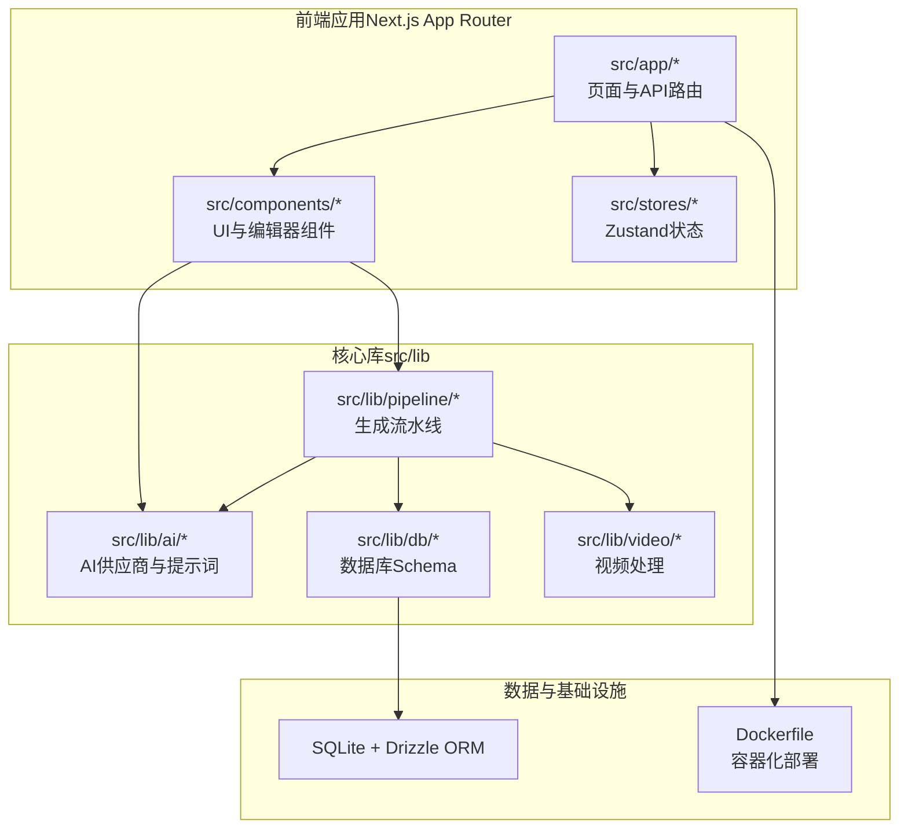
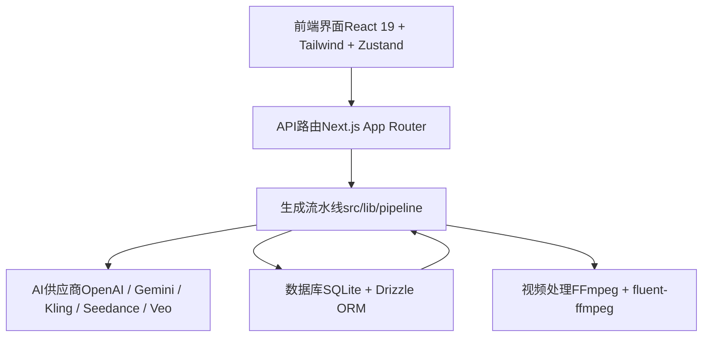
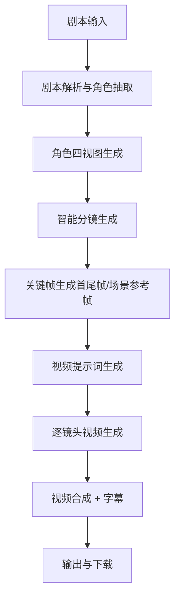
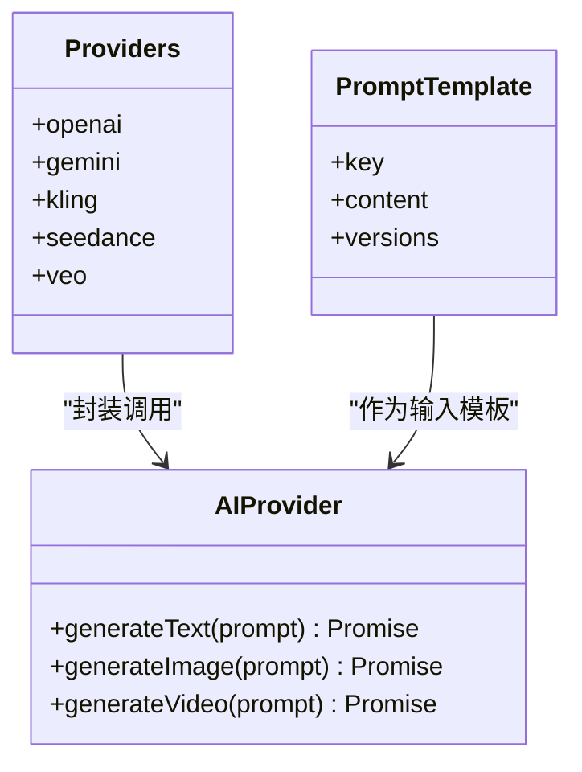
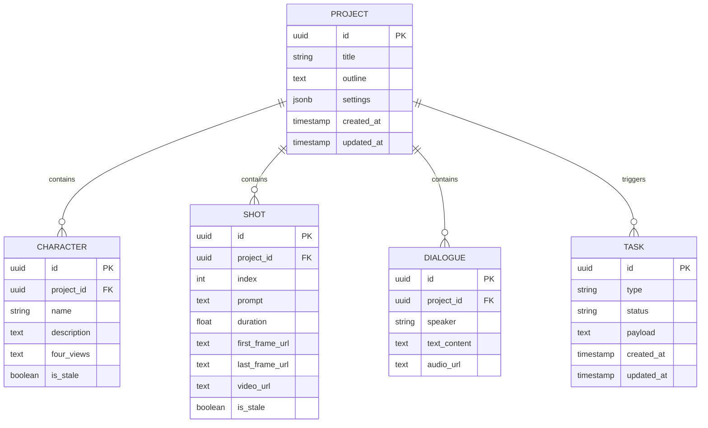
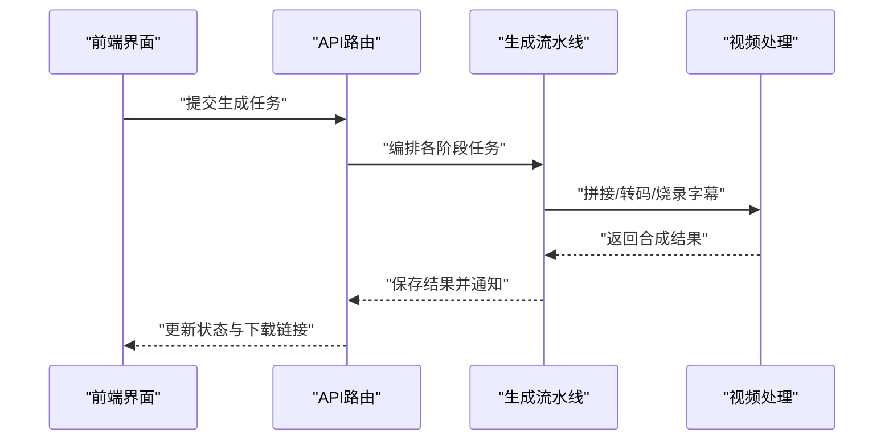
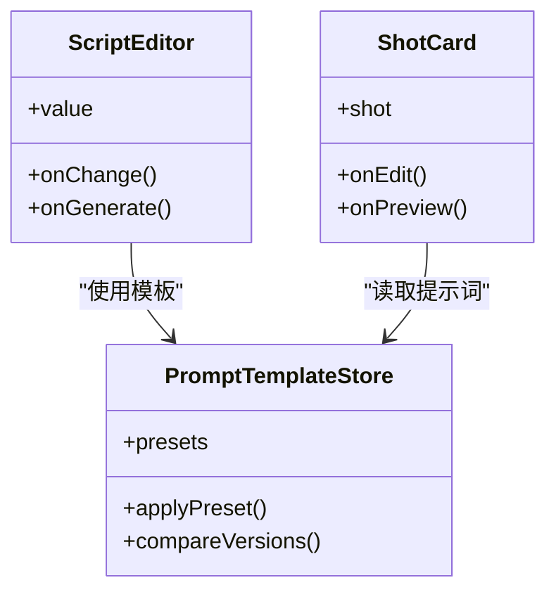
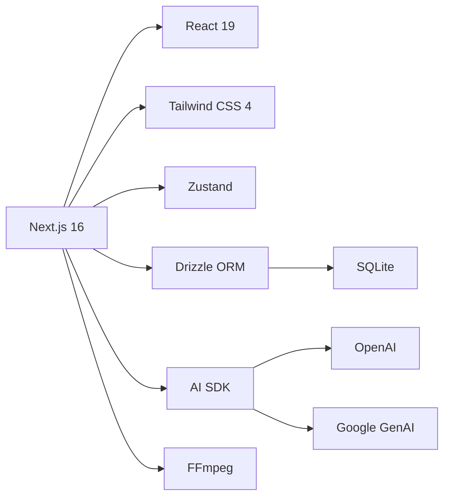

# 项目概述

<cite>
**本文引用的文件**
- [package.json](file://package.json)
- [README.md](file://README.md)
- [src/app/layout.tsx](file://src/app/layout.tsx)
- [src/app/api/projects/route.ts](file://src/app/api/projects/route.ts)
- [src/app/api/generate/route.ts](file://src/app/api/generate/route.ts)
- [src/components/editor/script-editor.tsx](file://src/components/editor/script-editor.tsx)
- [src/components/editor/shot-card.tsx](file://src/components/editor/shot-card.tsx)
- [src/lib/pipeline/index.ts](file://src/lib/pipeline/index.ts)
- [src/lib/ai/providers.ts](file://src/lib/ai/providers.ts)
- [src/lib/video/compositor.ts](file://src/lib/video/compositor.ts)
- [drizzle/0000_chemical_tyrannus.sql](file://drizzle/0000_chemical_tyrannus.sql)
- [drizzle/0001_add_user_id.sql](file://drizzle/0001_add_user_id.sql)
- [Dockerfile](file://Dockerfile)
</cite>

## 目录
1. 引言
2. 项目结构
3. 核心组件
4. 架构总览
5. 详细组件分析
6. 依赖关系分析
7. 性能考虑
8. 故障排除指南
9. 结论
10. 附录

## 引言
AIComicBuilder 是一个面向创作者的 AI 驱动漫画视频生成平台，旨在将“从创意到成品”的全流程自动化：从剧本导入与解析，到角色与场景设计，再到智能分镜、关键帧生成、视频提示词工程、逐镜头视频生成与最终合成。项目采用模块化设计，结合多种 AI 供应商能力（文本、图像、视频），并通过本地 SQLite 数据库存储项目数据，配合 FFmpeg 进行视频处理与合成。

- 核心目标：降低漫画视频制作门槛，提升创作效率与质量一致性
- 主要特性：剧本导入与解析、角色与四视图管理、智能分镜、首尾帧/参考帧生成、视频提示词工程、逐镜头视频生成、视频合成与字幕、多语言界面、多模型供应商适配
- 技术优势：前后端一体化（Next.js App Router）、状态管理（Zustand）、数据库迁移（Drizzle ORM + SQLite）、AI SDK 抽象、FFmpeg 流水线

**章节来源**
- [README.md:24-44](file://README.md#L24-L44)
- [README.md:138-154](file://README.md#L138-L154)

## 项目结构
项目采用 Next.js 16 App Router 的组织方式，核心目录划分如下：
- src/app：页面路由与 API 路由，包含国际化路由、仪表盘、项目编辑器、设置等
- src/components：UI 组件与编辑器组件（脚本编辑器、分镜卡片等）
- src/lib：AI 供应商抽象、生成流水线、数据库 Schema、视频处理（FFmpeg）
- src/stores：Zustand 状态管理
- drizzle：数据库迁移脚本与元数据
- 公共静态资源：public、images、messages 等

**图表来源**
- [README.md:156-180](file://README.md#L156-L180)
- [package.json:11-39](file://package.json#L11-L39)

**章节来源**
- [README.md:156-180](file://README.md#L156-L180)
- [package.json:11-39](file://package.json#L11-L39)

## 核心组件
- 剧本与脚本编辑：支持 TXT/DOCX/PDF 导入，AI 解析与角色抽取，支持手动编辑与 AI 辅助生成
- 角色与四视图：项目级角色管理，为主角/配角分区展示；为每个角色生成四视图参考图，保证后续帧画面一致性
- 智能分镜：将剧本拆解为专业镜头列表，包含构图、灯光、运镜指令
- 关键帧与视频提示词：逐镜头生成首尾帧或场景参考帧，并自动生成/编辑视频提示词
- 视频生成与合成：逐镜头生成视频片段，最终拼接为完整动画并支持字幕烧录
- 多模型与多语言：支持 OpenAI、Gemini、Kling、Seedance、Veo 等多家 AI 供应商；支持中/英/日/韩多语言
- 数据与状态：SQLite + Drizzle ORM 存储项目、角色、分镜、对话、任务等实体；Zustand 管理前端状态

**章节来源**
- [README.md:24-44](file://README.md#L24-L44)
- [README.md:182-188](file://README.md#L182-L188)

## 架构总览
系统采用“前端（Next.js）+ 后端 API（App Router）+ AI 供应商 + 数据库（SQLite）+ 视频处理（FFmpeg）”的分层架构。前端负责交互与状态管理，后端 API 负责业务编排与任务调度，AI 供应商提供文本、图像与视频生成能力，Drizzle ORM 管理数据库迁移与访问，FFmpeg 负责视频合成与处理。

**图表来源**
- [README.md:45-57](file://README.md#L45-L57)
- [package.json:11-39](file://package.json#L11-L39)

**章节来源**
- [README.md:45-57](file://README.md#L45-L57)
- [package.json:11-39](file://package.json#L11-L39)

## 详细组件分析

### 生成流水线（从创意到成品）
AIComicBuilder 的核心是“生成流水线”，覆盖从剧本到视频的全链路：

- 剧本解析与角色抽取：支持 TXT/DOCX/PDF，AI 自动识别角色与分集
- 角色四视图：保证角色在不同视角下的一致性
- 智能分镜：将剧本分解为镜头清单，包含构图与运镜指令
- 关键帧与提示词：逐镜头生成首尾帧或场景参考帧，并自动生成视频提示词
- 视频生成与合成：逐镜头生成视频片段并拼接为完整作品，支持字幕烧录

**图表来源**
- [README.md:138-154](file://README.md#L138-L154)

**章节来源**
- [README.md:138-154](file://README.md#L138-L154)

### AI 供应商与提示词工程
- 文本类：OpenAI / Gemini（通过 AI SDK）
- 图像类：OpenAI DALL-E / Gemini Imagen / Kling
- 视频类：Seedance / Kling / Veo
- 提示词工程：基于分镜描述与参考帧自动生成视频提示词，支持人工编辑与版本管理

**图表来源**
- [README.md:53-55](file://README.md#L53-L55)
- [src/lib/ai/providers.ts](file://src/lib/ai/providers.ts)

**章节来源**
- [README.md:53-55](file://README.md#L53-L55)
- [src/lib/ai/providers.ts](file://src/lib/ai/providers.ts)

### 数据模型与数据库
项目使用 SQLite + Drizzle ORM 管理数据，核心实体包括：
- Project：项目（剧本、状态）
- Character：角色（名称、描述、参考图）
- Shot：镜头（序号、提示词、时长、首尾帧、视频）
- Dialogue：对白（角色、文本、音频）
- Task：后台任务队列

**图表来源**
- [README.md:182-188](file://README.md#L182-L188)
- [drizzle/0000_chemical_tyrannus.sql](file://drizzle/0000_chemical_tyrannus.sql)
- [drizzle/0001_add_user_id.sql](file://drizzle/0001_add_user_id.sql)

**章节来源**
- [README.md:182-188](file://README.md#L182-L188)
- [drizzle/0000_chemical_tyrannus.sql](file://drizzle/0000_chemical_tyrannus.sql)
- [drizzle/0001_add_user_id.sql](file://drizzle/0001_add_user_id.sql)

### 视频处理与合成
- 使用 FFmpeg（fluent-ffmpeg）进行视频拼接、转码与字幕烧录
- 支持多种视频比例（16:9 / 9:16 / 1:1 / 自适应）
- 生成的视频片段按顺序合成，形成完整作品

**图表来源**
- [README.md:56](file://README.md#L56)
- [src/lib/video/compositor.ts](file://src/lib/video/compositor.ts)

**章节来源**
- [README.md:56](file://README.md#L56)
- [src/lib/video/compositor.ts](file://src/lib/video/compositor.ts)

### 前端交互与编辑器
- 脚本编辑器：支持手动编写与 AI 辅助生成
- 分镜卡片与看板：支持列表视图与看板视图，按生成进度自动分列
- 提示词管理：支持模板化与版本对比迭代
- 多语言：内置中/英/日/韩语言包

**图表来源**
- [src/components/editor/script-editor.tsx](file://src/components/editor/script-editor.tsx)
- [src/components/editor/shot-card.tsx](file://src/components/editor/shot-card.tsx)
- [src/stores/prompt-template-store.ts](file://src/stores/prompt-template-store.ts)

**章节来源**
- [src/components/editor/script-editor.tsx](file://src/components/editor/script-editor.tsx)
- [src/components/editor/shot-card.tsx](file://src/components/editor/shot-card.tsx)

## 依赖关系分析
- 前端框架：Next.js 16（App Router）、React 19、Tailwind CSS 4、Zustand
- 国际化：next-intl
- 数据库：SQLite + Drizzle ORM
- AI SDK：AI SDK（OpenAI / Google）、OpenAI 库
- 视频处理：FFmpeg（fluent-ffmpeg）
- 包管理：pnpm

**图表来源**
- [package.json:11-39](file://package.json#L11-L39)
- [README.md:45-57](file://README.md#L45-L57)

**章节来源**
- [package.json:11-39](file://package.json#L11-L39)
- [README.md:45-57](file://README.md#L45-L57)

## 性能考虑
- 任务队列与异步处理：通过 Task 实体与后台队列实现非阻塞生成
- 数据库优化：Drizzle ORM 提供类型安全与高效查询
- 视频处理：合理配置 FFmpeg 参数，避免高分辨率导致的内存峰值
- 前端性能：Zustand 减少不必要的重渲染，组件按需加载
- AI 调用：对长文本与复杂提示词进行分块与缓存，避免重复计算

## 故障排除指南
- 环境依赖缺失：确认已安装 Node.js 18+、pnpm、FFmpeg
- 数据库初始化：执行数据库迁移命令完成初始化
- Docker 部署：确保挂载数据卷与端口映射正确
- AI 模型配置：在设置页面中配置 OpenAI / Gemini / Seedance 等供应商密钥
- 视频合成失败：检查 FFmpeg 是否可用，确认输入片段路径与格式

**章节来源**
- [README.md:61-86](file://README.md#L61-L86)
- [README.md:87-137](file://README.md#L87-L137)

## 结论
AIComicBuilder 通过模块化的前后端架构、完善的数据库与视频处理管线，以及对多 AI 供应商的抽象封装，实现了从剧本到视频的自动化生产。其设计理念在于“降低门槛、提升效率、保障一致性”，既适合初学者快速上手，也为有经验的创作者提供了强大的工具与扩展空间。未来可在分布式任务队列、云端存储与更多 AI 供应商接入方面持续演进。

## 附录
- 快速开始与环境要求、安装与初始化、Docker 部署步骤详见项目自述文件
- 生成流水线与界面截图可参考项目自述文件中的演示与说明

**章节来源**
- [README.md:59-137](file://README.md#L59-L137)