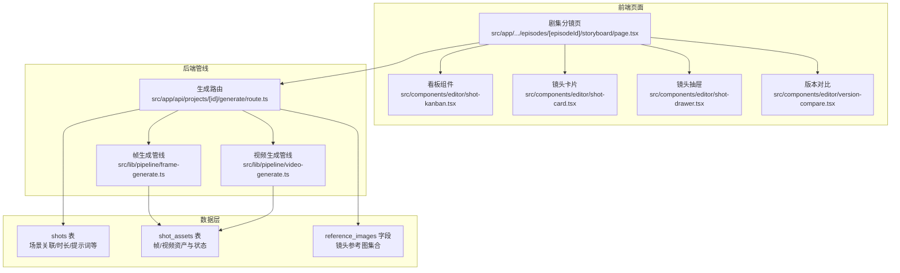
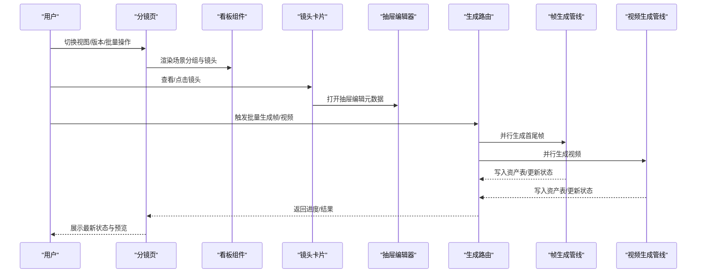
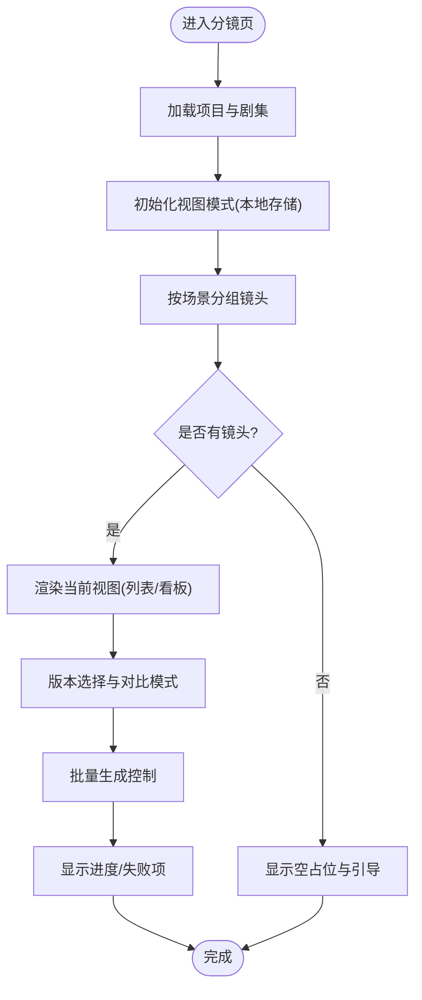
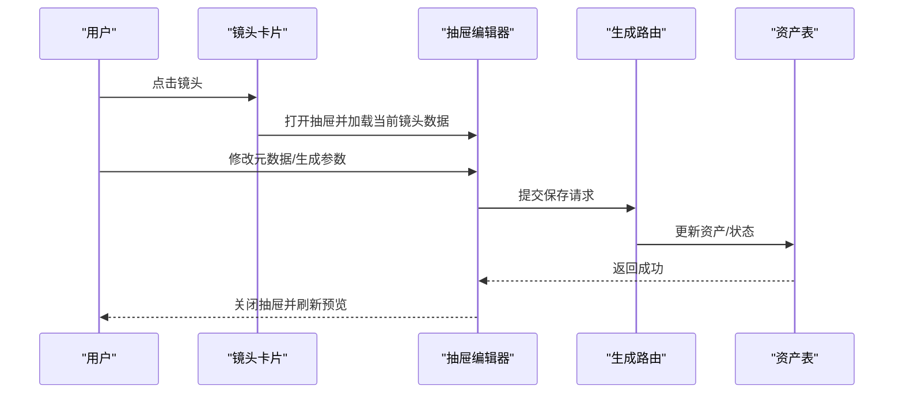
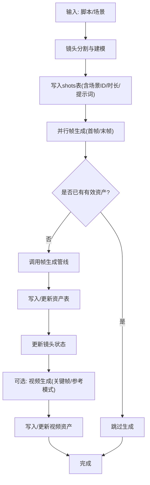
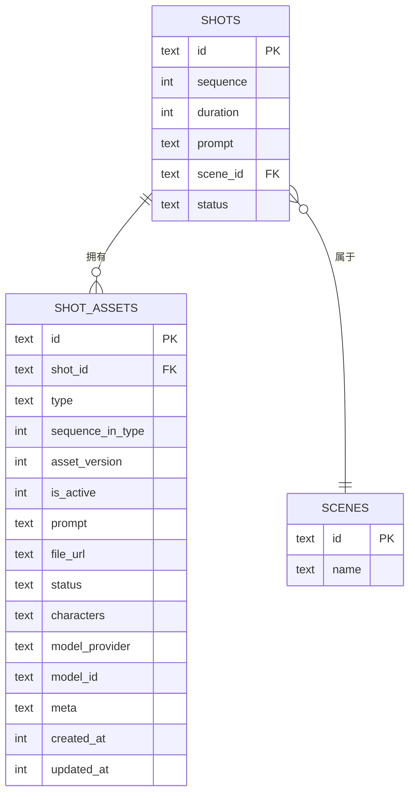
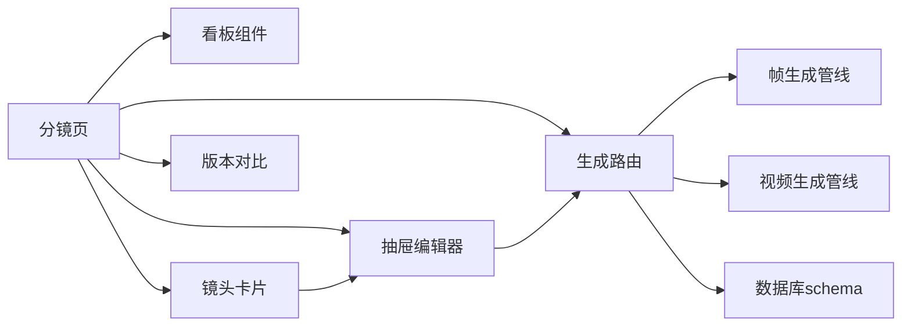

# 分镜设计工具

<cite>
**本文引用的文件**
- [src/app/[locale]/project/[id]/episodes/[episodeId]/storyboard/page.tsx](file://src/app/[locale]/project/[id]/episodes/[episodeId]/storyboard/page.tsx)
- [src/components/editor/shot-card.tsx](file://src/components/editor/shot-card.tsx)
- [src/components/editor/shot-drawer.tsx](file://src/components/editor/shot-drawer.tsx)
- [src/components/editor/shot-kanban.tsx](file://src/components/editor/shot-kanban.tsx)
- [src/lib/pipeline/frame-generate.ts](file://src/lib/pipeline/frame-generate.ts)
- [src/lib/pipeline/video-generate.ts](file://src/lib/pipeline/video-generate.ts)
- [src/app/api/projects/[id]/generate/route.ts](file://src/app/api/projects/[id]/generate/route.ts)
- [src/lib/shot-asset-utils.ts](file://src/lib/shot-asset-utils.ts)
- [drizzle/0027_add_shot_scene_id.sql](file://drizzle/0027_add_shot_scene_id.sql)
- [drizzle/0048_add_shot_reference_images.sql](file://drizzle/0048_add_shot_reference_images.sql)
- [drizzle/0050_add_shot_assets.sql](file://drizzle/0050_add_shot_assets.sql)
- [src/components/editor/version-compare.tsx](file://src/components/editor/version-compare.tsx)
- [src/components/editor/project-nav.tsx](file://src/components/editor/project-nav.tsx)
- [src/components/prompt-templates/prompt-editor.tsx](file://src/components/prompt-templates/prompt-editor.tsx)
</cite>

## 目录
1. [简介](#简介)
2. [项目结构](#项目结构)
3. [核心组件](#核心组件)
4. [架构总览](#架构总览)
5. [详细组件分析](#详细组件分析)
6. [依赖分析](#依赖分析)
7. [性能考虑](#性能考虑)
8. [故障排查指南](#故障排查指南)
9. [结论](#结论)
10. [附录](#附录)

## 简介
本文件面向AIComicBuilder的“分镜设计工具”，系统性阐述分镜设计流程、镜头分割与生成算法、镜头属性与关系管理、分镜看板视图与拖拽排序、镜头状态跟踪与版本对比、镜头卡片与预览、以及镜头编辑器等模块。同时提供最佳实践、视觉叙事指导与质量评估标准，帮助创作者高效产出高质量分镜。

## 项目结构
分镜设计工具由前端页面、编辑器组件、后端生成管线与数据库模式共同构成。前端页面负责展示与交互（列表/看板视图、版本对比、批量操作），编辑器组件负责镜头卡片渲染与抽屉式编辑，后端通过并行生成管线完成帧与视频资产的批量生成，并以数据库表结构承载镜头与资产元数据。

图表来源
- [src/app/[locale]/project/[id]/episodes/[episodeId]/storyboard/page.tsx](file://src/app/[locale]/project/[id]/episodes/[episodeId]/storyboard/page.tsx#L51-L1105)
- [src/components/editor/shot-kanban.tsx](file://src/components/editor/shot-kanban.tsx)
- [src/components/editor/shot-card.tsx](file://src/components/editor/shot-card.tsx)
- [src/components/editor/shot-drawer.tsx](file://src/components/editor/shot-drawer.tsx)
- [src/components/editor/version-compare.tsx](file://src/components/editor/version-compare.tsx)
- [src/app/api/projects/[id]/generate/route.ts](file://src/app/api/projects/[id]/generate/route.ts#L1545-L3017)
- [src/lib/pipeline/frame-generate.ts:134-160](file://src/lib/pipeline/frame-generate.ts#L134-L160)
- [src/lib/pipeline/video-generate.ts:2-2](file://src/lib/pipeline/video-generate.ts#L2-L2)
- [drizzle/0027_add_shot_scene_id.sql:1-1](file://drizzle/0027_add_shot_scene_id.sql#L1-L1)
- [drizzle/0048_add_shot_reference_images.sql:1-1](file://drizzle/0048_add_shot_reference_images.sql#L1-L1)
- [drizzle/0050_add_shot_assets.sql:1-21](file://drizzle/0050_add_shot_assets.sql#L1-L21)

章节来源
- [src/app/[locale]/project/[id]/episodes/[episodeId]/storyboard/page.tsx](file://src/app/[locale]/project/[id]/episodes/[episodeId]/storyboard/page.tsx#L51-L1105)
- [src/components/editor/shot-kanban.tsx](file://src/components/editor/shot-kanban.tsx)
- [src/components/editor/shot-card.tsx](file://src/components/editor/shot-card.tsx)
- [src/components/editor/shot-drawer.tsx](file://src/components/editor/shot-drawer.tsx)
- [src/components/editor/version-compare.tsx](file://src/components/editor/version-compare.tsx)
- [src/app/api/projects/[id]/generate/route.ts](file://src/app/api/projects/[id]/generate/route.ts#L1545-L3017)
- [src/lib/pipeline/frame-generate.ts:134-160](file://src/lib/pipeline/frame-generate.ts#L134-L160)
- [src/lib/pipeline/video-generate.ts:2-2](file://src/lib/pipeline/video-generate.ts#L2-L2)
- [drizzle/0027_add_shot_scene_id.sql:1-1](file://drizzle/0027_add_shot_scene_id.sql#L1-L1)
- [drizzle/0048_add_shot_reference_images.sql:1-1](file://drizzle/0048_add_shot_reference_images.sql#L1-L1)
- [drizzle/0050_add_shot_assets.sql:1-21](file://drizzle/0050_add_shot_assets.sql#L1-L21)

## 核心组件
- 分镜页：提供列表/看板双视图切换、版本选择、批量生成控制、无镜头占位与导航入口。
- 镜头卡片：展示镜头序列、首尾帧缩略图、提示词摘要、时长、状态与过期标记；支持打开抽屉进行编辑。
- 看板组件：按场景分组展示镜头，支持拖拽排序与批量操作。
- 抽屉编辑器：在侧边抽屉中编辑镜头元数据（提示词、时长、角色等）与生成参数。
- 版本对比：在同一界面对比不同版本的首尾帧，辅助评审与回溯。
- 生成管线：并行处理镜头帧与视频生成，写入资产表并更新镜头状态。

章节来源
- [src/app/[locale]/project/[id]/episodes/[episodeId]/storyboard/page.tsx](file://src/app/[locale]/project/[id]/episodes/[episodeId]/storyboard/page.tsx#L51-L1105)
- [src/components/editor/shot-card.tsx:836-836](file://src/components/editor/shot-card.tsx#L836-L836)
- [src/components/editor/shot-kanban.tsx](file://src/components/editor/shot-kanban.tsx)
- [src/components/editor/shot-drawer.tsx](file://src/components/editor/shot-drawer.tsx)
- [src/components/editor/version-compare.tsx:45-45](file://src/components/editor/version-compare.tsx#L45-L45)

## 架构总览
分镜设计工具采用“前端页面+编辑器组件+后端生成管线+数据库”的分层架构。前端负责用户交互与状态管理，后端通过并行任务队列生成帧与视频资产，数据库承担镜头与资产的持久化与版本化管理。

图表来源
- [src/app/[locale]/project/[id]/episodes/[episodeId]/storyboard/page.tsx](file://src/app/[locale]/project/[id]/episodes/[episodeId]/storyboard/page.tsx#L51-L1105)
- [src/app/api/projects/[id]/generate/route.ts](file://src/app/api/projects/[id]/generate/route.ts#L1545-L3017)
- [src/lib/pipeline/frame-generate.ts:134-160](file://src/lib/pipeline/frame-generate.ts#L134-L160)
- [src/lib/pipeline/video-generate.ts:2-2](file://src/lib/pipeline/video-generate.ts#L2-L2)

## 详细组件分析

### 分镜页与视图模式
- 功能要点
  - 支持“列表”与“看板”两种视图，本地存储用户偏好。
  - 场景分组与未分组镜头的聚合逻辑。
  - 版本下拉选择与当前版本回退策略。
  - 批量生成控制（帧/视频/参考图像/参考提示词），并显示进度与失败项。
  - 无镜头时的占位提示与引导按钮。
  - 导航入口指向分镜页。

图表来源
- [src/app/[locale]/project/[id]/episodes/[episodeId]/storyboard/page.tsx](file://src/app/[locale]/project/[id]/episodes/[episodeId]/storyboard/page.tsx#L51-L1105)

章节来源
- [src/app/[locale]/project/[id]/episodes/[episodeId]/storyboard/page.tsx](file://src/app/[locale]/project/[id]/episodes/[episodeId]/storyboard/page.tsx#L51-L1105)
- [src/components/editor/project-nav.tsx:26-26](file://src/components/editor/project-nav.tsx#L26-L26)

### 镜头卡片与抽屉编辑器
- 镜头卡片
  - 显示序列号、首尾帧缩略图、提示词摘要、时长、状态与“过期”标记。
  - 点击打开抽屉编辑器。
- 抽屉编辑器
  - 编辑镜头元数据（提示词、时长、角色等）与生成参数。
  - 与资产表联动，保存后触发重新生成或刷新预览。

图表来源
- [src/components/editor/shot-card.tsx:836-836](file://src/components/editor/shot-card.tsx#L836-L836)
- [src/components/editor/shot-drawer.tsx](file://src/components/editor/shot-drawer.tsx)
- [src/app/api/projects/[id]/generate/route.ts](file://src/app/api/projects/[id]/generate/route.ts#L1545-L3017)
- [src/lib/shot-asset-utils.ts:288-288](file://src/lib/shot-asset-utils.ts#L288-L288)

章节来源
- [src/components/editor/shot-card.tsx:836-836](file://src/components/editor/shot-card.tsx#L836-L836)
- [src/components/editor/shot-drawer.tsx](file://src/components/editor/shot-drawer.tsx)
- [src/lib/shot-asset-utils.ts:288-288](file://src/lib/shot-asset-utils.ts#L288-L288)

### 看板视图与拖拽排序
- 按场景分组展示镜头，支持拖拽调整顺序。
- 排序变更通过后端接口提交，确保一致性与并发安全。
- 与版本对比结合，便于在不同版本间比较排序差异。

章节来源
- [src/components/editor/shot-kanban.tsx](file://src/components/editor/shot-kanban.tsx)
- [src/app/[locale]/project/[id]/episodes/[episodeId]/storyboard/page.tsx](file://src/app/[locale]/project/[id]/episodes/[episodeId]/storyboard/page.tsx#L113-L1105)

### 版本对比与状态跟踪
- 版本对比组件在同一界面展示两个版本的首尾帧，辅助评审与回溯。
- 状态跟踪包括“待生成/生成中/成功/失败/过期”等，卡片上直观标识。
- 过期标记用于提醒需要重新生成或更新。

章节来源
- [src/components/editor/version-compare.tsx:45-45](file://src/components/editor/version-compare.tsx#L45-L45)
- [src/components/editor/shot-card.tsx:836-836](file://src/components/editor/shot-card.tsx#L836-L836)

### 镜头分割算法与生成流程
- 镜头分割
  - 基于脚本解析与场景边界自动分割镜头，支持手动微调。
  - 分割结果写入shots表，包含序列号、时长、提示词、场景ID等。
- 帧生成
  - 并行处理每个镜头的首帧与末帧，优先使用已存在的资产避免重复生成。
  - 生成前对资产状态置为“生成中”，异常时置为“失败”。
- 视频生成
  - 参考模式使用整场参考帧，关键帧模式使用首末帧描述过渡。
  - 生成结果写入资产表并更新镜头状态。

图表来源
- [src/app/api/projects/[id]/generate/route.ts](file://src/app/api/projects/[id]/generate/route.ts#L1545-L3017)
- [src/lib/pipeline/frame-generate.ts:134-160](file://src/lib/pipeline/frame-generate.ts#L134-L160)
- [src/lib/pipeline/video-generate.ts:2-2](file://src/lib/pipeline/video-generate.ts#L2-L2)

章节来源
- [src/app/api/projects/[id]/generate/route.ts](file://src/app/api/projects/[id]/generate/route.ts#L1545-L3017)
- [src/lib/pipeline/frame-generate.ts:134-160](file://src/lib/pipeline/frame-generate.ts#L134-L160)
- [src/lib/pipeline/video-generate.ts:2-2](file://src/lib/pipeline/video-generate.ts#L2-L2)

### 镜头数据模型与关系管理
- 数据模型
  - shots：镜头主表，包含序列号、时长、提示词、场景ID、状态等。
  - shot_assets：镜头资产表，包含类型（帧/视频）、序列、版本、状态、角色、模型、元数据、URL等。
  - reference_images：镜头参考图像集合（JSON数组），用于视频生成的上下文。
- 关系
  - shots ←→ shot_assets：一对多，一个镜头可有多个资产版本。
  - shots → scenes：外键关联场景，支持按场景分组与排序。
  - 通过scene_id实现镜头与场景的绑定，便于批量生成与看板展示。

图表来源
- [drizzle/0027_add_shot_scene_id.sql:1-1](file://drizzle/0027_add_shot_scene_id.sql#L1-L1)
- [drizzle/0048_add_shot_reference_images.sql:1-1](file://drizzle/0048_add_shot_reference_images.sql#L1-L1)
- [drizzle/0050_add_shot_assets.sql:1-21](file://drizzle/0050_add_shot_assets.sql#L1-L21)

章节来源
- [drizzle/0027_add_shot_scene_id.sql:1-1](file://drizzle/0027_add_shot_scene_id.sql#L1-L1)
- [drizzle/0048_add_shot_reference_images.sql:1-1](file://drizzle/0048_add_shot_reference_images.sql#L1-L1)
- [drizzle/0050_add_shot_assets.sql:1-21](file://drizzle/0050_add_shot_assets.sql#L1-L21)

### 镜头属性定义与编辑器
- 属性定义
  - 序列号：镜头在场景中的顺序。
  - 时长：镜头持续时间（秒），影响视频生成长度。
  - 提示词：用于生成首帧、末帧与视频的核心文本。
  - 场景ID：镜头所属场景，决定分组与批量操作范围。
  - 状态：待生成/生成中/成功/失败/过期。
  - 参考图像：整场参考帧集合，用于参考模式视频生成。
  - 资产：包含首帧、末帧、视频等，带版本与激活状态。
- 编辑器
  - 在抽屉中修改上述属性，保存后触发资产重建或刷新。
  - 与角色与提示模板联动，支持快速应用与预览。

章节来源
- [src/components/editor/shot-drawer.tsx](file://src/components/editor/shot-drawer.tsx)
- [src/components/prompt-templates/prompt-editor.tsx:17-23](file://src/components/prompt-templates/prompt-editor.tsx#L17-L23)

## 依赖分析
- 组件耦合
  - 分镜页与看板/卡片/抽屉强耦合，负责状态与事件传递。
  - 生成路由与管线解耦，通过数据库表作为契约。
- 外部依赖
  - 数据库schema：shots、shot_assets、scenes及扩展字段。
  - 提示模板系统：支持故事板类别的模板分类与复用。
- 潜在循环依赖
  - 页面与组件之间为单向依赖，无循环风险。
  - 生成路由与管线通过工具函数解耦，避免循环。

图表来源
- [src/app/[locale]/project/[id]/episodes/[episodeId]/storyboard/page.tsx](file://src/app/[locale]/project/[id]/episodes/[episodeId]/storyboard/page.tsx#L51-L1105)
- [src/components/editor/shot-kanban.tsx](file://src/components/editor/shot-kanban.tsx)
- [src/components/editor/shot-card.tsx](file://src/components/editor/shot-card.tsx)
- [src/components/editor/shot-drawer.tsx](file://src/components/editor/shot-drawer.tsx)
- [src/components/editor/version-compare.tsx:45-45](file://src/components/editor/version-compare.tsx#L45-L45)
- [src/app/api/projects/[id]/generate/route.ts](file://src/app/api/projects/[id]/generate/route.ts#L1545-L3017)
- [src/lib/pipeline/frame-generate.ts:134-160](file://src/lib/pipeline/frame-generate.ts#L134-L160)
- [src/lib/pipeline/video-generate.ts:2-2](file://src/lib/pipeline/video-generate.ts#L2-L2)

章节来源
- [src/app/[locale]/project/[id]/episodes/[episodeId]/storyboard/page.tsx](file://src/app/[locale]/project/[id]/episodes/[episodeId]/storyboard/page.tsx#L51-L1105)
- [src/app/api/projects/[id]/generate/route.ts](file://src/app/api/projects/[id]/generate/route.ts#L1545-L3017)

## 性能考虑
- 并行生成
  - 帧与视频生成采用Promise.allSettled并行执行，显著缩短总耗时。
  - 通过“跳过已存在有效资产”减少重复计算。
- 状态与缓存
  - 本地存储视图偏好，减少重复读取。
  - 资产状态实时更新，避免无效重试。
- 批量操作
  - 批量生成支持覆盖/跳过策略，结合失败列表快速定位问题。

## 故障排查指南
- 常见问题
  - 无可用帧：提示“请先生成帧”。检查生成路由返回与资产表状态。
  - 生成失败：查看失败镜头ID列表与错误日志，确认模型权限与配额。
  - 过期镜头：卡片显示“过期”，需重新生成或更新提示词。
- 定位步骤
  - 检查shots表状态与shot_assets表记录。
  - 对比当前版本与上一版本的资产差异。
  - 使用版本对比组件快速定位变更点。

章节来源
- [src/app/api/projects/[id]/generate/route.ts](file://src/app/api/projects/[id]/generate/route.ts#L1545-L3017)
- [src/components/editor/shot-card.tsx:836-836](file://src/components/editor/shot-card.tsx#L836-L836)
- [src/components/editor/version-compare.tsx:45-45](file://src/components/editor/version-compare.tsx#L45-L45)

## 结论
分镜设计工具通过清晰的前后端分层、并行化的生成管线与完善的版本/状态管理，实现了从镜头分割到预览与视频生成的完整闭环。配合看板视图与拖拽排序，创作者可以高效组织与优化分镜，提升视觉叙事质量与生产效率。

## 附录

### 最佳实践
- 视觉叙事
  - 保持镜头时长与节奏一致，突出关键动作与情绪转折。
  - 使用参考图像增强空间连续性与风格一致性。
- 分镜设计
  - 先场景分组再镜头细化，确保场景内连贯。
  - 合理拆分长镜头，便于后续帧与视频生成。
- 质量评估
  - 首帧/末帧应准确表达镜头意图与角色位置。
  - 视频生成后检查转场与动作流畅度，必要时微调提示词与时长。

### 视觉叙事指导
- 镜头语言
  - 运用前景/中景/背景层次表达空间深度。
  - 通过运动与构图强调角色关系与冲突。
- 提示词策略
  - 区分关键帧与参考帧的提示词重点。
  - 引入角色参考图与场景参考图，提升生成稳定性。

### 分镜质量评估标准
- 完整性：所有镜头均有首帧/末帧与可播放视频。
- 连续性：相邻镜头间角色位置、方向与场景元素一致。
- 表达力：镜头时长与提示词匹配叙事节奏，无歧义。
- 可维护性：版本对比清晰，过期标记明确，便于回溯与修正。