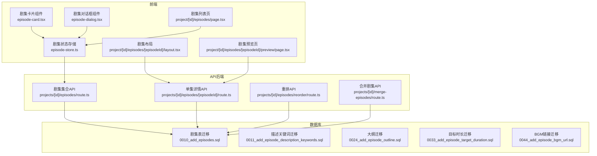
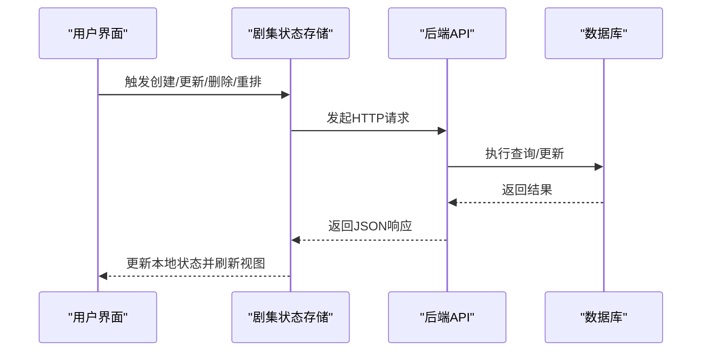
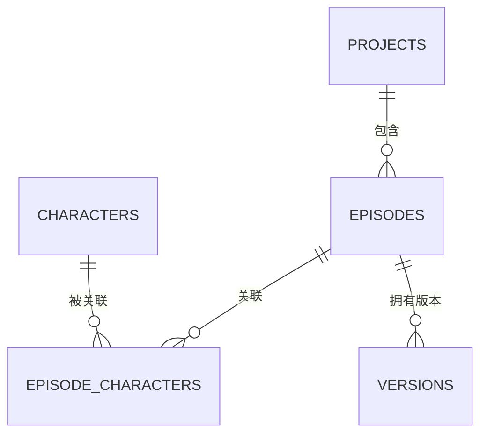
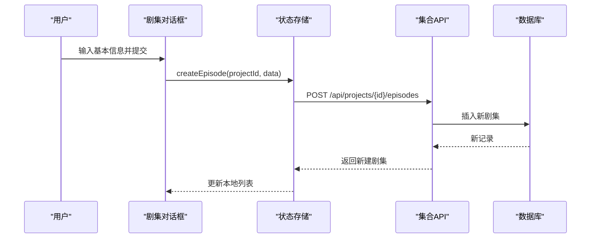
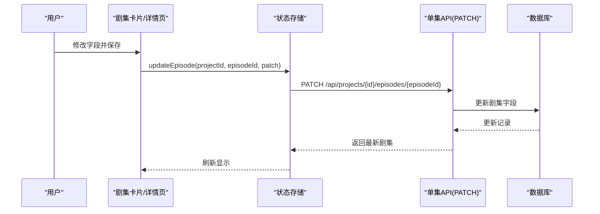
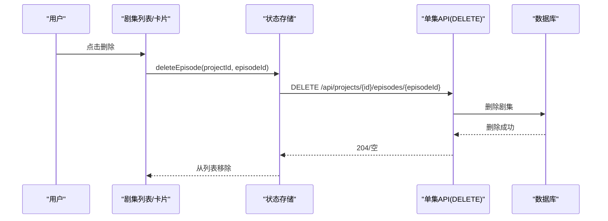
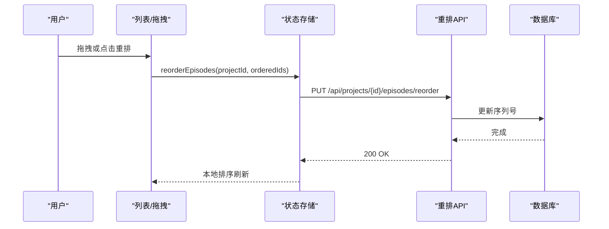
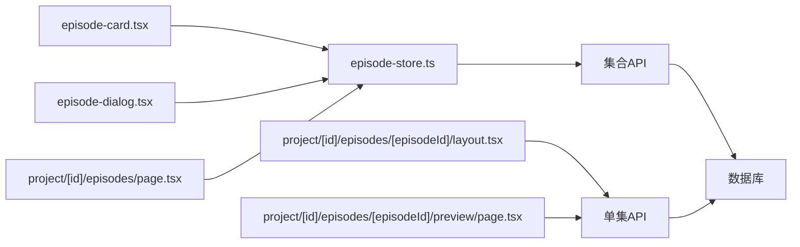

# 剧集管理

<cite>
**本文引用的文件**
- [src/stores/episode-store.ts](file://src/stores/episode-store.ts)
- [src/app/api/projects/[id]/episodes/route.ts](file://src/app/api/projects/[id]/episodes/route.ts)
- [src/app/api/projects/[id]/episodes/[episodeId]/route.ts](file://src/app/api/projects/[id]/episodes/[episodeId]/route.ts)
- [src/app/api/projects/[id]/episodes/reorder/route.ts](file://src/app/api/projects/[id]/episodes/reorder/route.ts)
- [src/app/api/projects/[id]/merge-episodes/route.ts](file://src/app/api/projects/[id]/merge-episodes/route.ts)
- [src/components/editor/episode-card.tsx](file://src/components/editor/episode-card.tsx)
- [src/components/editor/episode-dialog.tsx](file://src/components/editor/episode-dialog.tsx)
- [src/app/[locale]/project/[id]/episodes/page.tsx](file://src/app/[locale]/project/[id]/episodes/page.tsx)
- [src/app/[locale]/project/[id]/episodes/[episodeId]/layout.tsx](file://src/app/[locale]/project/[id]/episodes/[episodeId]/layout.tsx)
- [src/app/[locale]/project/[id]/episodes/[episodeId]/preview/page.tsx](file://src/app/[locale]/project/[id]/episodes/[episodeId]/preview/page.tsx)
- [drizzle/0010_add_episodes.sql](file://drizzle/0010_add_episodes.sql)
- [drizzle/0011_add_episode_description_keywords.sql](file://drizzle/0011_add_episode_description_keywords.sql)
- [drizzle/0024_add_episode_outline.sql](file://drizzle/0024_add_episode_outline.sql)
- [drizzle/0033_add_episode_target_duration.sql](file://drizzle/0033_add_episode_target_duration.sql)
- [drizzle/0044_add_episode_bgm_url.sql](file://drizzle/0044_add_episode_bgm_url.sql)
</cite>

## 目录
1. [简介](#简介)
2. [项目结构](#项目结构)
3. [核心组件](#核心组件)
4. [架构总览](#架构总览)
5. [详细组件分析](#详细组件分析)
6. [依赖分析](#依赖分析)
7. [性能考虑](#性能考虑)
8. [故障排除指南](#故障排除指南)
9. [结论](#结论)
10. [附录](#附录)

## 简介
本章节概述AIComicBuilder中“剧集管理”的目标与范围，包括剧集的创建、编辑、删除、重组、状态管理、顺序调整、关联关系维护、批处理能力以及预览机制。文档旨在帮助产品、设计与开发团队理解端到端工作流与数据模型，支持高效协作与扩展。

## 项目结构
剧集管理功能由前端状态管理、页面路由、API后端与数据库迁移共同组成。前端通过Zustand状态存储与API交互；后端提供REST接口；数据库通过Drizzle迁移定义剧集表及扩展字段。

图表来源
- [src/stores/episode-store.ts:46-99](file://src/stores/episode-store.ts#L46-L99)
- [src/app/api/projects/[id]/episodes/route.ts](file://src/app/api/projects/[id]/episodes/route.ts)
- [src/app/api/projects/[id]/episodes/[episodeId]/route.ts](file://src/app/api/projects/[id]/episodes/[episodeId]/route.ts#L176-L228)
- [src/app/api/projects/[id]/episodes/reorder/route.ts](file://src/app/api/projects/[id]/episodes/reorder/route.ts)
- [src/app/api/projects/[id]/merge-episodes/route.ts](file://src/app/api/projects/[id]/merge-episodes/route.ts)
- [drizzle/0010_add_episodes.sql](file://drizzle/0010_add_episodes.sql)
- [drizzle/0011_add_episode_description_keywords.sql](file://drizzle/0011_add_episode_description_keywords.sql)
- [drizzle/0024_add_episode_outline.sql](file://drizzle/0024_add_episode_outline.sql)
- [drizzle/0033_add_episode_target_duration.sql](file://drizzle/0033_add_episode_target_duration.sql)
- [drizzle/0044_add_episode_bgm_url.sql](file://drizzle/0044_add_episode_bgm_url.sql)

章节来源
- [src/stores/episode-store.ts:46-99](file://src/stores/episode-store.ts#L46-L99)
- [src/app/[locale]/project/[id]/episodes/page.tsx](file://src/app/[locale]/project/[id]/episodes/page.tsx)
- [src/app/[locale]/project/[id]/episodes/[episodeId]/layout.tsx](file://src/app/[locale]/project/[id]/episodes/[episodeId]/layout.tsx)
- [src/app/[locale]/project/[id]/episodes/[episodeId]/preview/page.tsx](file://src/app/[locale]/project/[id]/episodes/[episodeId]/preview/page.tsx)

## 核心组件
- 剧集状态存储（Zustand）
  - 提供创建、更新、删除、重排等动作，并维护本地剧集列表与序列号。
  - 关键方法：createEpisode、updateEpisode、deleteEpisode、reorderEpisodes。
- 剧集卡片与对话框
  - 展示剧集信息、触发编辑与删除、支持拖拽排序入口。
- 页面路由
  - 列表页：展示项目下所有剧集，支持批量与单个操作。
  - 详情页：按剧集ID加载并渲染脚本、分镜、角色等子页面。
  - 预览页：基于当前剧集生成或关联资源进行预览。

章节来源
- [src/stores/episode-store.ts:46-99](file://src/stores/episode-store.ts#L46-L99)
- [src/components/editor/episode-card.tsx](file://src/components/editor/episode-card.tsx)
- [src/components/editor/episode-dialog.tsx](file://src/components/editor/episode-dialog.tsx)
- [src/app/[locale]/project/[id]/episodes/page.tsx](file://src/app/[locale]/project/[id]/episodes/page.tsx)
- [src/app/[locale]/project/[id]/episodes/[episodeId]/layout.tsx](file://src/app/[locale]/project/[id]/episodes/[episodeId]/layout.tsx)
- [src/app/[locale]/project/[id]/episodes/[episodeId]/preview/page.tsx](file://src/app/[locale]/project/[id]/episodes/[episodeId]/preview/page.tsx)

## 架构总览
前端通过Zustand集中管理剧集状态，调用API完成增删改查与重排；后端路由负责鉴权、参数解析与数据库写入；数据库迁移定义表结构与扩展字段。

图表来源
- [src/stores/episode-store.ts:46-99](file://src/stores/episode-store.ts#L46-L99)
- [src/app/api/projects/[id]/episodes/route.ts](file://src/app/api/projects/[id]/episodes/route.ts)
- [src/app/api/projects/[id]/episodes/[episodeId]/route.ts](file://src/app/api/projects/[id]/episodes/[episodeId]/route.ts#L176-L228)
- [src/app/api/projects/[id]/episodes/reorder/route.ts](file://src/app/api/projects/[id]/episodes/reorder/route.ts)

## 详细组件分析

### 数据模型与字段定义
- 基础表：剧集表（episodes）
  - 字段：id、projectId、title、description、keywords、idea、script、outline、status、generationMode、targetDuration、finalVideoUrl、createdAt、updatedAt 等。
  - 约束：外键关联项目；状态枚举（草稿/处理中/已完成）；生成模式（关键帧/参考）；目标时长（秒）。
- 扩展字段（通过迁移添加）
  - 描述关键词：用于检索与标签化。
  - 大纲：结构化剧情概要。
  - 目标时长：控制视频生成时长。
  - BGM链接：剧集背景音乐URL。
- 关联关系
  - 一对多：项目 → 剧集。
  - 多对多：剧集 ↔ 角色（通过中间表维护）。
  - 版本：每个剧集可有多个版本记录。

图表来源
- [drizzle/0010_add_episodes.sql](file://drizzle/0010_add_episodes.sql)
- [drizzle/0011_add_episode_description_keywords.sql](file://drizzle/0011_add_episode_description_keywords.sql)
- [drizzle/0024_add_episode_outline.sql](file://drizzle/0024_add_episode_outline.sql)
- [drizzle/0033_add_episode_target_duration.sql](file://drizzle/0033_add_episode_target_duration.sql)
- [drizzle/0044_add_episode_bgm_url.sql](file://drizzle/0044_add_episode_bgm_url.sql)

章节来源
- [drizzle/0010_add_episodes.sql](file://drizzle/0010_add_episodes.sql)
- [drizzle/0011_add_episode_description_keywords.sql](file://drizzle/0011_add_episode_description_keywords.sql)
- [drizzle/0024_add_episode_outline.sql](file://drizzle/0024_add_episode_outline.sql)
- [drizzle/0033_add_episode_target_duration.sql](file://drizzle/0033_add_episode_target_duration.sql)
- [drizzle/0044_add_episode_bgm_url.sql](file://drizzle/0044_add_episode_bgm_url.sql)

### 创建剧集流程
- 前端
  - 用户在列表页或对话框中填写基础信息（标题、描述、关键词、想法等）。
  - 调用状态存储的创建方法，发起POST请求至集合API。
- 后端
  - 解析项目ID与用户身份，校验权限。
  - 写入数据库，返回新创建的剧集对象。
- 前端
  - 将返回的剧集插入本地状态列表，自动分配初始序列号。

图表来源
- [src/stores/episode-store.ts:46-55](file://src/stores/episode-store.ts#L46-L55)
- [src/app/api/projects/[id]/episodes/route.ts](file://src/app/api/projects/[id]/episodes/route.ts)

章节来源
- [src/stores/episode-store.ts:46-55](file://src/stores/episode-store.ts#L46-L55)
- [src/app/api/projects/[id]/episodes/route.ts](file://src/app/api/projects/[id]/episodes/route.ts)

### 编辑剧集流程
- 前端
  - 在卡片或详情页修改字段（标题、描述、关键词、想法、脚本、大纲、状态、生成模式、目标时长）。
  - 调用更新方法，发起PATCH请求。
- 后端
  - 校验存在性与权限，部分字段变更会触发下游失效标记（如脚本变更）。
  - 返回更新后的完整剧集对象。
- 前端
  - 合并更新字段到本地状态，保持视图一致。

图表来源
- [src/stores/episode-store.ts:66-81](file://src/stores/episode-store.ts#L66-L81)
- [src/app/api/projects/[id]/episodes/[episodeId]/route.ts](file://src/app/api/projects/[id]/episodes/[episodeId]/route.ts#L176-L228)

章节来源
- [src/stores/episode-store.ts:66-81](file://src/stores/episode-store.ts#L66-L81)
- [src/app/api/projects/[id]/episodes/[episodeId]/route.ts](file://src/app/api/projects/[id]/episodes/[episodeId]/route.ts#L176-L228)

### 删除剧集流程
- 前端
  - 在卡片或列表中选择删除，调用删除方法。
- 后端
  - 校验存在性与权限，拒绝删除最后一个剧集。
  - 成功删除后返回空内容。
- 前端
  - 从本地状态移除该剧集。

图表来源
- [src/stores/episode-store.ts:57-64](file://src/stores/episode-store.ts#L57-L64)
- [src/app/api/projects/[id]/episodes/[episodeId]/route.ts](file://src/app/api/projects/[id]/episodes/[episodeId]/route.ts#L230-L250)

章节来源
- [src/stores/episode-store.ts:57-64](file://src/stores/episode-store.ts#L57-L64)
- [src/app/api/projects/[id]/episodes/[episodeId]/route.ts](file://src/app/api/projects/[id]/episodes/[episodeId]/route.ts#L230-L250)

### 重组与顺序调整
- 前端
  - 支持拖拽或按钮触发重排，向后端发送新的ID顺序数组。
  - 本地根据新顺序更新序列号并排序。
- 后端
  - 接收orderedIds，更新对应剧集的序列号。
  - 返回确认。

图表来源
- [src/stores/episode-store.ts:83-98](file://src/stores/episode-store.ts#L83-L98)
- [src/app/api/projects/[id]/episodes/reorder/route.ts](file://src/app/api/projects/[id]/episodes/reorder/route.ts)

章节来源
- [src/stores/episode-store.ts:83-98](file://src/stores/episode-store.ts#L83-L98)
- [src/app/api/projects/[id]/episodes/reorder/route.ts](file://src/app/api/projects/[id]/episodes/reorder/route.ts)

### 批量操作与合并
- 合并剧集
  - 后端提供合并接口，将多个剧集合并为一个，保留目标剧集的ID并迁移其资源。
  - 合并后更新序列号与版本历史。
- 批量操作
  - 列表页支持勾选多个剧集执行统一操作（如删除、状态切换），前端通过循环调用单条API实现。

章节来源
- [src/app/api/projects/[id]/merge-episodes/route.ts](file://src/app/api/projects/[id]/merge-episodes/route.ts)
- [src/app/[locale]/project/[id]/episodes/page.tsx](file://src/app/[locale]/project/[id]/episodes/page.tsx)

### 剧集状态管理
- 状态枚举：草稿、处理中、已完成。
- 状态流转建议：
  - 草稿 → 处理中（开始生成/导入）。
  - 处理中 → 已完成（生成成功）。
  - 可回退至草稿（编辑或失败重试）。
- 影响链路：状态变更可能影响下游生成任务与预览可用性。

章节来源
- [src/app/api/projects/[id]/episodes/[episodeId]/route.ts](file://src/app/api/projects/[id]/episodes/[episodeId]/route.ts#L199-L200)

### 剧集卡片组件交互逻辑
- 展示字段：标题、状态、目标时长、生成模式、最后更新时间。
- 交互行为：
  - 点击进入详情页。
  - 右键菜单：编辑、删除、复制、预览。
  - 拖拽排序入口（启用时）。
- 与状态存储联动：点击编辑/删除直接调用对应方法，实时更新本地状态。

章节来源
- [src/components/editor/episode-card.tsx](file://src/components/editor/episode-card.tsx)
- [src/components/editor/episode-dialog.tsx](file://src/components/editor/episode-dialog.tsx)

### 剧集预览机制
- 预览页加载当前剧集的最终视频URL或生成中的资源。
- 若无最终视频，可根据生成模式与目标时长触发生成任务或展示占位。
- 预览页与详情页共享同一布局，便于在不同视图间切换。

章节来源
- [src/app/[locale]/project/[id]/episodes/[episodeId]/preview/page.tsx](file://src/app/[locale]/project/[id]/episodes/[episodeId]/preview/page.tsx)
- [src/app/[locale]/project/[id]/episodes/[episodeId]/layout.tsx](file://src/app/[locale]/project/[id]/episodes/[episodeId]/layout.tsx)

## 依赖分析
- 组件耦合
  - 剧集卡片与对话框依赖状态存储；列表页聚合两者；详情/预览页依赖单集API。
- 外部依赖
  - API层依赖数据库访问层与鉴权工具。
  - 状态存储依赖通用API封装工具。
- 循环依赖
  - 当前结构未见循环依赖，组件职责清晰。

图表来源
- [src/components/editor/episode-card.tsx](file://src/components/editor/episode-card.tsx)
- [src/components/editor/episode-dialog.tsx](file://src/components/editor/episode-dialog.tsx)
- [src/stores/episode-store.ts:46-99](file://src/stores/episode-store.ts#L46-L99)
- [src/app/[locale]/project/[id]/episodes/page.tsx](file://src/app/[locale]/project/[id]/episodes/page.tsx)
- [src/app/[locale]/project/[id]/episodes/[episodeId]/layout.tsx](file://src/app/[locale]/project/[id]/episodes/[episodeId]/layout.tsx)
- [src/app/[locale]/project/[id]/episodes/[episodeId]/preview/page.tsx](file://src/app/[locale]/project/[id]/episodes/[episodeId]/preview/page.tsx)
- [src/app/api/projects/[id]/episodes/route.ts](file://src/app/api/projects/[id]/episodes/route.ts)
- [src/app/api/projects/[id]/episodes/[episodeId]/route.ts](file://src/app/api/projects/[id]/episodes/[episodeId]/route.ts)

章节来源
- [src/stores/episode-store.ts:46-99](file://src/stores/episode-store.ts#L46-L99)
- [src/app/api/projects/[id]/episodes/route.ts](file://src/app/api/projects/[id]/episodes/route.ts)
- [src/app/api/projects/[id]/episodes/[episodeId]/route.ts](file://src/app/api/projects/[id]/episodes/[episodeId]/route.ts)

## 性能考虑
- 前端
  - 使用局部状态与最小化重渲染，避免全量刷新。
  - 批量操作时合并多次请求，减少网络往返。
- 后端
  - 重排与合并操作应使用事务，保证一致性与原子性。
  - 对大字段（脚本、大纲）采用懒加载策略，仅在需要时拉取。
- 数据库
  - 为projectId、sequence建立索引以优化查询与排序。
  - 控制单次批量操作数量上限，防止阻塞。

## 故障排除指南
- 常见问题
  - 删除失败：确保非最后一个剧集；检查权限与存在性。
  - 重排无效：确认传入的ID数组长度与当前剧集数一致。
  - 编辑不生效：检查PATCH字段是否正确；关注脚本变更导致的下游失效标记。
- 错误码
  - 404：资源不存在。
  - 403：权限不足。
  - 400：参数错误或约束冲突。
- 建议
  - 在前端增加二次确认与错误提示。
  - 记录关键操作日志，便于回溯。

章节来源
- [src/app/api/projects/[id]/episodes/[episodeId]/route.ts](file://src/app/api/projects/[id]/episodes/[episodeId]/route.ts#L230-L250)
- [src/stores/episode-store.ts:83-98](file://src/stores/episode-store.ts#L83-L98)

## 结论
剧集管理模块通过清晰的前后端分工与完善的API覆盖，实现了从创建到预览的全生命周期管理。状态存储与页面路由解耦良好，易于扩展批量操作与合并功能。建议后续完善版本对比、批量导入导出与更细粒度的状态机可视化。

## 附录
- 工作流程与协作模式
  - 协作模式：多人可同时编辑不同剧集；合并前进行冲突检测与版本对比。
  - 工作流建议：先创建草稿，逐步完善大纲与脚本，再进入生成阶段，完成后预览与归档。
- 最佳实践
  - 保持标题与关键词简洁明确，便于检索。
  - 合理设置目标时长，平衡生成质量与时长预算。
  - 使用预览快速验证关键场景，减少返工。