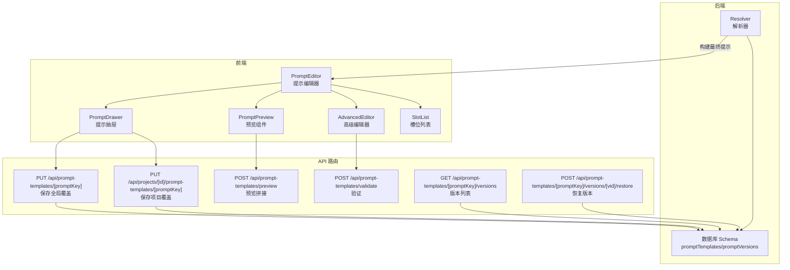
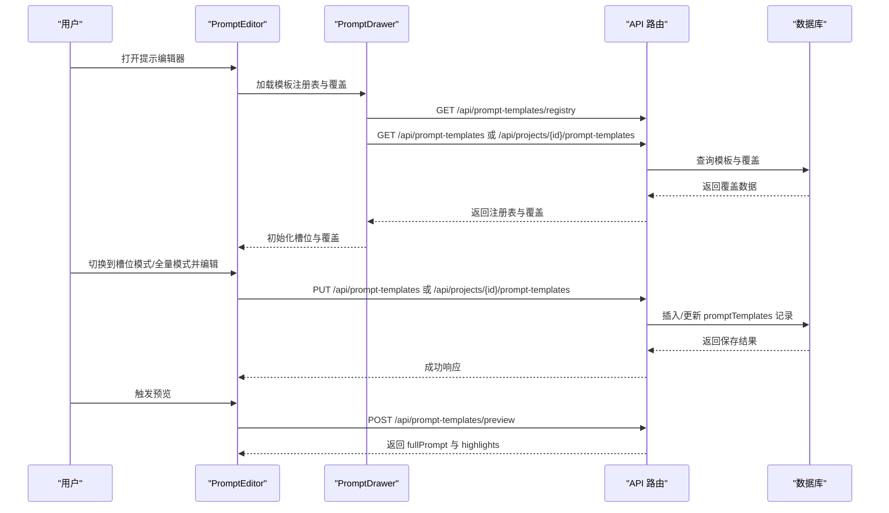
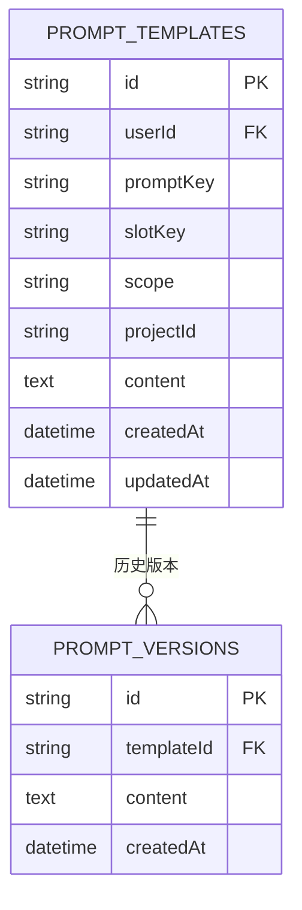
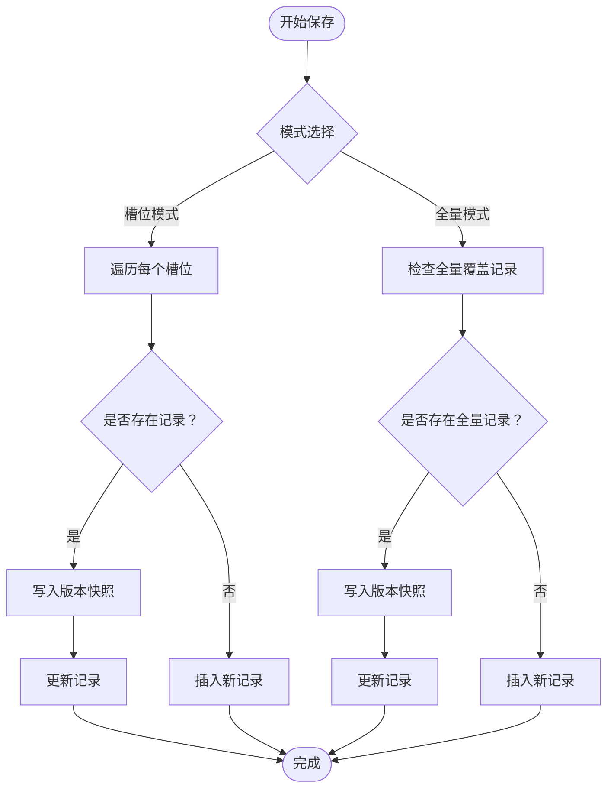
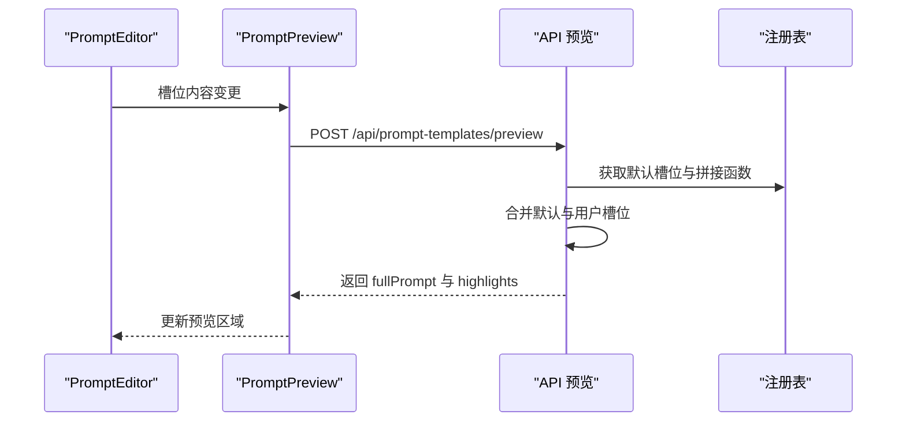
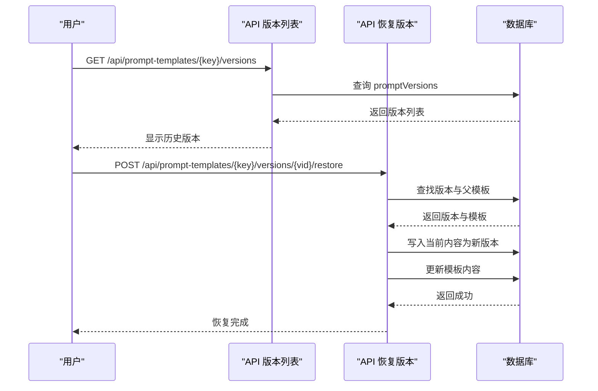
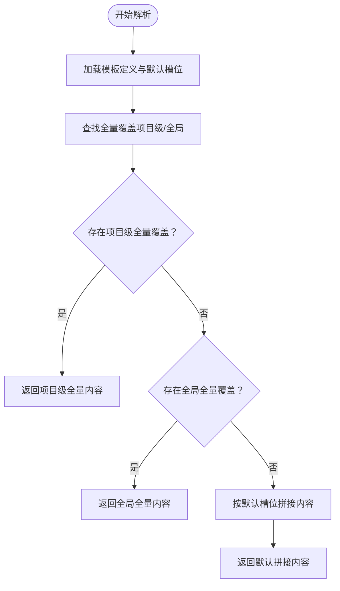
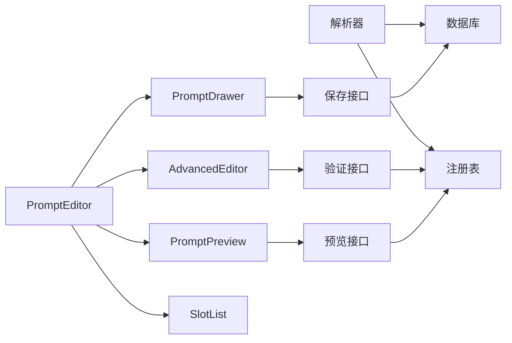

# 提示模板管理

<cite>
**本文档引用的文件**
- [src/app/api/prompt-templates/[promptKey]/route.ts](file://src/app/api/prompt-templates/[promptKey]/route.ts)
- [src/app/api/projects/[id]/prompt-templates/[promptKey]/route.ts](file://src/app/api/projects/[id]/prompt-templates/[promptKey]/route.ts)
- [src/app/api/prompt-templates/[promptKey]/versions/route.ts](file://src/app/api/prompt-templates/[promptKey]/versions/route.ts)
- [src/app/api/prompt-templates/[promptKey]/versions/[vid]/restore/route.ts](file://src/app/api/prompt-templates/[promptKey]/versions/[vid]/restore/route.ts)
- [src/lib/ai/prompts/resolver.ts](file://src/lib/ai/prompts/resolver.ts)
- [src/app/api/prompt-templates/preview/route.ts](file://src/app/api/prompt-templates/preview/route.ts)
- [src/components/prompt-templates/prompt-preview.tsx](file://src/components/prompt-templates/prompt-preview.tsx)
- [src/components/prompt-templates/advanced-editor.tsx](file://src/components/prompt-templates/advanced-editor.tsx)
- [src/components/prompt-templates/prompt-editor.tsx](file://src/components/prompt-templates/prompt-editor.tsx)
- [src/components/prompt-templates/slot-list.tsx](file://src/components/prompt-templates/slot-list.tsx)
- [src/components/prompt-templates/prompt-drawer.tsx](file://src/components/prompt-templates/prompt-drawer.tsx)
- [src/stores/prompt-template-store.ts](file://src/stores/prompt-template-store.ts)
- [src/lib/db/schema.ts](file://src/lib/db/schema.ts)
- [src/app/api/prompt-templates/validate/route.ts](file://src/app/api/prompt-templates/validate/route.ts)
</cite>

## 目录
1. [简介](#简介)
2. [项目结构](#项目结构)
3. [核心组件](#核心组件)
4. [架构总览](#架构总览)
5. [详细组件分析](#详细组件分析)
6. [依赖关系分析](#依赖关系分析)
7. [性能考虑](#性能考虑)
8. [故障排除指南](#故障排除指南)
9. [结论](#结论)
10. [附录](#附录)

## 简介
本文件面向AIComicBuilder的提示模板管理功能，系统性阐述提示模板的创建、编辑、版本控制与应用机制；解释提示模板槽位系统、模板预览与验证流程；记录提示模板编辑器的实现、模板分类管理与模板共享能力；给出提示模板数据模型、模板结构定义与模板继承（覆盖）机制的设计说明；并提供提示模板设计最佳实践与复用策略。

## 项目结构
提示模板管理涉及三层：前端编辑器组件、API路由层、后端数据库与解析器。前端通过编辑器与抽屉加载模板注册表与服务器覆盖，支持全局或项目级编辑；API负责保存、预览、验证与版本管理；解析器在运行时按作用域合并默认值与用户覆盖，生成最终提示内容。

图表来源
- [src/components/prompt-templates/prompt-editor.tsx:41-72](file://src/components/prompt-templates/prompt-editor.tsx#L41-L72)
- [src/components/prompt-templates/prompt-drawer.tsx:83-100](file://src/components/prompt-templates/prompt-drawer.tsx#L83-L100)
- [src/app/api/prompt-templates/[promptKey]/route.ts](file://src/app/api/prompt-templates/[promptKey]/route.ts#L8-L138)
- [src/app/api/projects/[id]/prompt-templates/[promptKey]/route.ts](file://src/app/api/projects/[id]/prompt-templates/[promptKey]/route.ts#L8-L142)
- [src/app/api/prompt-templates/preview/route.ts:7-49](file://src/app/api/prompt-templates/preview/route.ts#L7-L49)
- [src/app/api/prompt-templates/validate/route.ts](file://src/app/api/prompt-templates/validate/route.ts)
- [src/app/api/prompt-templates/[promptKey]/versions/route.ts](file://src/app/api/prompt-templates/[promptKey]/versions/route.ts#L7-L46)
- [src/app/api/prompt-templates/[promptKey]/versions/[vid]/restore/route.ts](file://src/app/api/prompt-templates/[promptKey]/versions/[vid]/restore/route.ts#L8-L59)
- [src/lib/ai/prompts/resolver.ts:15-49](file://src/lib/ai/prompts/resolver.ts#L15-L49)
- [src/lib/db/schema.ts](file://src/lib/db/schema.ts)

章节来源
- [src/components/prompt-templates/prompt-editor.tsx:41-72](file://src/components/prompt-templates/prompt-editor.tsx#L41-L72)
- [src/components/prompt-templates/prompt-drawer.tsx:83-100](file://src/components/prompt-templates/prompt-drawer.tsx#L83-L100)
- [src/app/api/prompt-templates/[promptKey]/route.ts](file://src/app/api/prompt-templates/[promptKey]/route.ts#L8-L138)
- [src/app/api/projects/[id]/prompt-templates/[promptKey]/route.ts](file://src/app/api/projects/[id]/prompt-templates/[promptKey]/route.ts#L8-L142)
- [src/app/api/prompt-templates/preview/route.ts:7-49](file://src/app/api/prompt-templates/preview/route.ts#L7-L49)
- [src/app/api/prompt-templates/validate/route.ts](file://src/app/api/prompt-templates/validate/route.ts)
- [src/app/api/prompt-templates/[promptKey]/versions/route.ts](file://src/app/api/prompt-templates/[promptKey]/versions/route.ts#L7-L46)
- [src/app/api/prompt-templates/[promptKey]/versions/[vid]/restore/route.ts](file://src/app/api/prompt-templates/[promptKey]/versions/[vid]/restore/route.ts#L8-L59)
- [src/lib/ai/prompts/resolver.ts:15-49](file://src/lib/ai/prompts/resolver.ts#L15-L49)
- [src/lib/db/schema.ts](file://src/lib/db/schema.ts)

## 核心组件
- 提示模板编辑器（PromptEditor）：负责选择模板、切换槽位模式与全量模式、保存覆盖、清空未保存更改、分类筛选与项目启用状态管理。
- 提示抽屉（PromptDrawer）：加载模板注册表与服务器覆盖，支持批量选择多个模板键，按作用域构建API路径，加载占位符解析后的数据。
- 预览组件（PromptPreview）：根据当前槽位内容异步请求预览接口，展示拼接后的完整提示文本，并高亮显示被覆盖的槽位。
- 高级编辑器（AdvancedEditor）：在全量模式下从槽位拼接初始内容，提供验证与保存流程。
- 槽位列表（SlotList）：展示模板槽位，支持编辑单个槽位内容。
- 解析器（Resolver）：在运行时按“项目级覆盖 > 全局覆盖 > 代码默认”顺序解析最终提示内容。
- 版本管理：列出版本、恢复指定版本，均基于模板与版本表进行操作。

章节来源
- [src/components/prompt-templates/prompt-editor.tsx:41-72](file://src/components/prompt-templates/prompt-editor.tsx#L41-L72)
- [src/components/prompt-templates/prompt-drawer.tsx:83-100](file://src/components/prompt-templates/prompt-drawer.tsx#L83-L100)
- [src/components/prompt-templates/prompt-preview.tsx:8-81](file://src/components/prompt-templates/prompt-preview.tsx#L8-L81)
- [src/components/prompt-templates/advanced-editor.tsx:40-82](file://src/components/prompt-templates/advanced-editor.tsx#L40-L82)
- [src/components/prompt-templates/slot-list.tsx](file://src/components/prompt-templates/slot-list.tsx)
- [src/lib/ai/prompts/resolver.ts:15-49](file://src/lib/ai/prompts/resolver.ts#L15-L49)

## 架构总览
提示模板管理采用“前端编辑器 + 后端API + 数据库”的分层架构。编辑器通过抽屉加载注册表与服务器覆盖，支持两种编辑模式：
- 槽位模式（slots）：对每个槽位独立保存，适合精细化定制。
- 全量模式（full）：保存整段提示文本，适合高级用户直接编辑。

API层提供以下能力：
- 保存：全局或项目级覆盖（PUT）。
- 预览：将槽位与默认值合并，返回拼接后的完整提示与高亮。
- 验证：校验全量模式下的提示内容是否符合规则。
- 版本：查询版本列表、恢复到指定版本。

图表来源
- [src/components/prompt-templates/prompt-drawer.tsx:88-100](file://src/components/prompt-templates/prompt-drawer.tsx#L88-L100)
- [src/app/api/prompt-templates/[promptKey]/route.ts](file://src/app/api/prompt-templates/[promptKey]/route.ts#L8-L138)
- [src/app/api/projects/[id]/prompt-templates/[promptKey]/route.ts](file://src/app/api/projects/[id]/prompt-templates/[promptKey]/route.ts#L8-L142)
- [src/app/api/prompt-templates/preview/route.ts:7-49](file://src/app/api/prompt-templates/preview/route.ts#L7-L49)
- [src/lib/db/schema.ts](file://src/lib/db/schema.ts)

## 详细组件分析

### 数据模型与存储
提示模板数据模型围绕两个核心表展开：
- promptTemplates：存储用户的模板覆盖，包括用户ID、模板键、槽位键、作用域（global/project）、所属项目ID、内容与时间戳。
- promptVersions：存储模板的历史版本，包含模板ID、内容与创建时间。

图表来源
- [src/lib/db/schema.ts](file://src/lib/db/schema.ts)

章节来源
- [src/lib/db/schema.ts](file://src/lib/db/schema.ts)

### 模板结构定义与槽位系统
- 注册表（registry）：定义模板键、槽位集合与默认内容，以及如何将槽位拼接为完整提示。
- 槽位（slot）：每个槽位具有唯一键、默认内容与可选描述；编辑器以槽位为单位进行编辑。
- 占位符解析：抽屉在加载时会解析视频时长等动态占位符，确保预览与实际生成一致。

章节来源
- [src/components/prompt-templates/prompt-drawer.tsx:70-81](file://src/components/prompt-templates/prompt-drawer.tsx#L70-L81)
- [src/app/api/prompt-templates/preview/route.ts:31-46](file://src/app/api/prompt-templates/preview/route.ts#L31-L46)

### 编辑器与保存机制
- 全局保存：PUT /api/prompt-templates/[promptKey] 支持槽位模式与全量模式，自动为每次更新创建版本快照。
- 项目保存：PUT /api/projects/[id]/prompt-templates/[promptKey] 在项目作用域内保存覆盖，同样支持版本快照。
- 保存流程要点：
  - 槽位模式：逐槽位检查是否存在现有记录，存在则先写入版本再更新，不存在则插入新记录。
  - 全量模式：当 slotKey 为 null 时视为全量覆盖，同样遵循版本快照与更新逻辑。
  - 权限校验：项目级保存需验证项目归属。

图表来源
- [src/app/api/prompt-templates/[promptKey]/route.ts](file://src/app/api/prompt-templates/[promptKey]/route.ts#L21-L80)
- [src/app/api/prompt-templates/[promptKey]/route.ts](file://src/app/api/prompt-templates/[promptKey]/route.ts#L82-L135)
- [src/app/api/projects/[id]/prompt-templates/[promptKey]/route.ts](file://src/app/api/projects/[id]/prompt-templates/[promptKey]/route.ts#L32-L91)
- [src/app/api/projects/[id]/prompt-templates/[promptKey]/route.ts](file://src/app/api/projects/[id]/prompt-templates/[promptKey]/route.ts#L93-L142)

章节来源
- [src/app/api/prompt-templates/[promptKey]/route.ts](file://src/app/api/prompt-templates/[promptKey]/route.ts#L8-L138)
- [src/app/api/projects/[id]/prompt-templates/[promptKey]/route.ts](file://src/app/api/projects/[id]/prompt-templates/[promptKey]/route.ts#L8-L142)

### 预览与验证
- 预览接口：POST /api/prompt-templates/preview 将提供的槽位与默认槽位合并，调用注册表的拼接函数生成完整提示，并返回每个槽位的高亮状态（被覆盖/默认）。
- 高级编辑器：在进入全量模式时，从当前槽位拼接初始内容；保存前先调用验证接口，确保内容符合规则后再执行保存。
- 预览组件：监听槽位变化，防抖请求预览接口，展示高亮后的完整提示文本。

图表来源
- [src/components/prompt-templates/prompt-preview.tsx:20-54](file://src/components/prompt-templates/prompt-preview.tsx#L20-L54)
- [src/app/api/prompt-templates/preview/route.ts:7-49](file://src/app/api/prompt-templates/preview/route.ts#L7-L49)
- [src/components/prompt-templates/advanced-editor.tsx:70-82](file://src/components/prompt-templates/advanced-editor.tsx#L70-L82)

章节来源
- [src/components/prompt-templates/prompt-preview.tsx:8-81](file://src/components/prompt-templates/prompt-preview.tsx#L8-L81)
- [src/app/api/prompt-templates/preview/route.ts:7-49](file://src/app/api/prompt-templates/preview/route.ts#L7-L49)
- [src/components/prompt-templates/advanced-editor.tsx:40-82](file://src/components/prompt-templates/advanced-editor.tsx#L40-L82)

### 版本控制与恢复
- 版本列表：GET /api/prompt-templates/[promptKey]/versions 返回该模板的所有历史版本，按创建时间倒序排列。
- 恢复版本：POST /api/prompt-templates/[promptKey]/versions/[vid]/restore 将指定版本的内容恢复为当前模板内容，并再次写入版本快照用于“撤销”。

图表来源
- [src/app/api/prompt-templates/[promptKey]/versions/route.ts](file://src/app/api/prompt-templates/[promptKey]/versions/route.ts#L7-L46)
- [src/app/api/prompt-templates/[promptKey]/versions/[vid]/restore/route.ts](file://src/app/api/prompt-templates/[promptKey]/versions/[vid]/restore/route.ts#L8-L59)

章节来源
- [src/app/api/prompt-templates/[promptKey]/versions/route.ts](file://src/app/api/prompt-templates/[promptKey]/versions/route.ts#L7-L46)
- [src/app/api/prompt-templates/[promptKey]/versions/[vid]/restore/route.ts](file://src/app/api/prompt-templates/[promptKey]/versions/[vid]/restore/route.ts#L8-L59)

### 应用机制与继承（覆盖）
解析器在运行时决定最终提示内容，遵循以下优先级：
- 若提供项目ID且存在项目级全量覆盖，则使用该项目覆盖。
- 否则若存在全局全量覆盖，则使用全局覆盖。
- 否则回退到代码中的默认槽位内容。

图表来源
- [src/lib/ai/prompts/resolver.ts:15-49](file://src/lib/ai/prompts/resolver.ts#L15-L49)

章节来源
- [src/lib/ai/prompts/resolver.ts:15-49](file://src/lib/ai/prompts/resolver.ts#L15-L49)

### 分类管理与模板共享
- 分类过滤：编辑器支持按脚本、角色、分镜等类别筛选模板，便于快速定位。
- 模板共享：通过项目级覆盖实现模板共享与差异化定制；不同项目可各自维护自己的覆盖而不影响其他项目或全局设置。

章节来源
- [src/components/prompt-templates/prompt-editor.tsx:18-30](file://src/components/prompt-templates/prompt-editor.tsx#L18-L30)
- [src/app/api/projects/[id]/prompt-templates/[promptKey]/route.ts](file://src/app/api/projects/[id]/prompt-templates/[promptKey]/route.ts#L16-L24)

## 依赖关系分析
- 前端组件依赖：
  - PromptEditor 依赖 PromptDrawer、PromptPreview、AdvancedEditor、SlotList 与全局状态存储。
  - PromptDrawer 依赖注册表与服务器覆盖数据，按作用域构造API路径。
  - PromptPreview 依赖注册表与服务器覆盖，调用预览API。
  - AdvancedEditor 依赖预览API与验证API。
- 后端API依赖：
  - 保存接口依赖数据库写入与版本快照。
  - 预览接口依赖注册表与拼接函数。
  - 解析器依赖数据库与注册表。
- 数据库依赖：
  - promptTemplates 与 promptVersions 表相互关联，形成版本链路。

图表来源
- [src/components/prompt-templates/prompt-editor.tsx:41-72](file://src/components/prompt-templates/prompt-editor.tsx#L41-L72)
- [src/components/prompt-templates/prompt-drawer.tsx:83-100](file://src/components/prompt-templates/prompt-drawer.tsx#L83-L100)
- [src/components/prompt-templates/prompt-preview.tsx:8-81](file://src/components/prompt-templates/prompt-preview.tsx#L8-L81)
- [src/components/prompt-templates/advanced-editor.tsx:40-82](file://src/components/prompt-templates/advanced-editor.tsx#L40-L82)
- [src/app/api/prompt-templates/[promptKey]/route.ts](file://src/app/api/prompt-templates/[promptKey]/route.ts#L8-L138)
- [src/app/api/prompt-templates/preview/route.ts:7-49](file://src/app/api/prompt-templates/preview/route.ts#L7-L49)
- [src/lib/ai/prompts/resolver.ts:15-49](file://src/lib/ai/prompts/resolver.ts#L15-L49)
- [src/lib/db/schema.ts](file://src/lib/db/schema.ts)

章节来源
- [src/components/prompt-templates/prompt-editor.tsx:41-72](file://src/components/prompt-templates/prompt-editor.tsx#L41-L72)
- [src/components/prompt-templates/prompt-drawer.tsx:83-100](file://src/components/prompt-templates/prompt-drawer.tsx#L83-L100)
- [src/components/prompt-templates/prompt-preview.tsx:8-81](file://src/components/prompt-templates/prompt-preview.tsx#L8-L81)
- [src/components/prompt-templates/advanced-editor.tsx:40-82](file://src/components/prompt-templates/advanced-editor.tsx#L40-L82)
- [src/app/api/prompt-templates/[promptKey]/route.ts](file://src/app/api/prompt-templates/[promptKey]/route.ts#L8-L138)
- [src/app/api/prompt-templates/preview/route.ts:7-49](file://src/app/api/prompt-templates/preview/route.ts#L7-L49)
- [src/lib/ai/prompts/resolver.ts:15-49](file://src/lib/ai/prompts/resolver.ts#L15-L49)
- [src/lib/db/schema.ts](file://src/lib/db/schema.ts)

## 性能考虑
- 防抖预览：预览组件对槽位变更进行防抖处理，减少频繁请求，提升交互流畅度。
- 并发加载：抽屉同时请求注册表与覆盖数据，缩短初始化等待时间。
- 版本快照：保存时自动写入版本，避免手动备份；恢复时再次写入版本，便于“撤销”。
- 数据库索引建议：在 promptTemplates 上对 (userId, promptKey, slotKey, scope, projectId) 建立复合索引，加速覆盖查询与去重判断。

## 故障排除指南
- 保存失败（400）：检查请求体字段是否正确（槽位模式需要 slots 对象，全量模式需要 content 字符串）。
- 无权限（403）：恢复版本时需验证模板归属，确认当前用户与模板 userId 一致。
- 未找到（404）：项目级保存需先验证项目归属；版本恢复需确认版本与模板存在。
- 预览异常：确认模板键有效且注册表存在对应定义；检查槽位键是否匹配。

章节来源
- [src/app/api/prompt-templates/[promptKey]/route.ts](file://src/app/api/prompt-templates/[promptKey]/route.ts#L22-L27)
- [src/app/api/prompt-templates/[promptKey]/route.ts](file://src/app/api/prompt-templates/[promptKey]/route.ts#L83-L88)
- [src/app/api/projects/[id]/prompt-templates/[promptKey]/route.ts](file://src/app/api/projects/[id]/prompt-templates/[promptKey]/route.ts#L22-L24)
- [src/app/api/prompt-templates/[promptKey]/versions/[vid]/restore/route.ts](file://src/app/api/prompt-templates/[promptKey]/versions/[vid]/restore/route.ts#L40-L42)
- [src/app/api/prompt-templates/preview/route.ts:16-21](file://src/app/api/prompt-templates/preview/route.ts#L16-L21)

## 结论
提示模板管理通过“槽位 + 全量”的双模式编辑、严格的版本控制与清晰的作用域覆盖（全局/项目），实现了高度灵活且可追溯的提示定制体系。前端编辑器与API路由配合，结合解析器的继承机制，使模板既可标准化复用，又支持个性化调整。建议在团队协作中优先使用槽位模式进行标准化配置，仅在必要时启用全量模式进行深度定制，并充分利用版本恢复能力保障可回溯性。

## 附录
- 最佳实践
  - 使用槽位模式进行常规定制，保持模板一致性。
  - 在项目级覆盖中存放差异化内容，避免污染全局模板。
  - 定期查看版本历史，利用恢复功能快速回滚错误修改。
  - 使用预览功能核对拼接效果，关注被覆盖槽位的高亮提示。
- 复用策略
  - 将通用默认槽位沉淀为全局模板，项目级仅保留差异部分。
  - 通过分类筛选快速定位模板，提高编辑效率。
  - 在团队内约定槽位命名规范，降低沟通成本。