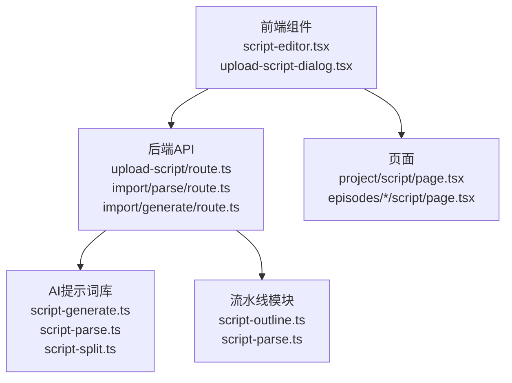
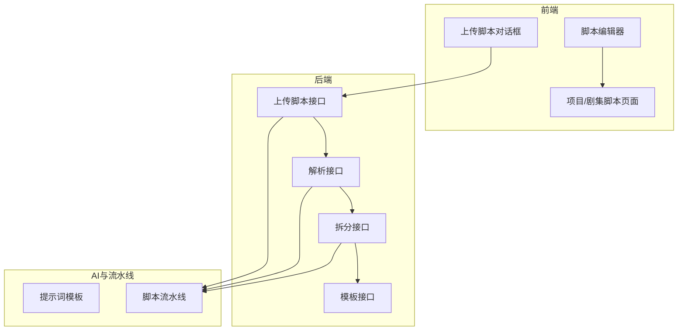
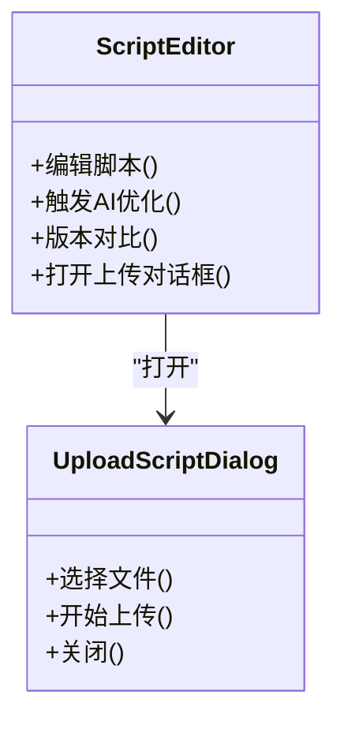
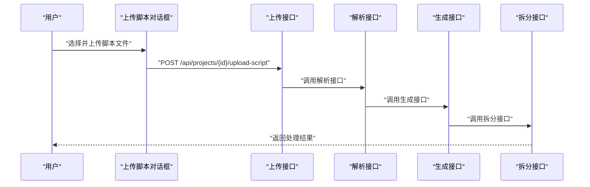
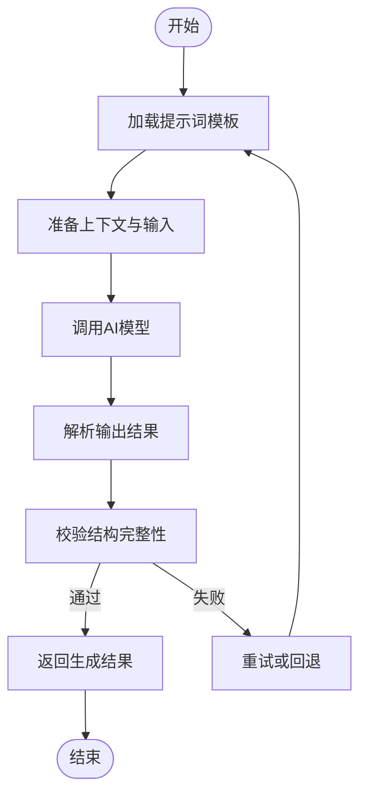
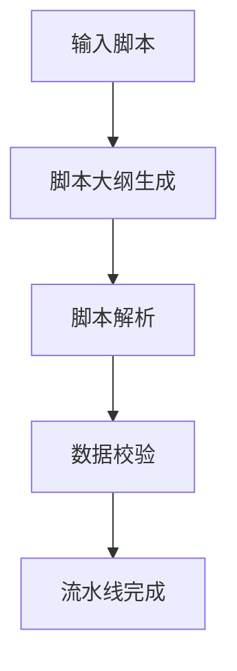
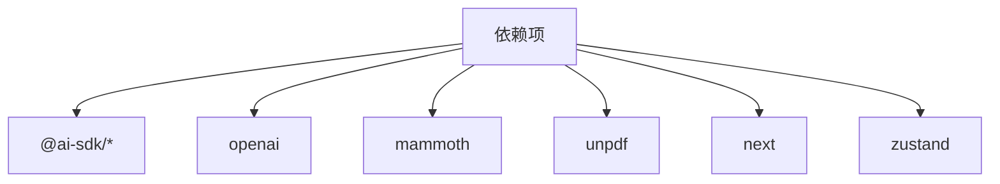

# 脚本生成功能

<cite>
**本文档引用的文件**
- [script-editor.tsx](file://src/components/editor/script-editor.tsx)
- [upload-script-dialog.tsx](file://src/components/editor/upload-script-dialog.tsx)
- [page.tsx](file://src/app/[locale]/project/[id]/script/page.tsx)
- [page.tsx](file://src/app/[locale]/project/[id]/episodes/[episodeId]/script/page.tsx)
- [route.ts](file://src/app/api/projects/[id]/upload-script/route.ts)
- [route.ts](file://src/app/api/projects/[id]/import/generate/route.ts)
- [route.ts](file://src/app/api/projects/[id]/import/parse/route.ts)
- [script-generate.ts](file://src/lib/ai/prompts/script-generate.ts)
- [script-parse.ts](file://src/lib/ai/prompts/script-parse.ts)
- [script-split.ts](file://src/lib/ai/prompts/script-split.ts)
- [script-outline.ts](file://src/lib/pipeline/script-outline.ts)
- [script-parse.ts](file://src/lib/pipeline/script-parse.ts)
- [v0.2.0-release-article.md](file://docs/v0.2.0-release-article.md)
- [package.json](file://package.json)
</cite>

## 目录
1. [简介](#简介)
2. [项目结构](#项目结构)
3. [核心组件](#核心组件)
4. [架构总览](#架构总览)
5. [详细组件分析](#详细组件分析)
6. [依赖关系分析](#依赖关系分析)
7. [性能考虑](#性能考虑)
8. [故障排除指南](#故障排除指南)
9. [结论](#结论)

## 简介
本文件聚焦于 AIComicBuilder 的脚本生成功能，涵盖智能脚本生成、脚本解析与优化、脚本编辑器实现、脚本导入导出与版本管理、脚本大纲生成、对话生成与场景描述创建等能力。文档基于仓库中的实际代码与发布说明进行梳理，旨在帮助开发者与产品人员快速理解系统设计与实现要点。

## 项目结构
脚本生成功能主要分布在以下区域：
- 前端编辑器与页面：脚本编辑器组件、上传对话框、项目与剧集脚本页面
- 后端 API：脚本上传、解析、生成、拆分等接口
- AI 提示词库：脚本生成、解析、拆分的提示词模板
- 流水线模块：脚本大纲生成、解析等业务流程

图表来源
- [script-editor.tsx](file://src/components/editor/script-editor.tsx)
- [upload-script-dialog.tsx](file://src/components/editor/upload-script-dialog.tsx)
- [page.tsx](file://src/app/[locale]/project/[id]/script/page.tsx)
- [page.tsx](file://src/app/[locale]/project/[id]/episodes/[episodeId]/script/page.tsx)
- [route.ts](file://src/app/api/projects/[id]/upload-script/route.ts)
- [route.ts](file://src/app/api/projects/[id]/import/parse/route.ts)
- [route.ts](file://src/app/api/projects/[id]/import/generate/route.ts)
- [script-generate.ts](file://src/lib/ai/prompts/script-generate.ts)
- [script-parse.ts](file://src/lib/ai/prompts/script-parse.ts)
- [script-split.ts](file://src/lib/ai/prompts/script-split.ts)
- [script-outline.ts](file://src/lib/pipeline/script-outline.ts)
- [script-parse.ts](file://src/lib/pipeline/script-parse.ts)

章节来源
- [script-editor.tsx](file://src/components/editor/script-editor.tsx)
- [upload-script-dialog.tsx](file://src/components/editor/upload-script-dialog.tsx)
- [page.tsx](file://src/app/[locale]/project/[id]/script/page.tsx)
- [page.tsx](file://src/app/[locale]/project/[id]/episodes/[episodeId]/script/page.tsx)
- [route.ts](file://src/app/api/projects/[id]/upload-script/route.ts)
- [route.ts](file://src/app/api/projects/[id]/import/parse/route.ts)
- [route.ts](file://src/app/api/projects/[id]/import/generate/route.ts)
- [script-generate.ts](file://src/lib/ai/prompts/script-generate.ts)
- [script-parse.ts](file://src/lib/ai/prompts/script-parse.ts)
- [script-split.ts](file://src/lib/ai/prompts/script-split.ts)
- [script-outline.ts](file://src/lib/pipeline/script-outline.ts)
- [script-parse.ts](file://src/lib/pipeline/script-parse.ts)

## 核心组件
- 脚本编辑器组件：提供脚本内容的可视化编辑、AI 优化按钮、版本对比等功能
- 上传脚本对话框：支持 TXT/DOCX/PDF 上传，触发解析与生成流程
- 项目/剧集脚本页面：承载脚本编辑器，展示当前项目或剧集的脚本状态
- 后端 API：提供脚本上传、解析、生成、拆分等接口
- AI 提示词库：封装脚本生成、解析、拆分的提示词模板
- 流水线模块：负责脚本大纲生成、解析等业务逻辑

章节来源
- [script-editor.tsx](file://src/components/editor/script-editor.tsx)
- [upload-script-dialog.tsx](file://src/components/editor/upload-script-dialog.tsx)
- [page.tsx](file://src/app/[locale]/project/[id]/script/page.tsx)
- [page.tsx](file://src/app/[locale]/project/[id]/episodes/[episodeId]/script/page.tsx)
- [route.ts](file://src/app/api/projects/[id]/upload-script/route.ts)
- [route.ts](file://src/app/api/projects/[id]/import/parse/route.ts)
- [route.ts](file://src/app/api/projects/[id]/import/generate/route.ts)
- [script-generate.ts](file://src/lib/ai/prompts/script-generate.ts)
- [script-parse.ts](file://src/lib/ai/prompts/script-parse.ts)
- [script-split.ts](file://src/lib/ai/prompts/script-split.ts)
- [script-outline.ts](file://src/lib/pipeline/script-outline.ts)
- [script-parse.ts](file://src/lib/pipeline/script-parse.ts)

## 架构总览
脚本生成功能采用前后端分离架构：
- 前端负责用户交互与脚本编辑
- 后端通过 API 接收脚本文件，调用 AI 提示词模板进行解析与生成
- 流水线模块协调不同阶段的任务，确保数据一致性与可追溯性

图表来源
- [script-editor.tsx](file://src/components/editor/script-editor.tsx)
- [upload-script-dialog.tsx](file://src/components/editor/upload-script-dialog.tsx)
- [page.tsx](file://src/app/[locale]/project/[id]/script/page.tsx)
- [page.tsx](file://src/app/[locale]/project/[id]/episodes/[episodeId]/script/page.tsx)
- [route.ts](file://src/app/api/projects/[id]/upload-script/route.ts)
- [route.ts](file://src/app/api/projects/[id]/import/parse/route.ts)
- [route.ts](file://src/app/api/projects/[id]/import/generate/route.ts)
- [script-generate.ts](file://src/lib/ai/prompts/script-generate.ts)
- [script-parse.ts](file://src/lib/ai/prompts/script-parse.ts)
- [script-split.ts](file://src/lib/ai/prompts/script-split.ts)
- [script-outline.ts](file://src/lib/pipeline/script-outline.ts)
- [script-parse.ts](file://src/lib/pipeline/script-parse.ts)

## 详细组件分析

### 脚本编辑器组件
脚本编辑器提供可视化的脚本编辑体验，支持：
- 脚本内容渲染与编辑
- AI 优化按钮：调用优化流程提升脚本质量
- 版本对比：比较不同版本的差异
- 上传脚本对话框：触发上传与后续解析流程

图表来源
- [script-editor.tsx](file://src/components/editor/script-editor.tsx)
- [upload-script-dialog.tsx](file://src/components/editor/upload-script-dialog.tsx)

章节来源
- [script-editor.tsx](file://src/components/editor/script-editor.tsx)
- [upload-script-dialog.tsx](file://src/components/editor/upload-script-dialog.tsx)

### 脚本导入与上传流程
上传脚本对话框支持 TXT/DOCX/PDF 格式，最大 20MB。上传后触发解析与生成流程：
- 上传接口接收文件并保存
- 解析接口调用 AI 模型提取关键信息
- 生成接口根据模板生成脚本内容
- 拆分接口将长文本拆分为多个片段以提高处理效率

图表来源
- [route.ts](file://src/app/api/projects/[id]/upload-script/route.ts)
- [route.ts](file://src/app/api/projects/[id]/import/parse/route.ts)
- [route.ts](file://src/app/api/projects/[id]/import/generate/route.ts)

章节来源
- [route.ts](file://src/app/api/projects/[id]/upload-script/route.ts)
- [route.ts](file://src/app/api/projects/[id]/import/parse/route.ts)
- [route.ts](file://src/app/api/projects/[id]/import/generate/route.ts)

### AI 提示词模板与脚本生成
AI 提示词模板负责将用户输入与业务需求转化为结构化输出：
- 脚本生成模板：根据上下文生成完整的脚本内容
- 脚本解析模板：从原始文本中抽取关键字段与结构
- 脚本拆分模板：将长文本按段落或场景拆分为更小的片段

图表来源
- [script-generate.ts](file://src/lib/ai/prompts/script-generate.ts)
- [script-parse.ts](file://src/lib/ai/prompts/script-parse.ts)
- [script-split.ts](file://src/lib/ai/prompts/script-split.ts)

章节来源
- [script-generate.ts](file://src/lib/ai/prompts/script-generate.ts)
- [script-parse.ts](file://src/lib/ai/prompts/script-parse.ts)
- [script-split.ts](file://src/lib/ai/prompts/script-split.ts)

### 脚本大纲生成与解析流水线
流水线模块负责协调脚本大纲生成与解析过程：
- 脚本大纲生成：根据输入生成结构化的大纲
- 脚本解析：将原始文本解析为结构化数据
- 数据一致性：确保各阶段数据的一致性与可追溯性

图表来源
- [script-outline.ts](file://src/lib/pipeline/script-outline.ts)
- [script-parse.ts](file://src/lib/pipeline/script-parse.ts)

章节来源
- [script-outline.ts](file://src/lib/pipeline/script-outline.ts)
- [script-parse.ts](file://src/lib/pipeline/script-parse.ts)

### 页面与路由
- 项目脚本页面：展示项目级别的脚本编辑与管理
- 剧集脚本页面：展示特定剧集的脚本编辑与管理
- API 路由：提供上传、解析、生成、拆分等接口

章节来源
- [page.tsx](file://src/app/[locale]/project/[id]/script/page.tsx)
- [page.tsx](file://src/app/[locale]/project/[id]/episodes/[episodeId]/script/page.tsx)
- [route.ts](file://src/app/api/projects/[id]/upload-script/route.ts)
- [route.ts](file://src/app/api/projects/[id]/import/parse/route.ts)
- [route.ts](file://src/app/api/projects/[id]/import/generate/route.ts)

## 依赖关系分析
脚本生成功能涉及的关键依赖包括：
- AI SDK：用于调用大模型进行脚本生成与解析
- 文档解析库：支持 DOCX/PDF 文档解析
- 前端框架：Next.js 提供页面与路由支持
- 状态管理：Zustand 用于组件状态管理

图表来源
- [package.json](file://package.json)

章节来源
- [package.json](file://package.json)

## 性能考虑
- 长文本分块并发：角色提取、分集、分镜均支持约 10000 字分块，提升处理效率
- JSON 格式强制：通过 response_format: json_object 确保输出结构化
- 并发处理：批量视频提示词采用 Promise.all 并发，显著提升速度
- 断点续传：未来计划支持导入 Pipeline 断点续传，减少重复计算

章节来源
- [v0.2.0-release-article.md](file://docs/v0.2.0-release-article.md)

## 故障排除指南
- JSON 解析失败：使用 extractJSON 控制字符清理，避免特殊字符导致解析异常
- 角色一致性问题：在生成首尾帧与提示词中强制角色名与服装一致性
- 角色隔离：确保各阶段仅查询本集角色，避免跨集数据污染
- 导入日志：通过 import_logs 表记录导入流程日志，便于问题追踪与复盘

章节来源
- [v0.2.0-release-article.md](file://docs/v0.2.0-release-article.md)

## 结论
AIComicBuilder 的脚本生成功能通过前端编辑器、后端 API、AI 提示词模板与流水线模块的协同，实现了从脚本上传到生成、解析与优化的完整闭环。结合长文本分块、并发处理与严格的数据校验机制，系统在保证质量的同时提升了处理效率。未来可通过断点续传、更多视频模型适配与音频/配音集成进一步完善脚本生成流水线。