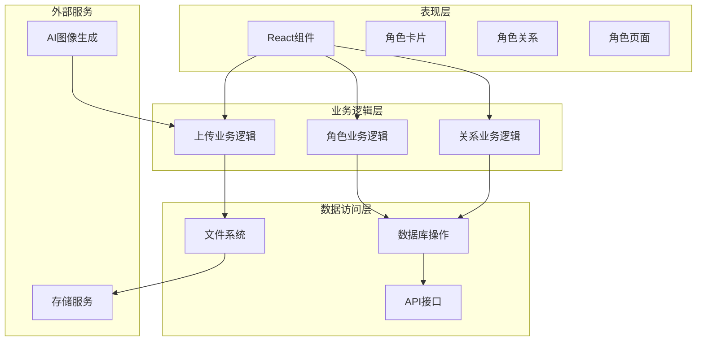
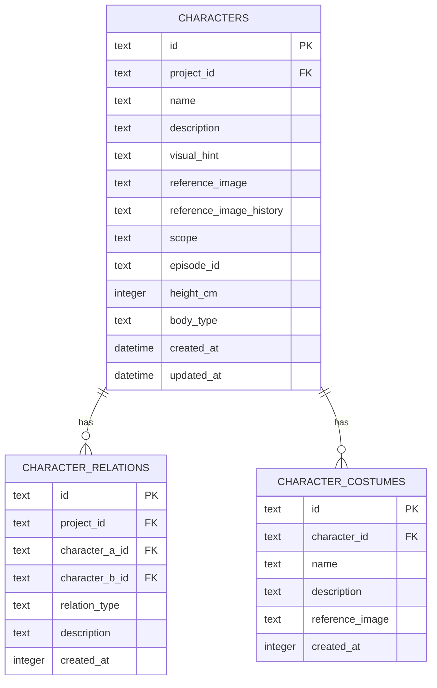
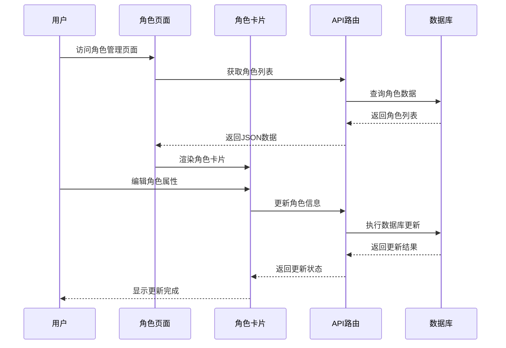
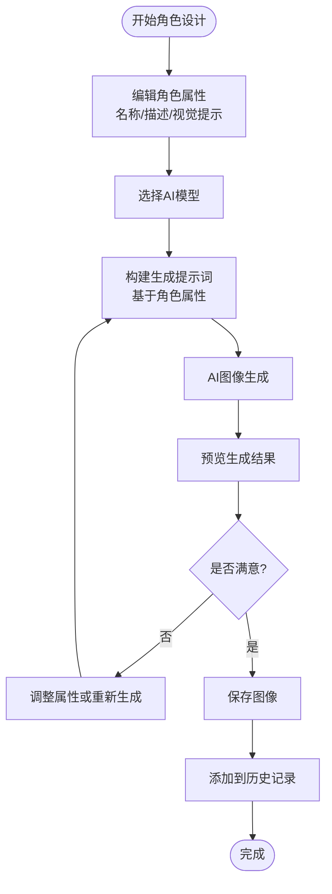
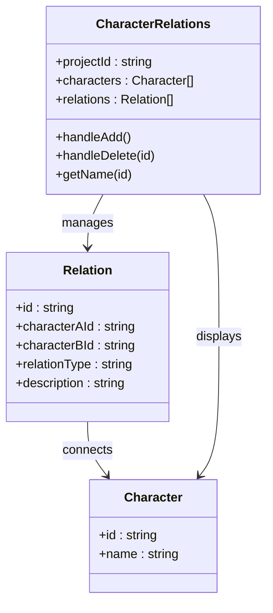
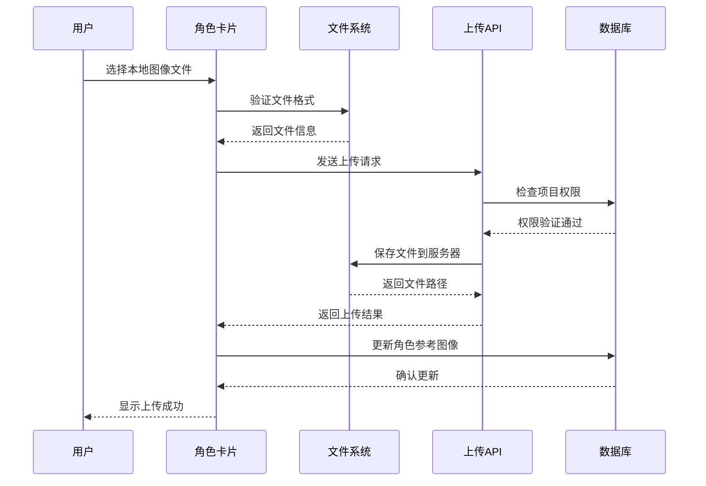

# 角色管理系统

<cite>
**本文档引用的文件**
- [character-card.tsx](file://src/components/editor/character-card.tsx)
- [character-relations.tsx](file://src/components/editor/character-relations.tsx)
- [characters/page.tsx](file://src/app/[locale]/project/[id]/characters/page.tsx)
- [characters/[characterId]/route.ts](file://src/app/api/projects/[id]/characters/[characterId]/route.ts)
- [characters/[characterId]/upload/route.ts](file://src/app/api/projects/[id]/characters/[characterId]/upload/route.ts)
- [schema.ts](file://src/lib/db/schema.ts)
- [0025_add_character_relations.sql](file://drizzle/0025_add_character_relations.sql)
- [0009_add_character_visual_hint.sql](file://drizzle/0009_add_character_visual_hint.sql)
- [0039_add_character_height_cm.sql](file://drizzle/0039_add_character_height_cm.sql)
- [generate/route.ts](file://src/app/api/projects/[id]/generate/route.ts)
- [registry.ts](file://src/lib/ai/prompts/registry.ts)
- [import/page.tsx](file://src/app/[locale]/project/[id]/import/page.tsx)
</cite>

## 目录
1. [简介](#简介)
2. [项目结构](#项目结构)
3. [核心组件](#核心组件)
4. [架构概览](#架构概览)
5. [详细组件分析](#详细组件分析)
6. [依赖关系分析](#依赖关系分析)
7. [性能考虑](#性能考虑)
8. [故障排除指南](#故障排除指南)
9. [结论](#结论)

## 简介

AIComicBuilder的角色管理系统是一个完整的角色生命周期管理解决方案，专注于漫画创作中的角色设计、管理和关系维护。该系统提供了从角色创建到关系管理的全栈功能，包括角色外观设计、历史版本控制、关系图谱构建、角色卡片组件、上传功能和预览机制。

系统采用现代化的React前端架构配合Next.js服务端渲染，结合Drizzle ORM进行数据库操作，实现了高效的角色数据管理。通过AI驱动的图像生成功能，用户可以快速创建高质量的角色外观，并支持多版本历史管理和关系网络构建。

## 项目结构

角色管理系统主要分布在以下目录结构中：

```mermaid
graph TB
subgraph "前端组件层"
A[角色卡片组件<br/>character-card.tsx]
B[角色关系组件<br/>character-relations.tsx]
C[角色管理页面<br/>characters/page.tsx]
D[导入页面<br/>import/page.tsx]
end
subgraph "API路由层"
E[角色CRUD路由<br/>characters/[characterId]/route.ts]
F[角色上传路由<br/>characters/[characterId]/upload/route.ts]
G[生成路由<br/>generate/route.ts]
end
subgraph "数据层"
H[数据库模式<br/>schema.ts]
I[迁移脚本<br/>0025_add_character_relations.sql]
J[视觉提示字段<br/>0009_add_character_visual_hint.sql]
K[身高字段<br/>0039_add_character_height_cm.sql]
end
A --> E
B --> E
C --> A
C --> B
E --> H
F --> H
G --> H
```

**图表来源**
- [character-card.tsx:1-341](file://src/components/editor/character-card.tsx#L1-L341)
- [character-relations.tsx:1-154](file://src/components/editor/character-relations.tsx#L1-L154)
- [characters/page.tsx:1-236](file://src/app/[locale]/project/[id]/characters/page.tsx#L1-L236)

**章节来源**
- [character-card.tsx:1-341](file://src/components/editor/character-card.tsx#L1-L341)
- [character-relations.tsx:1-154](file://src/components/editor/character-relations.tsx#L1-L154)
- [characters/page.tsx:1-236](file://src/app/[locale]/project/[id]/characters/page.tsx#L1-L236)

## 核心组件

### 角色卡片组件 (CharacterCard)

角色卡片是系统的核心UI组件，提供完整的角色编辑和管理功能：

- **属性编辑**：实时名称、描述、视觉提示编辑
- **图像生成**：AI驱动的角色外观生成
- **图像上传**：自定义角色图像上传
- **历史管理**：多版本图像历史切换
- **预览功能**：全屏图像预览
- **状态管理**：主角色/客串角色状态切换

### 角色关系组件 (CharacterRelations)

专门处理角色间关系管理的组件：

- **关系类型**：支持多种关系类型（盟友、敌人、恋人等）
- **双向关系**：自动处理角色间的相互关系
- **描述功能**：为关系添加详细描述
- **实时更新**：关系变更即时同步

### 页面管理组件

提供角色管理的完整工作流：

- **主角色管理**：主要角色的集中展示和编辑
- **客串角色管理**：按剧集分类的客串角色管理
- **批量操作**：支持批量角色提升和删除操作

**章节来源**
- [character-card.tsx:18-32](file://src/components/editor/character-card.tsx#L18-L32)
- [character-relations.tsx:14-25](file://src/components/editor/character-relations.tsx#L14-L25)
- [characters/page.tsx:12-28](file://src/app/[locale]/project/[id]/characters/page.tsx#L12-L28)

## 架构概览

系统采用分层架构设计，确保各组件职责明确且松耦合：



**图表来源**
- [character-card.tsx:83-132](file://src/components/editor/character-card.tsx#L83-L132)
- [character-relations.tsx:56-78](file://src/components/editor/character-relations.tsx#L56-L78)
- [characters/[characterId]/route.ts](file://src/app/api/projects/[id]/characters/[characterId]/route.ts#L7-L57)

系统架构特点：

1. **组件化设计**：每个功能模块独立封装，便于维护和扩展
2. **状态管理**：采用React Hooks进行本地状态管理
3. **API集成**：统一的API接口处理所有后端通信
4. **文件处理**：分离的文件上传和存储机制
5. **AI集成**：无缝集成AI图像生成功能

## 详细组件分析

### 角色数据模型

角色系统基于完整的数据模型设计，支持丰富的角色属性：



**图表来源**
- [schema.ts:62-120](file://src/lib/db/schema.ts#L62-L120)
- [schema.ts:283-299](file://src/lib/db/schema.ts#L283-L299)
- [schema.ts:301-312](file://src/lib/db/schema.ts#L301-L312)

#### 核心数据属性

| 属性名 | 类型 | 描述 | 约束 |
|--------|------|------|------|
| id | text | 角色唯一标识符 | 主键 |
| name | text | 角色名称 | 必填 |
| description | text | 角色描述 | 可选 |
| visual_hint | text | 视觉提示标签 | 可选 |
| reference_image | text | 当前参考图像 | 可选 |
| reference_image_history | text | 图像历史记录 | JSON格式 |
| scope | text | 角色作用域 | main/guest/global |
| episode_id | text | 剧集关联 | 外键引用 |
| height_cm | integer | 身高（厘米） | 默认0 |
| body_type | text | 体型描述 | 可选 |

#### 关系约束

- **角色关系**：支持双向关系，自动维护对称性
- **作用域管理**：主角色和客串角色的不同权限级别
- **剧集关联**：客串角色与特定剧集的绑定关系
- **历史追踪**：完整的图像版本历史记录

**章节来源**
- [schema.ts:62-120](file://src/lib/db/schema.ts#L62-L120)
- [0025_add_character_relations.sql:1-9](file://drizzle/0025_add_character_relations.sql#L1-L9)
- [0009_add_character_visual_hint.sql:1-1](file://drizzle/0009_add_character_visual_hint.sql#L1-L1)
- [0039_add_character_height_cm.sql:1-1](file://drizzle/0039_add_character_height_cm.sql#L1-L1)

### 角色创建流程



**图表来源**
- [characters/page.tsx:45-57](file://src/app/[locale]/project/[id]/characters/page.tsx#L45-L57)
- [character-card.tsx:83-90](file://src/components/editor/character-card.tsx#L83-L90)
- [characters/[characterId]/route.ts](file://src/app/api/projects/[id]/characters/[characterId]/route.ts#L7-L57)

### 角色外观设计工作流程

系统提供完整的AI驱动角色外观设计流程：



**图表来源**
- [character-card.tsx:92-112](file://src/components/editor/character-card.tsx#L92-L112)
- [generate/route.ts:110-125](file://src/app/api/projects/[id]/generate/route.ts#L110-L125)
- [registry.ts:816-841](file://src/lib/ai/prompts/registry.ts#L816-L841)

### 角色关系管理



**图表来源**
- [character-relations.tsx:14-25](file://src/components/editor/character-relations.tsx#L14-L25)
- [character-relations.tsx:27-33](file://src/components/editor/character-relations.tsx#L27-L33)

**章节来源**
- [character-relations.tsx:1-154](file://src/components/editor/character-relations.tsx#L1-L154)
- [characters/page.tsx:175-183](file://src/app/[locale]/project/[id]/characters/page.tsx#L175-L183)

### 角色上传和预览机制



**图表来源**
- [character-card.tsx:114-132](file://src/components/editor/character-card.tsx#L114-L132)
- [characters/[characterId]/upload/route.ts](file://src/app/api/projects/[id]/characters/[characterId]/upload/route.ts#L12-L41)

**章节来源**
- [character-card.tsx:114-132](file://src/components/editor/character-card.tsx#L114-L132)
- [characters/[characterId]/upload/route.ts](file://src/app/api/projects/[id]/characters/[characterId]/upload/route.ts#L1-L41)

## 依赖关系分析

系统组件间的依赖关系体现了清晰的分层架构：

```mermaid
graph LR
subgraph "外部依赖"
A[lucide-react]
B[sonner]
C[next-intl]
D[drizzle-orm]
end
subgraph "内部模块"
E[api-fetch]
F[model-store]
G[utils/upload-url]
H[assert-project-ownership]
end
subgraph "核心组件"
I[CharacterCard]
J[CharacterRelations]
K[CharactersPage]
end
A --> I
B --> I
C --> I
D --> K
E --> I
F --> I
G --> I
H --> K
I --> K
J --> K
```



**图表来源**
- [character-card.tsx:1-16](file://src/components/editor/character-card.tsx#L1-L16)
- [character-relations.tsx:1-8](file://src/components/editor/character-relations.tsx#L1-L8)
- [characters/page.tsx:1-10](file://src/app/[locale]/project/[id]/characters/page.tsx#L1-L10)

**章节来源**
- [character-card.tsx:1-16](file://src/components/editor/character-card.tsx#L1-L16)
- [character-relations.tsx:1-8](file://src/components/editor/character-relations.tsx#L1-L8)
- [characters/page.tsx:1-10](file://src/app/[locale]/project/[id]/characters/page.tsx#L1-L10)

## 性能考虑

### 数据加载优化

系统采用并行数据加载策略，减少页面初始化时间：

- **并发API调用**：角色列表和剧集列表同时加载
- **缓存策略**：合理利用浏览器缓存和组件状态缓存
- **虚拟滚动**：大量角色时采用虚拟滚动技术

### 图像处理优化

- **懒加载**：图像资源按需加载
- **格式优化**：支持多种图像格式以平衡质量与体积
- **CDN集成**：图像资源通过CDN加速分发

### AI生成优化

- **队列管理**：AI生成任务排队处理，避免资源竞争
- **进度反馈**：实时显示生成进度，提升用户体验
- **错误恢复**：生成失败时提供重试机制

## 故障排除指南

### 常见问题及解决方案

#### 角色更新失败
**症状**：角色属性修改后未保存成功
**可能原因**：
- 权限不足
- 网络连接异常
- 数据库约束冲突

**解决步骤**：
1. 检查用户项目访问权限
2. 确认网络连接稳定
3. 验证输入数据格式正确性

#### 图像上传失败
**症状**：角色图像无法上传
**可能原因**：
- 文件格式不支持
- 文件大小超限
- 服务器存储空间不足

**解决步骤**：
1. 确认文件格式为支持的图像格式
2. 检查文件大小限制
3. 验证服务器存储状态

#### 关系创建异常
**症状**：角色关系无法正常创建
**可能原因**：
- 角色ID无效
- 自身关系尝试
- 数据库约束错误

**解决步骤**：
1. 验证角色ID的有效性
2. 确保选择不同的角色进行关系建立
3. 检查数据库外键约束

**章节来源**
- [character-card.tsx:127-131](file://src/components/editor/character-card.tsx#L127-L131)
- [character-relations.tsx:56-78](file://src/components/editor/character-relations.tsx#L56-L78)
- [characters/[characterId]/route.ts](file://src/app/api/projects/[id]/characters/[characterId]/route.ts#L12-L23)

## 结论

AIComicBuilder的角色管理系统展现了现代Web应用的最佳实践，通过精心设计的架构和丰富的功能特性，为漫画创作者提供了强大的角色管理工具。

### 主要优势

1. **完整的功能覆盖**：从基础的角色创建到复杂的关系管理，满足各种使用场景
2. **优秀的用户体验**：直观的界面设计和流畅的操作流程
3. **强大的技术实现**：采用先进的React技术和现代化的开发模式
4. **灵活的扩展性**：清晰的架构设计便于功能扩展和维护

### 技术亮点

- **AI集成**：无缝集成AI图像生成功能，大幅提升创作效率
- **版本控制**：完善的图像历史记录和版本管理机制
- **关系建模**：灵活的角色关系系统支持复杂的故事情节
- **协作友好**：支持多用户协作和权限管理

该系统为漫画创作提供了一个强大而易用的平台，通过技术创新和用户体验优化，显著提升了角色设计和管理的效率与质量。