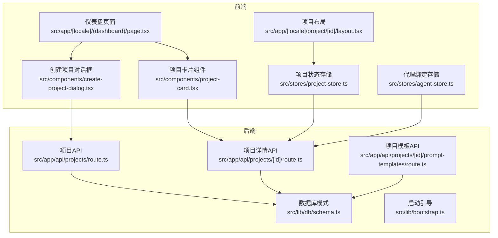
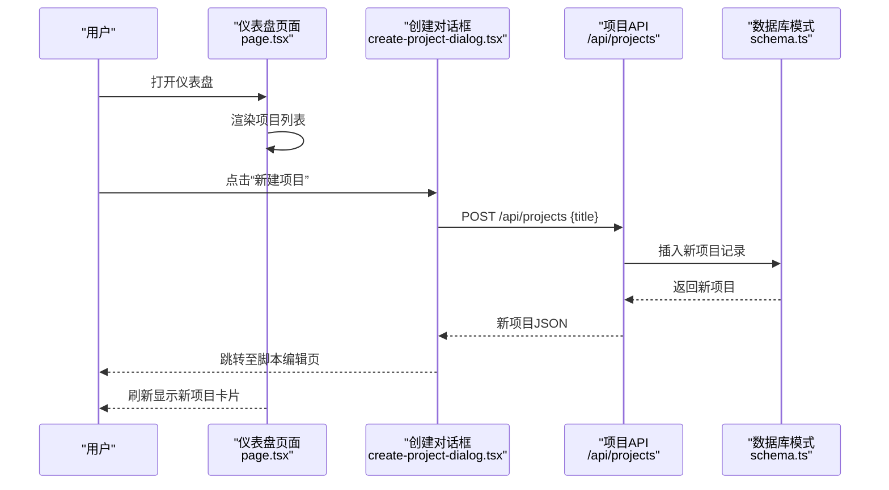
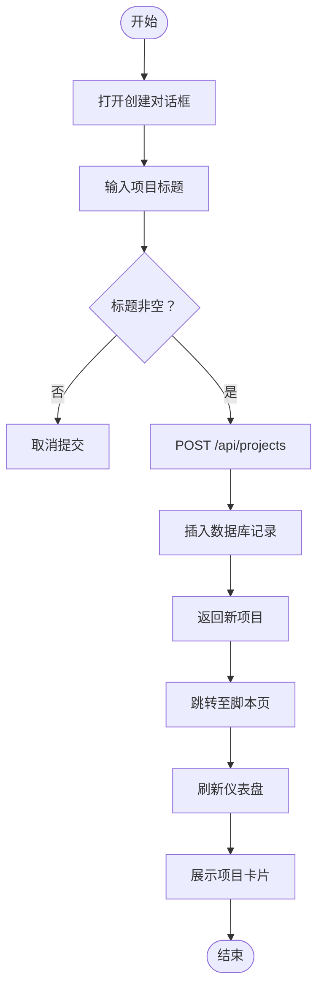
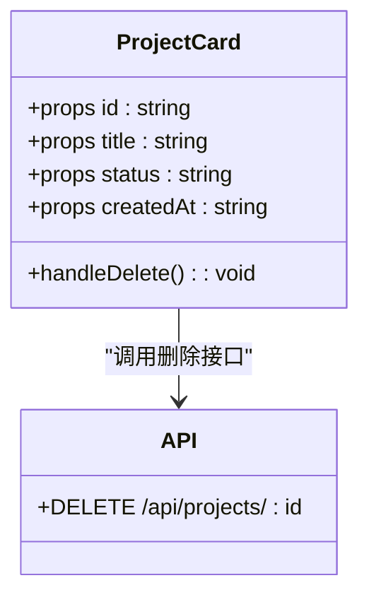
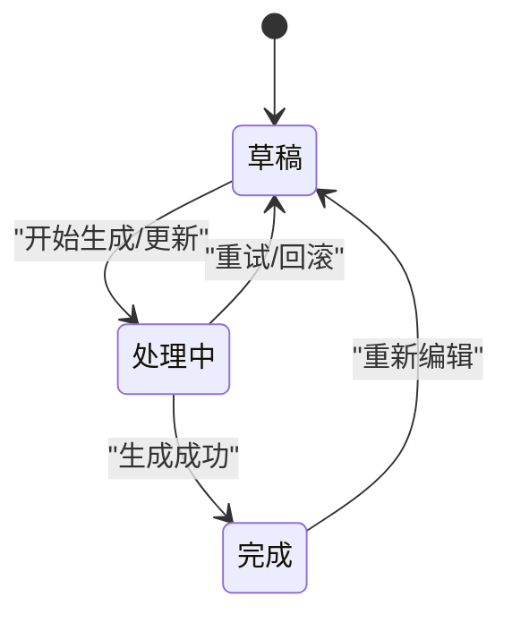
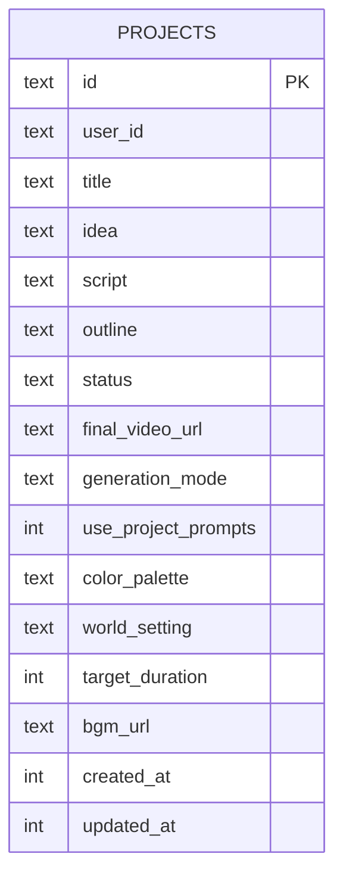
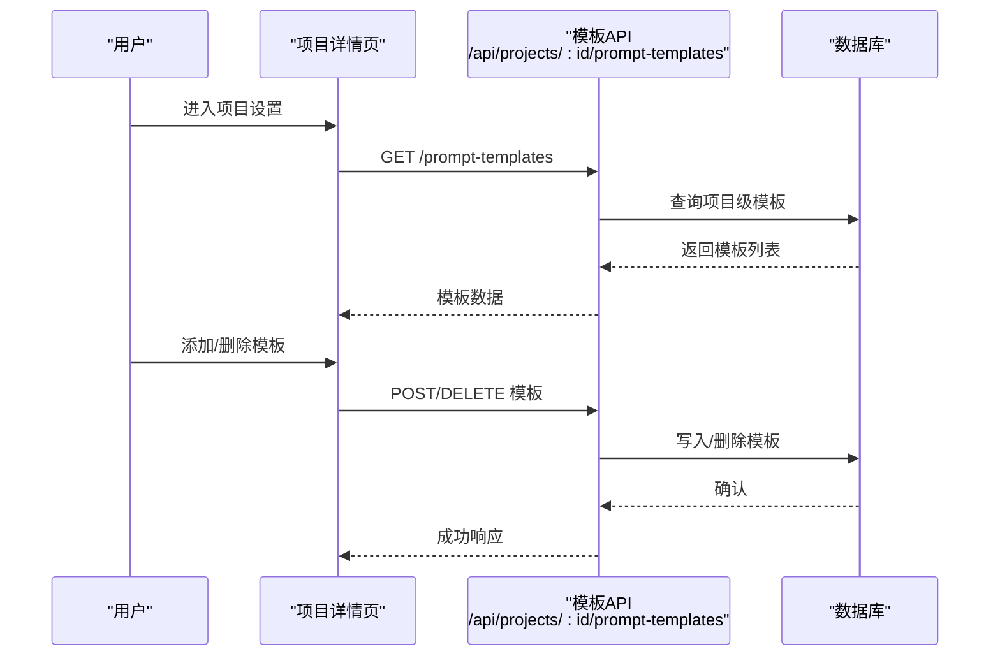
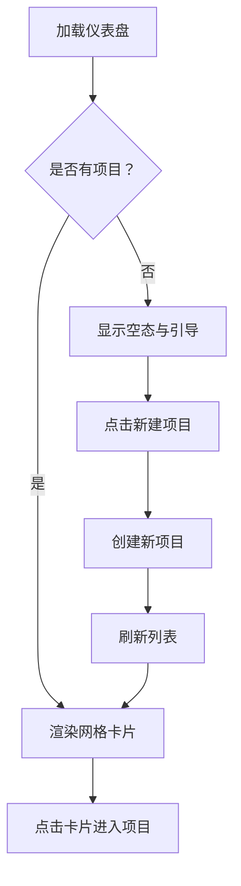
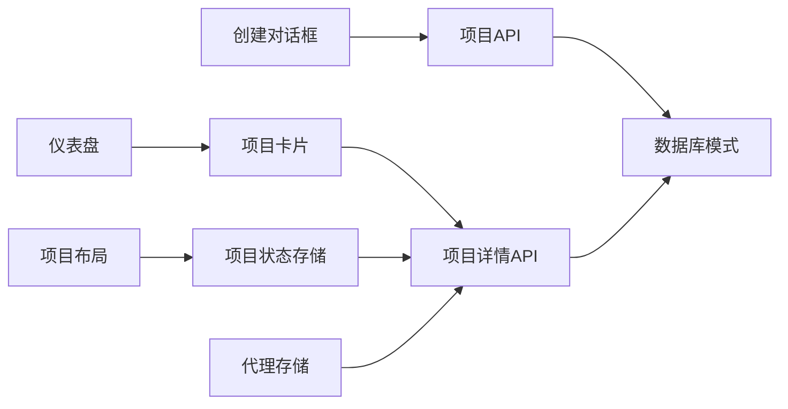

# 项目概览与创建

<cite>
**本文档引用的文件**
- [src/app/[locale]/(dashboard)/page.tsx](file://src/app/[locale]/(dashboard)/page.tsx)
- [src/components/create-project-dialog.tsx](file://src/components/create-project-dialog.tsx)
- [src/stores/project-store.ts](file://src/stores/project-store.ts)
- [src/components/project-card.tsx](file://src/components/project-card.tsx)
- [src/app/api/projects/route.ts](file://src/app/api/projects/route.ts)
- [src/lib/db/schema.ts](file://src/lib/db/schema.ts)
- [src/lib/bootstrap.ts](file://src/lib/bootstrap.ts)
- [src/app/[locale]/project/[id]/layout.tsx](file://src/app/[locale]/project/[id]/layout.tsx)
- [src/stores/agent-store.ts](file://src/stores/agent-store.ts)
- [src/app/api/projects/[id]/route.ts](file://src/app/api/projects/[id]/route.ts)
- [src/app/api/projects/[id]/prompt-templates/route.ts](file://src/app/api/projects/[id]/prompt-templates/route.ts)
</cite>

## 目录
1. [简介](#简介)
2. [项目结构](#项目结构)
3. [核心组件](#核心组件)
4. [架构总览](#架构总览)
5. [详细组件分析](#详细组件分析)
6. [依赖关系分析](#依赖关系分析)
7. [性能考虑](#性能考虑)
8. [故障排除指南](#故障排除指南)
9. [结论](#结论)
10. [附录](#附录)

## 简介
本文件面向AIComicBuilder的“项目概览与创建”功能，系统性阐述从用户发起创建到项目卡片展示的完整流程，涵盖项目配置选项、项目模板系统、状态管理、设置与元数据管理、项目卡片组件实现、项目列表展示以及搜索过滤能力。同时给出项目生命周期各阶段的状态变化与数据流转图，并提供最佳实践与常见配置场景建议。

## 项目结构
该功能涉及三层：前端页面层（仪表盘与项目详情）、状态管理层（Zustand Store）与后端API层（Drizzle ORM + SQLite）。整体采用Next.js App Router组织路由，使用Drizzle进行数据库访问，Zustand负责前端状态管理。

**图表来源**
- [src/app/[locale]/(dashboard)/page.tsx:10-76](file://src/app/[locale]/(dashboard)/page.tsx#L10-L76)
- [src/components/create-project-dialog.tsx:20-43](file://src/components/create-project-dialog.tsx#L20-L43)
- [src/stores/project-store.ts:219-256](file://src/stores/project-store.ts#L219-L256)
- [src/app/api/projects/route.ts:8-34](file://src/app/api/projects/route.ts#L8-L34)
- [src/app/api/projects/[id]/route.ts:127-179](file://src/app/api/projects/[id]/route.ts#L127-L179)
- [src/lib/db/schema.ts:3-28](file://src/lib/db/schema.ts#L3-L28)
- [src/lib/bootstrap.ts:8-25](file://src/lib/bootstrap.ts#L8-L25)

**章节来源**
- [src/app/[locale]/(dashboard)/page.tsx:10-76](file://src/app/[locale]/(dashboard)/page.tsx#L10-L76)
- [src/components/create-project-dialog.tsx:20-43](file://src/components/create-project-dialog.tsx#L20-L43)
- [src/stores/project-store.ts:219-256](file://src/stores/project-store.ts#L219-L256)
- [src/app/api/projects/route.ts:8-34](file://src/app/api/projects/route.ts#L8-L34)
- [src/lib/db/schema.ts:3-28](file://src/lib/db/schema.ts#L3-L28)
- [src/lib/bootstrap.ts:8-25](file://src/lib/bootstrap.ts#L8-L25)

## 核心组件
- 仪表盘页面负责加载当前用户的项目列表，并渲染项目卡片；提供“新建项目”入口。
- 创建项目对话框负责收集标题并调用后端API创建项目，创建成功后跳转至脚本编辑页。
- 项目卡片组件用于展示单个项目的基本信息、状态徽标与删除确认交互。
- 项目状态存储负责在项目详情页拉取并缓存项目数据，支持版本切换与局部更新。
- 项目API提供列表查询、创建、更新与删除等操作；项目详情API返回聚合后的完整数据。
- 数据库模式定义了项目表及其相关联的剧集、镜头、资产等表结构。
- 启动引导负责初始化数据库迁移、AI Provider、流水线处理器与任务工作线程。

**章节来源**
- [src/app/[locale]/(dashboard)/page.tsx:10-76](file://src/app/[locale]/(dashboard)/page.tsx#L10-L76)
- [src/components/create-project-dialog.tsx:20-43](file://src/components/create-project-dialog.tsx#L20-L43)
- [src/components/project-card.tsx:46-148](file://src/components/project-card.tsx#L46-L148)
- [src/stores/project-store.ts:219-256](file://src/stores/project-store.ts#L219-L256)
- [src/app/api/projects/route.ts:8-34](file://src/app/api/projects/route.ts#L8-L34)
- [src/lib/db/schema.ts:3-28](file://src/lib/db/schema.ts#L3-L28)
- [src/lib/bootstrap.ts:8-25](file://src/lib/bootstrap.ts#L8-L25)

## 架构总览
下图展示了从用户点击“新建项目”到项目卡片展示的端到端流程，包括前端交互、API调用与数据库写入。

**图表来源**
- [src/app/[locale]/(dashboard)/page.tsx:10-76](file://src/app/[locale]/(dashboard)/page.tsx#L10-L76)
- [src/components/create-project-dialog.tsx:20-43](file://src/components/create-project-dialog.tsx#L20-L43)
- [src/app/api/projects/route.ts:18-34](file://src/app/api/projects/route.ts#L18-L34)
- [src/lib/db/schema.ts:3-28](file://src/lib/db/schema.ts#L3-L28)

## 详细组件分析

### 项目创建流程
- 用户在仪表盘点击“新建项目”，弹出对话框输入标题。
- 前端调用POST /api/projects，携带标题。
- 后端生成唯一ID并插入projects表，返回新项目对象。
- 前端关闭对话框并跳转至项目脚本编辑页；仪表盘刷新后展示新卡片。

**图表来源**
- [src/components/create-project-dialog.tsx:20-43](file://src/components/create-project-dialog.tsx#L20-L43)
- [src/app/api/projects/route.ts:18-34](file://src/app/api/projects/route.ts#L18-L34)
- [src/app/[locale]/(dashboard)/page.tsx:10-76](file://src/app/[locale]/(dashboard)/page.tsx#L10-L76)

**章节来源**
- [src/components/create-project-dialog.tsx:20-43](file://src/components/create-project-dialog.tsx#L20-L43)
- [src/app/api/projects/route.ts:18-34](file://src/app/api/projects/route.ts#L18-L34)
- [src/app/[locale]/(dashboard)/page.tsx:10-76](file://src/app/[locale]/(dashboard)/page.tsx#L10-L76)

### 项目卡片组件实现
- 接收项目id、标题、状态与创建时间。
- 根据状态选择不同颜色与图标：草稿、处理中、已完成。
- 支持删除：弹出确认对话框，确认后调用DELETE /api/projects/{id}并刷新。
- 鼠标悬停显示删除按钮，点击卡片进入项目剧集页。

**图表来源**
- [src/components/project-card.tsx:46-148](file://src/components/project-card.tsx#L46-L148)
- [src/app/api/projects/[id]/route.ts:181-195](file://src/app/api/projects/[id]/route.ts#L181-L195)

**章节来源**
- [src/components/project-card.tsx:46-148](file://src/components/project-card.tsx#L46-L148)
- [src/app/api/projects/[id]/route.ts:181-195](file://src/app/api/projects/[id]/route.ts#L181-L195)

### 项目状态管理与生命周期
- 项目状态枚举：draft（草稿）、processing（处理中）、completed（完成）。
- 项目详情页通过useProjectStore在首次加载时设置loading并在获取数据后清除。
- 更新项目设置会触发下游失效标记逻辑（如脚本变更时标记下游过期）。
- 项目卡片根据状态动态渲染徽标与图标，体现生命周期阶段。

**图表来源**
- [src/lib/db/schema.ts:10-14](file://src/lib/db/schema.ts#L10-L14)
- [src/stores/project-store.ts:224-239](file://src/stores/project-store.ts#L224-L239)
- [src/app/api/projects/[id]/route.ts:174-176](file://src/app/api/projects/[id]/route.ts#L174-L176)

**章节来源**
- [src/lib/db/schema.ts:10-14](file://src/lib/db/schema.ts#L10-L14)
- [src/stores/project-store.ts:224-239](file://src/stores/project-store.ts#L224-L239)
- [src/app/api/projects/[id]/route.ts:174-176](file://src/app/api/projects/[id]/route.ts#L174-L176)

### 项目设置与元数据管理
- 支持的项目级设置字段：标题、创意、脚本、大纲、状态、生成模式（关键帧/参考）、是否使用项目提示词、配色板、世界观设定、目标时长、背景音乐URL等。
- 更新接口按需更新字段并维护updatedAt；当脚本字段被修改时，触发下游失效标记。
- 项目详情API返回聚合数据，包含剧集、角色、镜头与版本信息。

**图表来源**
- [src/lib/db/schema.ts:3-28](file://src/lib/db/schema.ts#L3-L28)
- [src/app/api/projects/[id]/route.ts:139-179](file://src/app/api/projects/[id]/route.ts#L139-L179)

**章节来源**
- [src/lib/db/schema.ts:3-28](file://src/lib/db/schema.ts#L3-L28)
- [src/app/api/projects/[id]/route.ts:139-179](file://src/app/api/projects/[id]/route.ts#L139-L179)

### 项目模板系统
- 项目级提示词模板：支持列出、新增与删除项目级别的模板覆盖。
- 模板作用域限定为“项目”，并与用户ID关联，确保权限控制。
- 通过API路由实现模板的增删查操作，便于在项目内定制化生成参数。

**图表来源**
- [src/app/api/projects/[id]/prompt-templates/route.ts:8-37](file://src/app/api/projects/[id]/prompt-templates/route.ts#L8-L37)
- [src/lib/db/schema.ts:245-282](file://src/lib/db/schema.ts#L245-L282)

**章节来源**
- [src/app/api/projects/[id]/prompt-templates/route.ts:8-37](file://src/app/api/projects/[id]/prompt-templates/route.ts#L8-L37)
- [src/lib/db/schema.ts:245-282](file://src/lib/db/schema.ts#L245-L282)

### 项目列表展示与搜索过滤
- 仪表盘页面按创建时间倒序列出当前用户的所有项目。
- 当无项目时展示引导占位与“新建项目”按钮。
- 项目卡片支持删除与跳转，状态徽标直观反映生命周期阶段。
- 搜索过滤可通过扩展API或前端筛选实现（例如按标题、状态、日期范围等），当前仓库未提供现成的搜索路由，可基于现有GET /api/projects进行扩展。

**图表来源**
- [src/app/[locale]/(dashboard)/page.tsx:46-76](file://src/app/[locale]/(dashboard)/page.tsx#L46-L76)
- [src/components/project-card.tsx:46-148](file://src/components/project-card.tsx#L46-L148)

**章节来源**
- [src/app/[locale]/(dashboard)/page.tsx:46-76](file://src/app/[locale]/(dashboard)/page.tsx#L46-L76)
- [src/components/project-card.tsx:46-148](file://src/components/project-card.tsx#L46-L148)

## 依赖关系分析
- 组件间依赖：仪表盘依赖项目卡片与创建对话框；项目卡片依赖API；创建对话框依赖API；项目布局依赖项目状态存储。
- 存储依赖：项目状态存储依赖API Fetch；代理绑定存储依赖项目API。
- 数据库依赖：所有API均依赖Drizzle ORM访问SQLite；项目表与其他实体存在外键约束。

**图表来源**
- [src/components/create-project-dialog.tsx:20-43](file://src/components/create-project-dialog.tsx#L20-L43)
- [src/app/[locale]/(dashboard)/page.tsx:10-76](file://src/app/[locale]/(dashboard)/page.tsx#L10-L76)
- [src/components/project-card.tsx:46-148](file://src/components/project-card.tsx#L46-L148)
- [src/stores/project-store.ts:219-256](file://src/stores/project-store.ts#L219-L256)
- [src/stores/agent-store.ts:25-55](file://src/stores/agent-store.ts#L25-L55)
- [src/app/api/projects/route.ts:8-34](file://src/app/api/projects/route.ts#L8-L34)
- [src/app/api/projects/[id]/route.ts:127-179](file://src/app/api/projects/[id]/route.ts#L127-L179)
- [src/lib/db/schema.ts:3-28](file://src/lib/db/schema.ts#L3-L28)

**章节来源**
- [src/components/create-project-dialog.tsx:20-43](file://src/components/create-project-dialog.tsx#L20-L43)
- [src/app/[locale]/(dashboard)/page.tsx:10-76](file://src/app/[locale]/(dashboard)/page.tsx#L10-L76)
- [src/components/project-card.tsx:46-148](file://src/components/project-card.tsx#L46-L148)
- [src/stores/project-store.ts:219-256](file://src/stores/project-store.ts#L219-L256)
- [src/stores/agent-store.ts:25-55](file://src/stores/agent-store.ts#L25-L55)
- [src/app/api/projects/route.ts:8-34](file://src/app/api/projects/route.ts#L8-L34)
- [src/app/api/projects/[id]/route.ts:127-179](file://src/app/api/projects/[id]/route.ts#L127-L179)
- [src/lib/db/schema.ts:3-28](file://src/lib/db/schema.ts#L3-L28)

## 性能考虑
- 列表加载：按创建时间倒序分页加载，避免一次性渲染过多卡片。
- 状态缓存：项目详情使用Zustand缓存，避免重复请求；版本切换时后台刷新不卸载子组件。
- 删除操作：本地立即隐藏卡片，失败时回滚，提升交互反馈速度。
- 数据库：合理索引userId与createdAt，减少查询成本；批量更新时合并事务。

## 故障排除指南
- 创建失败：检查网络请求与后端日志；确认标题非空；查看返回状态码。
- 项目卡片不显示：确认用户身份Cookie有效；检查数据库中userId匹配。
- 删除异常：确认拥有者权限；检查DELETE接口返回状态。
- 状态不更新：确认PATCH接口已正确更新updatedAt；检查下游失效标记逻辑是否触发。

**章节来源**
- [src/components/create-project-dialog.tsx:20-43](file://src/components/create-project-dialog.tsx#L20-L43)
- [src/components/project-card.tsx:56-67](file://src/components/project-card.tsx#L56-L67)
- [src/app/api/projects/[id]/route.ts:181-195](file://src/app/api/projects/[id]/route.ts#L181-L195)

## 结论
本功能以简洁的前端组件与清晰的后端API实现了完整的项目创建与概览体验。通过状态存储与数据库模式的配合，项目生命周期中的状态变化与数据流转得以稳定呈现。建议后续扩展搜索过滤与更丰富的模板管理能力，进一步提升用户体验。

## 附录

### 最佳实践
- 创建项目时建议默认生成一个初始剧集，便于快速推进创作。
- 使用项目模板统一风格，减少重复配置。
- 对于大型项目，建议启用“参考模式”以获得更稳定的输出质量。
- 定期清理过期资产与历史版本，保持数据库整洁。

### 常见配置场景
- 快速原型：选择“关键帧模式”，最小化配置，快速生成演示视频。
- 高质量输出：选择“参考模式”，搭配项目模板与代理绑定，精细化控制生成参数。
- 团队协作：开启“使用项目提示词”，集中管理模板与风格，保证一致性。