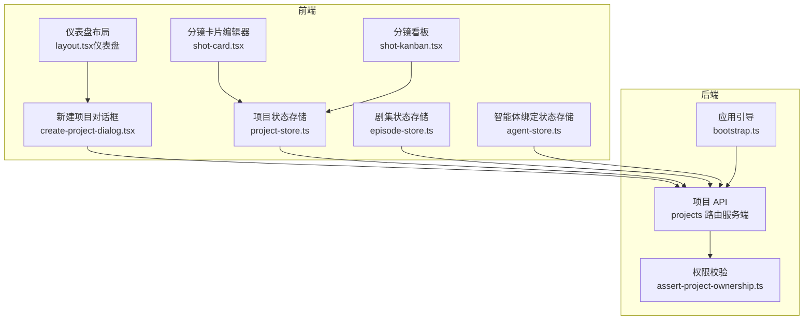
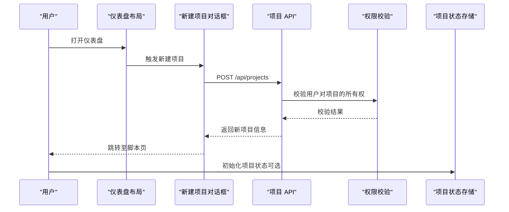
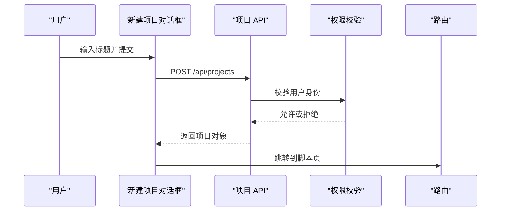
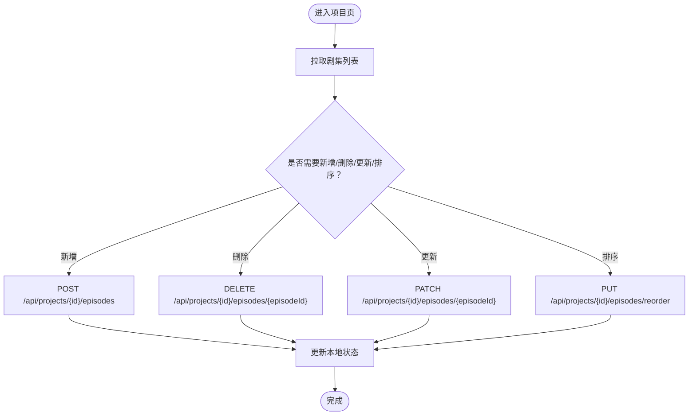
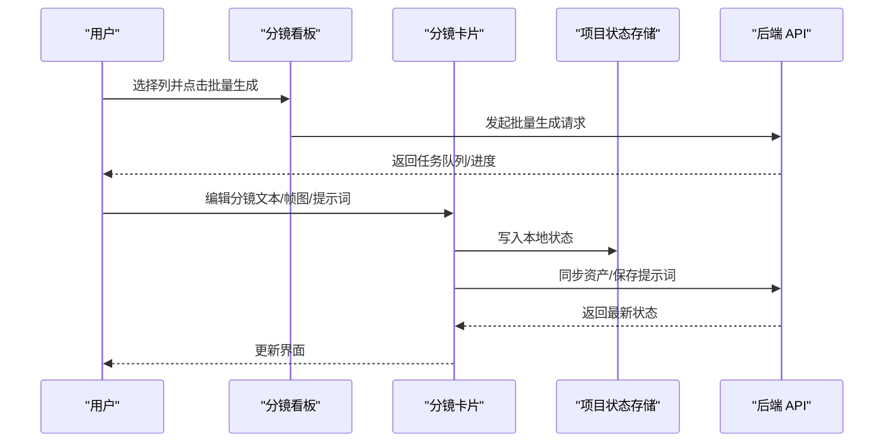
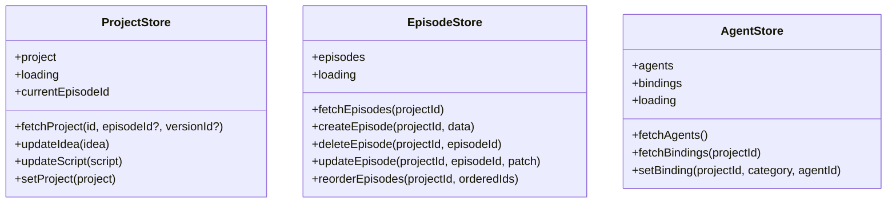
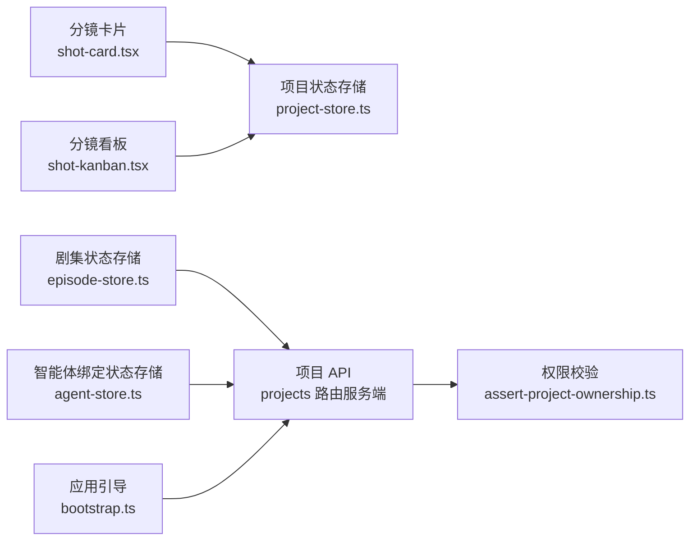

# 项目管理功能

<cite>
**本文引用的文件**
- [project-store.ts](file://src/stores/project-store.ts)
- [episode-store.ts](file://src/stores/episode-store.ts)
- [agent-store.ts](file://src/stores/agent-store.ts)
- [create-project-dialog.tsx](file://src/components/create-project-dialog.tsx)
- [layout.tsx（仪表盘）](file://src/app/[locale]/(dashboard)/layout.tsx)
- [bootstrap.ts](file://src/lib/bootstrap.ts)
- [assert-project-ownership.ts](file://src/lib/assert-project-ownership.ts)
- [projects 路由（服务端）](file://src/app/api/projects/route.ts)
- [shot-card.tsx](file://src/components/editor/shot-card.tsx)
- [shot-kanban.tsx](file://src/components/editor/shot-kanban.tsx)
</cite>

## 目录
1. [简介](#简介)
2. [项目结构](#项目结构)
3. [核心组件](#核心组件)
4. [架构总览](#架构总览)
5. [详细组件分析](#详细组件分析)
6. [依赖关系分析](#依赖关系分析)
7. [性能考量](#性能考量)
8. [故障排查指南](#故障排查指南)
9. [结论](#结论)
10. [附录](#附录)

## 简介
本文件系统性梳理 AIComicBuilder 的“项目管理功能”，覆盖项目创建与配置、剧集管理、角色管理、分镜设计工具、Zustand 状态管理、组件间数据流与状态同步、项目生命周期与版本控制、协作与权限、以及备份与恢复策略。文档以渐进方式呈现，既适合初学者快速上手，也提供深入的技术细节与最佳实践。

## 项目结构
项目采用前后端同构架构：前端 Next.js 应用通过自定义路由组织页面；状态管理基于 Zustand；后端 API 使用 Next.js App Router 的 API 路由；数据库迁移与初始化在启动阶段完成。

图表来源
- [layout.tsx（仪表盘）](file://src/app/[locale]/(dashboard)/layout.tsx#L1-L46)
- [create-project-dialog.tsx:1-89](file://src/components/create-project-dialog.tsx#L1-L89)
- [project-store.ts:1-257](file://src/stores/project-store.ts#L1-L257)
- [episode-store.ts:1-100](file://src/stores/episode-store.ts#L1-L100)
- [agent-store.ts:1-56](file://src/stores/agent-store.ts#L1-L56)
- [projects 路由（服务端）:1-35](file://src/app/api/projects/route.ts#L1-L35)
- [assert-project-ownership.ts:1-22](file://src/lib/assert-project-ownership.ts#L1-L22)
- [bootstrap.ts:1-26](file://src/lib/bootstrap.ts#L1-L26)

章节来源
- [layout.tsx（仪表盘）](file://src/app/[locale]/(dashboard)/layout.tsx#L1-L46)
- [bootstrap.ts:1-26](file://src/lib/bootstrap.ts#L1-L26)

## 核心组件
- 项目状态存储（Project Store）
  - 负责加载/更新项目、切换剧集与版本、读取分镜资产等。
  - 提供统一的资产访问辅助函数，屏蔽历史版本与激活态差异。
- 剧集状态存储（Episode Store）
  - 提供剧集列表、创建、删除、更新、排序等操作。
- 智能体绑定状态存储（Agent Store）
  - 维护可用智能体与项目绑定关系，并支持动态设置。
- 分镜卡片与看板
  - 支持单个分镜的文本、帧图、视频提示词与视频生成全流程。
  - 看板按“缺帧/缺提示/缺视频/已完成”四象限展示与批量生成。

章节来源
- [project-store.ts:1-257](file://src/stores/project-store.ts#L1-L257)
- [episode-store.ts:1-100](file://src/stores/episode-store.ts#L1-L100)
- [agent-store.ts:1-56](file://src/stores/agent-store.ts#L1-L56)
- [shot-card.tsx:1-800](file://src/components/editor/shot-card.tsx#L1-L800)
- [shot-kanban.tsx:1-206](file://src/components/editor/shot-kanban.tsx#L1-L206)

## 架构总览
下图展示从前端交互到后端 API 的调用链路与状态流转：

图表来源
- [layout.tsx（仪表盘）](file://src/app/[locale]/(dashboard)/layout.tsx#L1-L46)
- [create-project-dialog.tsx:1-89](file://src/components/create-project-dialog.tsx#L1-L89)
- [projects 路由（服务端）:1-35](file://src/app/api/projects/route.ts#L1-L35)
- [assert-project-ownership.ts:1-22](file://src/lib/assert-project-ownership.ts#L1-L22)

## 详细组件分析

### 项目创建与配置
- 用户通过新建项目对话框发起请求，携带标题，后端生成唯一 ID 并持久化。
- 权限校验确保仅当前用户可创建项目。
- 创建成功后自动跳转至脚本编辑页，便于快速进入创作流程。

图表来源
- [create-project-dialog.tsx:1-89](file://src/components/create-project-dialog.tsx#L1-L89)
- [projects 路由（服务端）:1-35](file://src/app/api/projects/route.ts#L1-L35)
- [assert-project-ownership.ts:1-22](file://src/lib/assert-project-ownership.ts#L1-L22)

章节来源
- [create-project-dialog.tsx:1-89](file://src/components/create-project-dialog.tsx#L1-L89)
- [projects 路由（服务端）:1-35](file://src/app/api/projects/route.ts#L1-L35)
- [assert-project-ownership.ts:1-22](file://src/lib/assert-project-ownership.ts#L1-L22)

### 剧集管理
- 列表：按创建时间倒序返回当前用户的项目集合。
- 新增/删除/更新：提供标准 CRUD 接口，支持变更标题、想法、脚本、状态与生成模式。
- 排序：通过重排接口更新序列号并保持本地顺序一致性。

图表来源
- [episode-store.ts:1-100](file://src/stores/episode-store.ts#L1-L100)
- [projects 路由（服务端）:1-35](file://src/app/api/projects/route.ts#L1-L35)

章节来源
- [episode-store.ts:1-100](file://src/stores/episode-store.ts#L1-L100)

### 角色管理系统
- 角色数据结构包含标识、名称、描述、参考图、视觉提示等字段。
- 项目状态存储中维护角色数组，分镜卡片可引用角色进行对话与动作标注。
- 参考图历史与版本控制通过资产系统统一管理。

章节来源
- [project-store.ts:4-13](file://src/stores/project-store.ts#L4-L13)

### 分镜设计工具
- 单个分镜卡片支持：
  - 文本优化与重写
  - 关键帧（首尾帧）生成
  - 场景参考帧生成
  - 参考图像批量生成与逐张重绘
  - 视频提示词生成与视频生成
  - 资产上传与历史版本切换
- 看板视图按“缺帧/缺提示/缺视频/已完成”四象限组织，支持批量生成。

图表来源
- [shot-kanban.tsx:1-206](file://src/components/editor/shot-kanban.tsx#L1-L206)
- [shot-card.tsx:1-800](file://src/components/editor/shot-card.tsx#L1-L800)
- [project-store.ts:1-257](file://src/stores/project-store.ts#L1-L257)

章节来源
- [shot-card.tsx:1-800](file://src/components/editor/shot-card.tsx#L1-L800)
- [shot-kanban.tsx:1-206](file://src/components/editor/shot-kanban.tsx#L1-L206)

### Zustand 状态管理与数据流
- 项目状态存储
  - 提供加载项目、切换剧集与版本、更新想法与脚本、设置项目等方法。
  - 通过资产访问辅助函数屏蔽底层复杂度，保证 UI 读取安全。
- 剧集状态存储
  - 提供列表、创建、删除、更新、排序等方法，本地状态与后端保持一致。
- 智能体绑定状态存储
  - 获取可用智能体与绑定关系，支持按分类设置智能体。

图表来源
- [project-store.ts:209-257](file://src/stores/project-store.ts#L209-L257)
- [episode-store.ts:21-33](file://src/stores/episode-store.ts#L21-L33)
- [agent-store.ts:16-23](file://src/stores/agent-store.ts#L16-L23)

章节来源
- [project-store.ts:1-257](file://src/stores/project-store.ts#L1-L257)
- [episode-store.ts:1-100](file://src/stores/episode-store.ts#L1-L100)
- [agent-store.ts:1-56](file://src/stores/agent-store.ts#L1-L56)

### 数据模型与业务逻辑
- 项目（Project）
  - 字段：标题、创意、脚本、大纲、状态、最终视频链接、生成模式、角色列表、分镜列表、版本列表。
- 剧集（Episode）
  - 字段：标题、序号、创意、脚本、描述、关键词、状态、生成模式、预览图、创建/更新时间。
- 分镜（Shot）
  - 字段：序列、提示词、视频脚本、运动脚本、摄影机方向、时长、场景、转场、视频提示词、构图/焦点/景深/音效/音乐等、质量评分与问题、是否陈旧、状态、对话列表、资产列表。
- 资产（ShotAsset）
  - 类型：首帧、末帧、参考图、关键帧视频、参考视频；支持版本历史与激活态切换。

章节来源
- [project-store.ts:195-207](file://src/stores/project-store.ts#L195-L207)
- [project-store.ts:54-78](file://src/stores/project-store.ts#L54-L78)
- [project-store.ts:38-52](file://src/stores/project-store.ts#L38-L52)

### 版本控制与协作
- 版本控制
  - 通过资产版本号与激活态实现历史版本管理，支持回溯与切换。
  - 分镜资产历史查询与激活接口保障版本一致性。
- 协作
  - 通过权限校验确保项目归属，避免越权访问。
  - 智能体绑定支持不同类别工作流的智能体选择。

章节来源
- [project-store.ts:98-109](file://src/stores/project-store.ts#L98-L109)
- [project-store.ts:474-485](file://src/stores/project-store.ts#L474-L485)
- [assert-project-ownership.ts:1-22](file://src/lib/assert-project-ownership.ts#L1-L22)
- [agent-store.ts:1-56](file://src/stores/agent-store.ts#L1-L56)

### 权限管理、数据备份与恢复
- 权限管理
  - 项目所有权校验：仅项目所属用户可操作。
- 备份与恢复
  - 建议策略：定期导出项目数据（含角色、剧集、分镜与资产元数据），结合后端数据库备份与版本控制工具进行归档与回滚。
  - 风险提示：避免直接操作底层表结构，优先使用提供的 API 与状态存储方法。

章节来源
- [assert-project-ownership.ts:1-22](file://src/lib/assert-project-ownership.ts#L1-L22)

## 依赖关系分析
- 组件耦合
  - 分镜卡片与看板依赖项目状态存储中的资产访问辅助函数，降低 UI 对底层数据结构的耦合。
  - 剧集与项目 API 路由紧密关联，保证数据一致性。
- 外部依赖
  - 后端 API 依赖权限校验模块与数据库访问层。
  - 应用引导负责迁移、AI Provider 初始化、流水线注册与任务队列启动。

图表来源
- [shot-card.tsx:1-800](file://src/components/editor/shot-card.tsx#L1-L800)
- [shot-kanban.tsx:1-206](file://src/components/editor/shot-kanban.tsx#L1-L206)
- [project-store.ts:1-257](file://src/stores/project-store.ts#L1-L257)
- [episode-store.ts:1-100](file://src/stores/episode-store.ts#L1-L100)
- [agent-store.ts:1-56](file://src/stores/agent-store.ts#L1-L56)
- [projects 路由（服务端）:1-35](file://src/app/api/projects/route.ts#L1-L35)
- [assert-project-ownership.ts:1-22](file://src/lib/assert-project-ownership.ts#L1-L22)
- [bootstrap.ts:1-26](file://src/lib/bootstrap.ts#L1-L26)

章节来源
- [project-store.ts:1-257](file://src/stores/project-store.ts#L1-L257)
- [episode-store.ts:1-100](file://src/stores/episode-store.ts#L1-L100)
- [agent-store.ts:1-56](file://src/stores/agent-store.ts#L1-L56)
- [projects 路由（服务端）:1-35](file://src/app/api/projects/route.ts#L1-L35)

## 性能考量
- 状态读取优化
  - 使用资产访问辅助函数进行空值安全读取，避免渲染异常。
- 批量操作
  - 看板支持批量生成，减少多次往返请求。
- 本地持久化
  - 分镜卡片采用去抖与挂起保存机制，减少不必要的网络请求。
- 渲染优化
  - 仅在必要时重新计算派生状态，避免重复渲染。

## 故障排查指南
- 无法创建项目
  - 检查权限校验是否返回有效用户；确认后端路由响应状态。
- 分镜资产未更新
  - 确认资产同步接口调用成功；检查版本激活是否正确。
- 批量生成无响应
  - 查看任务队列与流水线注册状态；确认模型守卫允许生成。
- 权限错误
  - 核对项目所有权校验逻辑与用户会话。

章节来源
- [assert-project-ownership.ts:1-22](file://src/lib/assert-project-ownership.ts#L1-L22)
- [shot-card.tsx:525-556](file://src/components/editor/shot-card.tsx#L525-L556)
- [bootstrap.ts:1-26](file://src/lib/bootstrap.ts#L1-L26)

## 结论
AIComicBuilder 的项目管理功能以清晰的状态存储与 API 设计为核心，围绕项目、剧集、角色与分镜构建了完整的创作闭环。通过版本控制与权限校验保障数据安全与可追溯性，借助看板与批量生成提升效率。建议在实际使用中遵循本文的最佳实践，结合备份与恢复策略，确保项目数据的完整性与可维护性。

## 附录
- 最佳实践
  - 在编辑过程中充分利用去抖与挂起保存，避免频繁网络请求。
  - 使用看板视图进行批量生成，提高整体产出效率。
  - 定期导出项目元数据，配合数据库备份进行灾难恢复。
  - 通过智能体绑定为不同工作流选择合适的 AI 能力。